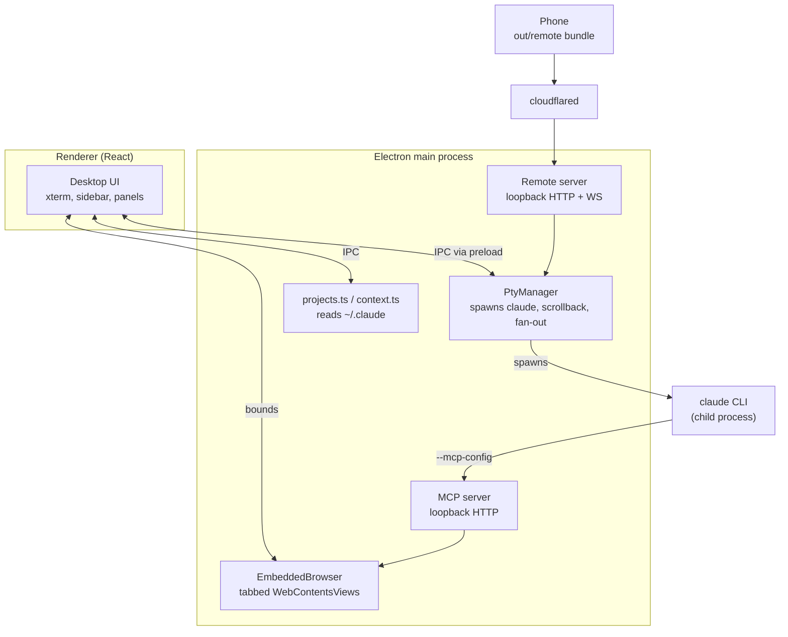

# Stoke architecture

How the whole thing fits together, and why it is built this way. [CLAUDE.md](CLAUDE.md) is
the short version; this is the reference.

## The central decision

Stoke drives the **real `claude` CLI inside a pseudo-terminal**. It does not talk to the
Anthropic API, and it does not use the Agent SDK.

That choice is what makes everything else work. Skills, MCP servers, plugins, hooks, slash
commands, permission prompts, the TUI's own rendering — all of it behaves exactly as it does
in a terminal, because it *is* a terminal. The cost is that Stoke cannot introspect the
conversation directly; it reads Claude Code's own files instead (see
[Reading Claude's state](#reading-claudes-state)).

## Processes



Three surfaces consume the same core: the desktop renderer over IPC, the CLI over MCP, and a
phone over HTTP/WebSocket.

## Sessions and the PTY

`src/main/pty.ts` owns every running session.

- `@lydell/node-pty` is used rather than `node-pty` because it ships **prebuilt N-API
  binaries for all six win/mac/linux × x64/arm64 targets**. There is no native compile step
  on either platform, which is the single biggest packaging simplification in the project.
- New sessions get a **generated `--session-id`**. That is what lets the context meter attach
  before the process has even written anything: the transcript path is known in advance.
- The environment is sanitised. See gotcha 1 in CLAUDE.md — this is not optional.
- Output is retained in a capped ring buffer *in main*, not only in the renderer, because a
  phone attaching to an hour-old session has no other way to see what happened.
- `subscribe()` fans output out to remote clients alongside the renderer.

`buildArgs()` in `cli.ts` maps Stoke's options onto CLI flags. Note that **`bypassPermissions`
maps to `--dangerously-skip-permissions`**, not `--permission-mode bypassPermissions`: the
latter requires the mode to already be enabled for the workspace.

**A session's id is not fixed for the life of its process.** `/clear` mints a new one, the
in-TUI `/resume` switches to another, and a `--continue` learns its id only after launch. The
CLI's own registry, `<config dir>/sessions/<pid>.json`, states the id the process is on now,
whether a turn is running (`busy`/`shell`/`waiting`/`idle`) and the binary's version.
`sessionRegistry.ts` reads it once a second for every live local Claude pty; a changed id is
a rebind (`rebindSession` in index.ts moves the context watcher and the worklog's address book
to it, and `session:rebind` moves the tab), and a changed state is pushed as `session:state`.
The statusLine files do NOT move: they belong to the launch (gotcha 73), so a reader holding a
session id finds them through `payloadKeyFor`. Gotcha 80.

Relaunching a session (the pill, onto a newer CLI) asks first when a turn is running — Force
restart, Wait, Cancel — waits for the old process to exit before starting the new one, and lets
main pick `--resume` or `--session-id` against the disk (`resumeOrMint`), because `--resume` on
an id with no transcript exits 1. Gotchas 81 and 82.

Finding the executable matters more than it looks. On macOS a GUI app launched from Finder
does **not** inherit the login shell's PATH, so `cli.ts` asks the login shell for it once
(`$SHELL -ilc 'printf %s "$PATH"'`) and caches the result.

## Reading Claude's state

Stoke never writes to Claude Code's files. It reads:

| Source | Used for |
| --- | --- |
| `~/.claude.json` → `projects` | known project folders, last activity, last cost |
| `~/.claude/projects/<encoded-cwd>/<uuid>.jsonl` | sessions, titles, context usage |

The history directory name is the absolute cwd with every non-alphanumeric character replaced
by `-`. That encoding is **lossy**, so directories that cannot be matched back to a config
entry are resolved by reading `cwd` out of the transcript itself.

`~/.claude.json` can legitimately contain two keys differing only in case, so paths are always
compared case-folded on Windows.

### Transcript records

One JSON object per line. Types seen in practice: `mode`, `permission-mode`,
`file-history-snapshot`, `user`, `assistant`, `attachment`, `last-prompt`, `ai-title`,
`system`. Notably there are **no `summary` records** in current versions — do not depend on
them. `ai-title` gives free human-readable session titles.

### The context meter

Context in use is `input_tokens + cache_read_input_tokens + cache_creation_input_tokens` from
the most recent `assistant` record. These are overwritten, not accumulated: each turn's usage
already reports the full context being resent.

The window size is **stated**, not derived. Stoke installs its own `statusLine` command for the
sessions it spawns (`statusLine.ts`, folded into the one `--settings` file assembled at launch),
and the CLI pipes that command a JSON payload whose `context_window.context_window_size` is the
answer — per model, correct before a token is spent. The CLI's startup banner is the fallback
for older versions, and inferring the tier from observed usage is the fallback below that; see
gotcha 2. Inference alone was wrong in the first implementation and reported 140–320% occupancy,
which is why `npm run verify:context` exists and asserts the invariant against real transcripts.

That command, together with the `ultracode` key it shares a file with, is the only thing Stoke
puts into the session's `--settings` file — a separate mechanism from the `--mcp-config`
injection that hands the CLI its browser tools (below). Neither writes anything of Claude's: the
settings file, the wrapper and the payloads all live under the system temp directory, and
`~/.claude/settings.json` is read for the user's own status line and never modified.

`ContextWatcher` polls rather than using `fs.watch`: transcripts are appended constantly,
append semantics differ across macOS and Windows, and only the handful of sessions with an
open tab are ever tracked. A poll reads only what was appended since the last one: parsing a
whole 16-22 MB transcript on every changed tick held the main process 40-130 ms at a time, and
every pty byte and keystroke waited behind it (gotcha 103).

**One launch path gets no context ring at all: `--continue`.** The watcher depends on knowing
the session id before the process starts, which is why a new session is handed a `--session-id`
Stoke minted itself. `--continue` takes no id — the CLI picks one after launch — so `pty.ts`
resolves the id to the empty string, `ContextWatcher.watch('')` returns immediately rather than
starting a watch, and no `ctx:update` is ever emitted for that tab. Nor is there a
way to repair it later: `ctx:watch`, `ctx:unwatch` and `ctx:update` are the entire context
surface in `src/shared/ipc.ts`, and all three are keyed on an id the caller must already hold,
so a session id discovered after the fact has no channel to arrive on. `--resume` is unaffected,
because it is handed the id it is resuming. The session is not silent otherwise: it still gets a
statusLine wrapper, named after a random launch key instead of a session id, and still writes
payloads — which is why the plan-limit chip keeps working for it, since `refreshLastStatusLine`
reads those files by launch key and the rate limits in them are account-wide anyway. It is the
per-session reading, and only that, which is wired to nothing.

## The docked browser

`src/main/browser.ts` runs tabbed `WebContentsView`s on a persistent partition
(`persist:stoke-browser`), so logins survive restarts.

Two structural points:

- **Views stay mounted and are merely hidden.** A detached view gets a 0×0 viewport and never
  lays out (gotcha 3).
- **Console and network capture uses Electron events and the `webRequest` API, not CDP.** The
  reason is coverage, not availability: `webRequest` listens for the life of the session with
  no attach, no reload and no observer effect, so a page's very first request is captured — a
  debugger session opened on demand would already have missed it. Network entries are routed
  back to their tab via `webContentsId`.

CDP *is* used, just not for capture. `src/main/mcp/cdp.ts` opens a **short-lived session per
operation** rather than holding one open, because an attached debugger is not free — some
domains carry a stated cost for as long as they are enabled — and nothing here needs to observe
events between calls. Sessions are **serialised through one promise queue per `WebContents`**:
two tools running at once would otherwise race on attach and detach, and the loser either sees
"Debugger is already attached" or has the session pulled out from under it mid-command.
Three tools are built on it — `browser_design` (computed styles and geometry for
every laid-out node from a single `DOMSnapshot.captureSnapshot`), `browser_security` (the
`scriptParsed` replay that finds exposed source maps without issuing one extra request, plus
`Network.getAllCookies`) and `browser_perf` (`Profiler` and `CSS` coverage across a
cache-disabled reload). `browser_stack` is the exception: it runs its detection script through
`executeJavaScript` and touches CDP not at all.

This file and `browser.ts` both used to assert that only one debugger client may attach at a
time and that the slot had to stay free for DevTools, and every one of those capabilities was
written off on that basis. It is not true of Chromium, which supports several protocol clients
per target; probed directly on Electron 43, commands succeed while DevTools is open and a fresh
attach succeeds while it is open.

## Giving Claude the browser

This is the part worth understanding properly.

Stoke launches the CLI, so it **injects `--mcp-config`** pointing at an MCP server it runs
in-process. Every session automatically gets browser tools aimed at the pane the user is
watching — no install, no configuration.

- Transport is HTTP on loopback with an ephemeral port and a per-run bearer token.
- The config is written to a **file**, not passed as a JSON string on the command line:
  shell quoting of JSON differs per platform and fails silently.
- A fresh `McpServer` + transport is created per request (stateless mode). The tools close
  over the browser, so there is no session state worth keeping.

Because the browser shares the user's session, Claude can read authenticated dashboards a
cold headless browser cannot. That is the whole point, and it is also the risk: in Bypass mode
Claude can act in a browser holding live logins, and a hostile page can attempt prompt
injection. Documented in the README rather than hidden.

### Reading pages well

`src/main/mcp/inject/extract.js` runs inside the page and is deliberately dependency-free so
it can be injected as one string. It provides:

- **main-content extraction to markdown** — link-density scoring picks the article, and the
  walker preserves headings, lists, tables and code blocks
- **a ref-indexed interactive map** — only visible, actionable elements, each with a short
  stable ref so the agent clicks `e12` rather than a brittle selector
- **outline / section / find** for progressive disclosure on large pages
- **a content signature** the main process diffs

Two behaviours do most of the work for token cost:

1. **Actions return a diff, not the page.** After a click, re-sending a 95%-identical page is
   the dominant cost in a multi-step flow.
2. **Every read waits for the page to settle.** Reading a skeleton loader produces
   confidently wrong answers rather than obviously wrong ones.

Clicks dispatch a full pointer sequence, and typing goes through the prototype's native value
setter — React and Vue track input values internally and ignore a plain assignment.

## Remote access

`src/main/remote/server.ts` serves the mobile bundle plus a small API and a WebSocket that
attaches to a PTY, replaying its scrollback first.

- **Loopback by default**, and that is the intended deployment: a Cloudflare Tunnel pointing a
  hostname at it, with cloudflared running on this machine and dialling `127.0.0.1`, so nothing
  inbound is opened at all. Two shipped toggles do open a port, and both are off unless asked
  for. `bindLan` moves the listener to `0.0.0.0`, which is all-or-nothing — binding the LAN
  address alongside `127.0.0.1` would collide on the port — so it exposes Stoke to whatever
  network the machine is on. `bindTailscale` instead adds a *second* listener on the machine's
  own `100.64.0.0/10` address, so a phone on the tailnet reaches Stoke without the tunnel and
  nothing on the surrounding network can; it only applies when `bindLan` is off, since the
  `0.0.0.0` listener already covers the tailnet, and it is best effort, because Tailscale being
  absent or down must not take the whole remote server with it.
- **A bearer token is required on every path**, on every listener, regardless of Cloudflare
  Access. If the tunnel is up and the Access policy is misconfigured or removed, that token is
  the only thing between the internet and a shell.
- `requireAccessHeader` is the opt-in that additionally rejects anything arriving without
  Cloudflare Access headers. It is enforced on the loopback listener **and on the LAN one**, and
  deliberately not on the dedicated tailnet listener: a request that reached the machine over
  the tailnet did not come through the tunnel and so can never carry those headers, and
  enforcing it there would 401 every device on the VPN, WebSocket upgrade included. The
  exemption is decided by asking which listener accepted the connection — read off the socket's
  local address, so a header cannot forge it — rather than by inference. Two earlier attempts
  inferred it and were wrong in opposite directions, both silently: keying on "came in on
  loopback" also exempted the LAN, since `bindLan` collapses everything onto one `0.0.0.0`
  listener; adding a `!bindLan` guard then made the condition always true in the Tailscale
  configuration, so every tailnet request 401'd and the terminal simply never opened.
- **The link says how it gets there.** `link.ts`'s `connectTarget` returns a `reach` beside the
  URL — a running tunnel, the configured hostname, the tailnet address, the best LAN address,
  and last `loopback`, which is reported as such so no surface ever draws a QR code of
  127.0.0.1. `remote:openOnPhone` is the one-press path: it picks the tailnet when Tailscale is
  up and the LAN otherwise, mints a key if there is none, starts, and pushes `settingsChanged`.
  A running server is restarted from the `settings:set` handler when a bound field changes.
- **The phone reflows the desktop terminal by default, and puts it back.** `Fit` is on unless
  the user turned it off, so opening a session from a phone fits the PTY to the phone's screen
  and the desktop's xterm follows. The server remembers the desktop's own size the first time a
  phone resizes a pty and restores it when the last phone detaches. (This used to say resize was
  opt-in; it has defaulted to on since the first visit stopped rendering a tiny grid in a corner.)
- **The phone paints the desktop's theme.** `GET /api/theme` serves the resolved theme and the
  terminal font; the mobile bundle writes the tokens onto `:root` and hands xterm the same
  sixteen ANSI slots the desktop uses. The stylesheet's Ember copy paints one frame at most.
- **A dropped socket comes back.** iOS Safari drops a WebSocket seconds after backgrounding; the
  phone reconnects with backoff and on `visibilitychange`, resetting the terminal before the
  server's history replay lands.

The mobile UI (`src/remote/`) is a separate Vite build because it is a plain web app, not an
Electron surface. Input goes through a normal `<textarea>` rather than the terminal: typing
into an xterm on a soft keyboard is miserable and autocorrect fights the TUI. A key row
supplies `esc`, `tab`, arrows and `ctrl-c`, which phone keyboards lack.

## The worklog agent

`src/main/worklog/` turns finished work into Notion pages and ClickUp tasks. It is a **review
queue, not an auto-writer**: every run only ever proposes, and the sole code path that changes
anything outside Stoke is an accept the user pressed.

Four runs' worth of behaviour, and the ordering between them is the design:

1. **The gate** (`gate.ts`) decides whether a session may be looked at, keyed on the session's
   *own folder group* — never on the profile chip in the sidebar. The chip is a view filter, so
   keying off it would either skip a work session running in a background tab or hand a personal
   one to a work tracker. Both failures are silent.
2. **Auto-scan** (`autoscan.ts`) decides *when*. The signal is the transcript file: `ContextWatcher`
   already polls it at 1.5s for the context meter and already reports the message count and the
   mtime, which is exactly "how much work" and "when did it stop". So nothing new watches
   anything. A session is scanned once it has been quiet for two minutes, has at least six new
   messages *since Stoke started watching it*, and has not been scanned in the last twenty —
   with a ceiling of six scans an hour across everything. Closing a tab does not stop tracking:
   finishing and closing is the most natural end of a work block there is.
3. **Recall** (`recall.ts`) reads the boards before anything is proposed, so a job that is
   already tracked gets a status change instead of a near-duplicate beside it. This has to be
   its own run, because the scan is hermetic — `--safe-mode` plus an empty `--mcp-config` — and
   safe mode switches every MCP server off. It is read-only by an exact four-name allowlist, and
   cached with a TTL and a single-flight promise so two sessions scanned a second apart read the
   boards once. It also asks the *list* for its status vocabulary, not just the tasks: recall
   lists open records, so the states in use are precisely the ones a finished job does not need.
4. **The scan** (`runner.ts`) is handed a bounded digest of the transcript plus the recall
   block, and asked for entries. It never sees the repository: no cwd, no CLAUDE.md, no skills,
   no MCP, and Read/Glob/Grep denied — given a working directory a model that decides to go
   looking turns a fixed-price run into an open-ended one.

Two things are checked in code rather than asked for in the prompt, because both fail at
somebody else's API where the user can do nothing about it. An update naming an id recall never
returned is filed as a *create* instead and counted; a status the destination does not actually
offer is dropped, leaving a note-only update. Titles get the same treatment — every parsed title
goes through `tidyTitle`, which strips commit prefixes and markdown and caps the length, because
the title is the only part of a proposal the user reads before deciding.

Cost drove most of it. The probe that proved connector tools reach a headless run cost $0.50 for
one trivial prompt, because it defaulted to Opus against a large cached context. Everything here
is pinned to Sonnet with an explicit `--max-budget-usd`.

### Over SSH

An SSH session spawns `ssh -t <alias> <command>`, so `claude` runs on the far machine and writes
its transcript there. Everything above reads a local file, so none of it — nor the context meter —
had ever worked for a remote session.

`sshTranscript.ts` closes that by fetching the real JSONL back over the same connection. The
alternative was scraping the PTY stream, which Stoke does retain (512KB per session), and it is a
much worse signal: that stream is a recording of a *screen*, and Claude Code's TUI repaints as it
streams, so the same sentence arrives dozens of times interleaved with box drawing and none of
what matters — which tools ran, which subagents were spawned, how many tokens — is in it at all.

Three decisions are worth keeping:

- **The user's connect command is never modified.** Passing `--session-id` to the remote `claude`
  would correlate the session exactly, but a remote CLI that does not know the flag exits with an
  unknown-option error and the *terminal itself* breaks on every connection to that host. The
  newest transcript is asked for instead, and the path it came from is reported so the user can
  see which. Two Claude sessions on one host at once cannot be told apart; that is the price.
- **The gate is per host**, not per folder. A remote session's `cwd` is wherever Stoke was pointed
  locally, so the folder gate would match the wrong project or none. `SshHost.worklog` is the
  switch, and the true working directory is read out of the fetched transcript.
- **An unchanged transcript is not rewritten.** Every reader decides "has anything happened?" from
  the cache file's mtime, and auto-scan measures how long a session has been *quiet* from it.
  Rewriting an identical file each poll would move that forward forever, and a remote session
  would never once look idle — the feature would appear to work and silently never fire.

The fetch is routed through `ContextWatcher` rather than beside it, so one poller serves both:
the meter starts reading for SSH sessions, and the auto-scan trigger, which is fed from those same
snapshots, starts firing for them. Remote sessions poll at 30s rather than 1.5s, because it is a
network round trip rather than a `stat`.

The queue (`queue.ts`) is the safety property. Rejections are kept as tombstones rather than
deleted, so "no, don't log that" is permanent — and because proposal ids are the sha1 of the
dedupe key, updates were given their own key shape so the `create` key could stay byte-for-byte
what it was and no old rejection could come back.

## `stoke` from a terminal

`stoke .` in any terminal opens that folder in the running Stoke — or starts Stoke — and focuses
the tab already running there rather than opening a twin. The command is a shell shim shipped
inside the app (`build/bin/stoke`, `build/bin/stoke.cmd`, via `extraResources`) and linked onto
PATH as `~/.local/bin/stoke` on macOS; on Linux it is the launcher the one-line installer writes,
and on Windows the shim's folder goes on the user PATH. The shim answers `--help`, `--version`
and `install-cli` itself and turns everything else into
`--stoke-cli --stoke-cwd=<shell cwd> -- <what was typed>` for the app — `open -n` on macOS,
because a running app is only activated by `open -a` and its arguments dropped.

Main parses its OWN argv before the single-instance lock (`parseStokeArgs`, in
`src/shared/stokeArgs.ts`) and hands the parsed request to the running instance as the lock's
`additionalData`, because the `argv` a `second-instance` handler receives has been reordered by
Chromium. An argv without the `--stoke-cli` marker is never a request, and the `--` after the
marker is Chromium's switch terminator, so nothing typed can configure the browser. Main checks
the folder (async, with a deadline), adds it to the sidebar, and QUEUES the request until the
renderer asks for it once tab restore has settled (`CH.cliPending`); after that it pushes
(`CH.cliRequest`). App.tsx claims a (cli, folder) before its first await and holds the claim until
that session's tab is in the list, so two quick `stoke .` cannot open two tabs.

## Renderer

React 19, hand-written CSS, no component library.

- Every colour is a CSS custom property written onto `:root`, so switching themes is one
  style write with no re-render. xterm gets its palette object separately.
- Terminals are **never unmounted** on tab switch, only hidden, or scrollback would be lost.
  Nor are they moved: the panes render in `paneOrder` (sorted by id, `lib/tabs.ts`), not in
  strip order, because React moving a focused xterm's node blurs it.
- The tab strip is dragged Chrome-style by `lib/useTabDrag.ts`: pointer events with capture on
  `.tablist`, the real tab on an inline transform, neighbours sliding to preview slots, one
  `moveTab` commit on release with a FLIP settle, Escape reverting. Imperative by design — no
  React state per frame. Its maths (`nearestSlot`, `previewSlot`, `clampDrag`,
  `autoscrollVelocity`) is in `lib/tabs.ts` and asserted by `verify:tabs`; the wiring is not
  reachable from any suite (gotcha 31).
- `lib/ptyBus.ts` retains output per process and replays it on attach, which also makes the
  component safe under React StrictMode's double-mount.
- Shortcuts (`lib/shortcuts.ts`) use Cmd on macOS and **Ctrl+Shift** elsewhere, because bare
  `Ctrl+K`/`Ctrl+W`/`Ctrl+T` are readline bindings Claude Code's own prompt uses. Matching is
  on `event.code` so holding Shift does not break it.

## Build and packaging

`electron-vite` builds main, preload and renderer; a second plain `vite build` produces the
mobile bundle into `out/remote`. `build/icon.svg` is the icon source and `npm run icon`
rasterises it through Electron itself, avoiding an image toolchain.

The **installer artwork** works the same way. Four more SVGs in `build/` are the sources, and
`npm run art` rasterises them to the bitmaps the Windows wizard and the macOS dmg actually
read: `installerSidebar.bmp` and `uninstallerSidebar.bmp` (164×314), `installerHeader.bmp`
(150×57), and `background.png` / `background@2x.png` (540×380 and 1080×760). The BMPs are
written by hand, because Chromium's canvas cannot encode one and NSIS only displays the classic
40-byte-header "Windows 3.x" variant. All five outputs are **committed**, like `build/icon.png`,
so no release runner rasterises anything; `npm run art` is a deliberate act and does not run in
`check`. What `check` runs is `verify:installer-art` over the committed files, because
electron-builder validates none of them — see gotcha 69, and `.claude/rules/release.md` for what
each failure looks like from outside. `npm run art` also writes `build/installer-art.json`,
committed with them: it hashes each source and each output, which is the only way the suite can
tell a current raster from one whose SVG has moved on since.

`build/installer.nsh` is the only NSIS script Stoke owns, named by `nsis.include`, and it does
one thing: `!insertmacro MUI_PAGE_WELCOME` inside a `customWelcomePage` macro. Without it the
164×314 sidebar is read by no installer page until `MUI_PAGE_FINISH`, so the art commissioned
for the wizard appears once, at the end, after every decision has been made — electron-builder
adds no welcome page by default and inserts that macro only `!ifmacrodef`. `nsis.script` is the
key that must never be used: it replaces the whole generated script and takes the uninstaller's
generation *and* its signing with it. **None of the NSIS half is verified** — no round of work
in this repo has run on Windows, so `verify:welcome` checks that the file says what
app-builder-lib's own templates need it to say, and nothing about what a wizard draws.

The same campfire appears **inside the app**, once per install or upgrade:
`src/renderer/src/components/Campfire.tsx` draws `installerSidebar.svg`'s own flame paths as an
SVG/CSS animation tinted from `--accent`, and `src/shared/welcome.ts` decides whether it plays
at all. It is loaded through `import()` so a launch that is not showing it fetches, parses and
evaluates none of its **JavaScript** (gotcha 40's lesson, one process over) — measured at 5,340
bytes of its own chunk, 1,612 gzipped. Its CSS is the exception and is not free: Vite does not
split a single imported `app.css`, so the campfire's 5,563 bytes of rules sit in the one 142 KB
stylesheet every launch parses. The `import()` also carries a `.catch`, because `lazy` rethrows
a rejected factory during render and nothing in this tree is an error boundary — without it a
chunk that will not load blanks the entire window, measured. What it remembers is one settings
field, `welcomeSeenVersion`: a version rather than a boolean, so an upgrade can be marked as
well as an install without spending a second field.

Self-update uses `electron-updater` against GitHub releases, configured in the `publish` block
of `electron-builder.yml`. It only activates for a packaged app with a published release.

**On Windows, how a copy updates depends on how it got there**, and that is decided first
(`src/shared/installKind.ts`, probed once at startup). electron-updater only ever runs the NSIS
installer, which is right for a copy the installer put down — the website `.exe`, the one-line
installer and winget all run that same installer, so they all update the same way, and the
installer rewrites the Apps & Features version winget reads. It is wrong for anything else: an
unzipped folder "updated" by installing a second copy under `%LOCALAPPDATA%\Programs` and staying
stale itself. So a folder without `Uninstall Stoke.exe` beside Stoke.exe takes the **portable**
route: electron-updater still checks, then `portableUpdate.ts` fetches the release's
`-<arch>-win.zip` (its sha512 in `latest.yml`, injected by the publish job), unpacks it beside the
running folder and hands a plan to `portableSwap.ts`'s helper, which waits for every process
running out of the folder to exit and swaps the two by rename — never killing anything, and
putting the old copy back if the new one will not move in. Because the swap renames the WHOLE
folder, a folder holding anything that is not part of a Stoke build is never portable (it is
told to update by hand), and the same check runs again after staging and right before the
helper starts. A package manager's own folder
(Scoop, a winget portable install, Chocolatey's lib) is shown its update command instead; a
folder Stoke cannot write beside is shown the releases page and why. The NSIS installer itself,
run silently over a running Stoke (`winget upgrade`, the one-liner), asks it to close rather
than killing it (`build/installer.nsh`, `customCheckAppRunning`). `.github/workflows/windows.yml`
runs all of this on real x64 and arm64 Windows.

**macOS packages can only be built on macOS**, and the Windows NSIS installer needs Windows,
so neither installer can be produced on the other's machine. The architecture is just as hard a
constraint and fails silently instead (gotcha 67), so a release is **one arch per job on a
native runner**: five legs, read out of `scripts/targets.mjs` by a `prepare` job rather than
written into the workflow a second time. One later job downloads all five, merges the per-job
`latest*.yml` — electron-builder names those per platform, so both Windows jobs and both macOS
jobs write the same name (gotcha 68) — refuses to publish a feed that cannot update some arch,
and creates the release.

**Linux x64 is now built and has still never been run.** `npm run dist:linux` and a
`ubuntu-latest` matrix leg produce an AppImage, and `toolsets.appimage` is set so it carries
the static FUSE-3 runtime rather than the legacy one that needs libfuse2 and will not start on
a default Ubuntu 24.04. AppImage is the only Linux format in scope, because it is the only one
electron-updater installs without elevation; there is no `tar.gz`, because an unpacked tarball
sets no `$APPIMAGE` and so can never update itself by any route. None of that is the same as
the app working: nothing in `pty.ts`, `cli.ts`'s login-shell probe, `claudePaths.ts` or
`workspaceRoots.ts` has ever executed on Linux. Treat a Linux release as experimental.
Linux arm64 is deliberately not built (`NOT_BUILT` in `scripts/targets.mjs`).

## Testing

Verification lives in `scripts/`, one `verify-*` suite per subject — thirty-eight of them now.
Thirty-six are in `npm run check`, between the typecheck and the full build; `check` is the
gate, and it is what "done" means here. They are `.mts` run straight through node's
type-stripping with no build step, except `verify:selection`, which opens a real Electron window
and so needs a display. Each runs alone:

```bash
npm run verify:context        # context meter against the real transcripts on this machine,
                              # and that folding them in pieces at random cut points equals
                              # one pass (gotcha 103)
npm run verify:statusline     # the statusLine wrapper: payload, suppression, pass-through,
                              # the context meter's four tiers at every boundary, and that
                              # no bypass bead is drawn where the ring's arc would touch it
npm run verify:unicode        # xterm's cell widths for emoji and box drawing
npm run verify:profiles       # profile resolution + every accent clears 4.5:1
npm run verify:settings       # settings hydration: repair, clamps, what it drops, and the
                              # light/dark theme pair the OS chooses between
npm run verify:claude-config  # writing Claude Code's OWN config: the allowlist, the refusals,
                              # and the ~/.claude.json lock. Runs against real files in a temp
                              # CLAUDE_CONFIG_DIR, never the user's (gotchas 38, 39)
npm run verify:folders        # folder metadata: trimming, caps, added folders, hide/pin; and
                              # transcripts read in pieces on synthetic files - incremental
                              # == one pass at every cut, a split UTF-8 character, resets on
                              # truncate/rename/rewrite, the watcher end to end, and
                              # listSessions re-parsing only what changed (gotcha 103)
npm run verify:search         # sidebar + palette search: tiers, recency, highlight ranges on
                              # accented text, the label in both surfaces; and the session
                              # index against real files in a temp dir - a 40 MB transcript
                              # costs two 256 KB reads, a second pass costs none
npm run verify:cli            # finding the `claude` binary: the version-manager shim dirs,
                              # the probe's retry rule, and the two not-found messages.
                              # Hermetic - HOME is redirected into a temp tree (gotcha 52)
npm run verify:stoke-args     # `stoke …` from a terminal: no marker, no request; every command,
                              # path form and refusal; an argv reordered the way Chromium
                              # reorders it; a forwarded request rebuilt, never trusted. Then
                              # build/bin/stoke RUN against a fake bundle, with `open` recorded
                              # and fed back through the parser, its install-cli against the
                              # fixtures the link rules classify, and src/main/stokeCommand.ts
                              # against the same ones, under a temp HOME with a bystander file
npm run verify:tabs           # which tab is selected after one is closed, where the
                              # next/previous chord lands, and the tab drag's maths: that its
                              # preview is exactly the reorder it commits, and that no
                              # reorder moves a terminal pane. And the relaunch: the plan
                              # (the registry's id and version over the tab's, busy, fresh),
                              # Wait and the automatic relaunch, and what counts as a draft
npm run verify:launcher       # the new-session page: each launch value resolved through
                              # tab, Stoke and Claude Code's files (the machine the QA ran
                              # on, modelSettings included, reads what the banner said),
                              # same-name projects told apart, the switcher's groups, the
                              # conversation list, every key, and the picker's Select all
                              # never reaching an uninstalled agent
npm run verify:registry       # Claude Code's session registry: parsing junk, missing fields and
                              # every status; matching a pty to its file (pid, then the unique
                              # id, then the unique folder); and the poller against a directory
                              # that exists only in memory — rebind on /clear, once, and never a
                              # path outside the directory it was handed (gotcha 74); and
                              # activityView's whole table beside the hooks (gotcha 104)
npm run verify:shortcuts      # app chords vs the keys the terminal owns, the zoom maths, and
                              # that Ctrl+Tab and the bare brackets still reach the CLI
npm run verify:drop           # what a dropped file types: quoting per platform, and the
                              # names that cannot be typed at all
npm run verify:browser-url    # what the docked browser will load: file://, javascript:,
                              # data: refused to a tool call, file:// kept for the address
                              # bar, and localhost:3000 not mistaken for a scheme
npm run verify:agents         # the coding agents: what is stored, what the launcher shows,
                              # each CLI's exact launch plan (endpoint, MCP, continue) with
                              # every key in env and none in argv, and the install script —
                              # only table ids survive into a command
npm run verify:voice          # who owns a held Space: Claude Code's /voice or Stoke's
                              # dictation, and that dictation swallows the REPEATS too;
                              # what a refused microphone is called; and the wire from
                              # TerminalView to those rules (gotcha 79)
npm run verify:campfire       # the installer's campfire: the locked alphabet that lets one
                              # copy of the art live in a POSIX string and a PowerShell
                              # here-string, a hearth that never moves, the stage boundaries,
                              # a golden hash per colour tier, zero escape bytes in `none`,
                              # and the shipped art blocks against the generator. Also runs
                              # the block through sh, bash, zsh and dash for real
npm run verify:color          # colour maths: contrast, APCA, oklch; every theme's tokens, the
                              # accent matrix, the meter colours and the bypass mark at 3:1
npm run verify:theme-gen      # the theme generator: that a five-field seed reproduces every
                              # built-in byte-for-byte, that no slider position can breach a
                              # contrast floor, and that a saved seed survives hydration
npm run verify:updates        # the updater: a failure and a success must not read the same,
                              # whether the channel the CLI follows is itself behind latest,
                              # and macOS must still build the zip it updates from (24, 25, 46)
npm run verify:worklog-gate     # which sessions the worklog agent would watch
npm run verify:worklog-runner   # prompt building, JSON parsing, titles, create-vs-update
npm run verify:worklog-retry    # writes happen once, and a retry never duplicates a record
npm run verify:worklog-recall   # the read-only board read, its parse and its cache
npm run verify:worklog-autoscan # when a session is scanned without being asked
npm run verify:ssh            # ssh argv, ~/.ssh/config parsing, the remote transcript fetch
npm run verify:remote         # phone access: where the link points and how it says it gets
                              # there, the LAN interface ranking, what a dead tunnel reports
npm run verify:phone-ui       # the phone UI's decisions: list sections, answer options read
                              # off the screen, the resize policy, queued sends, connect input
npm run verify:installer-art  # the committed installer bitmaps: BMP3 headers decoded by hand,
                              # exact dimensions, that neither the bitmaps nor the dmg PNGs are a
                              # well-formed blank, that the generator, electron-builder.yml and
                              # the four SVG sources name the same files and share one campfire,
                              # and — via build/installer-art.json — that every raster was
                              # generated from the SVG committed beside it
npm run verify:install        # the one-line installer and the endpoint that serves it: the whole
                              # User-Agent matrix through the Worker's routing rule (PowerShell
                              # before anything browser-shaped, and HTML as the fallback), the
                              # truncation guard as the LAST line of both scripts, `-n` under sh,
                              # bash, dash and zsh, install.sh's own painter run and diffed
                              # against campfire.ts's paint() in all four tiers, its degrade
                              # rules against renderPlan's, the sha512-is-base64 digest run on
                              # random bytes, the NSIS upgrade GUID recomputed from
                              # electron-builder.yml's appId, http answered with a 301, the
                              # Mac refusals (inside Stoke, several copies) run through main
                              # before any download, the Linux launcher run both as a user
                              # and as root, and the macOS `stoke` link step via --link-cli
npm run verify:welcome        # the first-run campfire: which (lastSeen, current) version pairs
                              # play it and which must not, the settings field it remembers that
                              # in, that the component carries no colour and no second copy of
                              # the flame geometry, that App imports it with import() rather than
                              # statically — and, from the other end of the same feature, that
                              # build/installer.nsh still defines customWelcomePage and
                              # electron-builder.yml still names it through `include`
npm run verify:selection      # Option-drag selection survives letting go of the mouse.
                              # Opens a real Electron window, so it needs a display
                              # and is one of the two `check` suites CI skips
                              # (the other is verify:context)
npm run verify:extract        # page extractor regression set
npm run verify:usage          # plan limits from the statusLine payload; STOKE_LIVE_USAGE=1 adds the account call
npm run verify:security <url> <token> --access   # remote server, against a running instance
```

Four more sit in the `check` chain without an entry above: `verify:activity` (the activity
report's active time and lines written — a session's wall-clock span is not time worked),
`verify:restore` (the tab-restore store: what survives a quit, what is trimmed, what a corrupt
file does), `verify:targets` (that every runner in the release matrix is native for the arch it
builds, that the `dist:*` scripts and the workflow both read `scripts/targets.mjs`, and that
every platform/arch node-pty publishes is built or named as deliberately unbuilt) and
`verify:manifests` (the update-manifest merger and the publish gate, asserted against the real
published v0.9.4 manifests, against electron-builder's own `writeUpdateInfoFiles`, and against
electron-updater's own `findFile`/`filterFilesForArch`). And `verify:portable`: which kind of
Windows copy this is, the zip each arch is offered (never another arch's), download/verify/unpack
against a local server with every refusal made to happen, and the swap helper itself RUN under a
real PowerShell where one exists — CI's ubuntu runner ships `pwsh`; elsewhere set `STOKE_PWSH`.

The two `.mjs` suites want a live instance rather than a fixture, which is why `check` cannot
run them: `verify:extract` drives the page extractor through Stoke's own MCP endpoint, and
`verify:security` is pointed at a running remote server with a URL and a token.

CI runs the `check` chain minus two, and the list is derived rather than transcribed:
`scripts/ci-verify.mjs` reads the chain out of `package.json` and fails on a stale exclusion
(`npm run verify:ci -- --list` prints the plan). `verify:selection` needs a display. And
**`verify:context` deliberately reads the real transcripts under `~/.claude/projects`**: that is
the reason it exists, not an oversight. It asserts the context maths, the window inference and
the live watcher path against actual sessions on the machine, so on a clean runner the directory
is simply not there and the suite throws. Teaching it to synthesise its own fixtures would
delete the only thing it is for, so it runs on a developer's machine and is skipped in CI.

Beyond that, verification has been done by driving the running app over CDP — launching with
`--remote-debugging-port`, clicking through real flows and capturing screenshots. That is how
every bug listed in CLAUDE.md was found; all of them produced *empty or wrong output rather
than errors*, which is exactly the class a typecheck cannot catch.

## File map

Every file worth knowing about, and the one thing about it that is easy to get wrong. CLAUDE.md
carries a shorter copy; this is the full one.

```
src/main/         Electron main process
  index.ts          lifecycle, window, every IPC handler
  pty.ts            PTY sessions, env sanitising, scrollback, fan-out. A session's
                    `sessionId` is where it is NOW (`rebind`); its `statusKey` is where its
                    files are, and never moves. `stop()` kills and waits for the exit, capped at 3s
  sessionRegistry.ts  reads Claude Code's own `<config dir>/sessions/<pid>.json` for every
                    live local Claude pty: the session it is on now (a `/clear` moves it) and
                    whether a turn is running. No electron import and the fs is injected, so
                    verify:registry runs it against a directory in memory. Gotcha 80
  cli.ts            locating claude and every other agent, building claude's argv. An agent
                    whose name an unrelated program also uses (Homebrew's `grok` is a regex
                    tool, its `amp` a text editor) must match its `identify` pattern on
                    `--version`, or detection reports the impostor as a conflict and a tab
                    never launches it
  stokeCommand.ts   Settings > Updates > Command line: `~/.local/bin/stoke` as a symlink
                    to this bundle's shim (macOS, async fs), the installer's launcher read
                    back (Linux, never written from here: an AppImage mount is under /tmp),
                    the user PATH through PowerShell (Windows, unverified). Replaces nothing
                    that is not a link into some Stoke.app. No electron import
  projects.ts       project + session discovery from Claude's own files. `listSessions`
                    caches each transcript's parse on path+mtime+size, 8 at a time, so a
                    focus re-fetch parses only the one that moved (gotcha 103)
  projectMeta.ts    per-folder emoji/label/added-by-hand, and the one pair of caps
  context.ts        live context-window watcher (polls transcripts). Publishes on a
                    changed transcript OR a newly-stated window, for gotcha 49's reason.
                    Incremental: each watch keeps a `TranscriptCursor`, so a tick reads
                    only the bytes appended since the last (an SSH copy, rewritten in
                    place, is read whole each time). No 32 MB sampling (gotcha 103)
  sessionFile.ts    transcript parsing and the context maths. `promptOf`/`titleOf` are the
                    one definition of a session's first prompt and title, and the fold
                    (`createFold`/`foldLine`/`finishFold`) the one rule every reader
                    shares. `foldFrom` streams 1 MB reads, one chunk's fold per
                    event-loop turn across the process, so no parse blocks the main
                    thread for long (gotcha 103)
  sessionIndex.ts   every session's title + first prompt, for search: one 256 KB chunk
                    from each end of a transcript, cached on mtime+size, top-level
                    `*.jsonl` only (never `<id>/subagents/`). Never `listSessions`, which
                    parses every file whole on a miss
  statusLine.ts     Stoke's statusLine wrapper: context window + plan limits, and the SAME
                    shim run as a hook. The session's --settings file carries Stop,
                    Notification and UserPromptSubmit hooks that append one JSON line each
                    to <key>.events.jsonl; index.ts polls that every second and pushes
                    `session:event`, which the tab strip's activity dot, the status bar's
                    "Claude is working…" line and the OS notifications all read, beside the
                    registry, through shared/activityView.ts. A Stop carries the background
                    work still running and a prompt who put it in (gotcha 104). Measured:
                    hooks in a --settings file fire and MERGE with the user's own (a project
                    hook and the flag-file hook both ran on one prompt), and a hook that
                    prints is shown in the TUI (Stop) or fed to the model (UserPromptSubmit),
                    so the event branch of the wrapper prints nothing, ever
  usage.ts          plan limits from the undocumented OAuth endpoint the CLI itself calls.
                    Reads the token from ~/.claude/.credentials.json OR, on macOS, the login
                    Keychain - which is why the chip works with no session running (gotcha 36)
  claudePaths.ts    where Claude Code's own two config files are. Pure; env and home are
                    arguments, so a suite can ask about another machine's layout
  claudeSettings.ts ~/.claude/settings.json: read, and patch one allowlisted key, preserving
                    every key Stoke does not draw
  claudeGlobalConfig.ts  ~/.claude.json: the lock protocol, the refusals, and the
                    verify-after-write. See gotcha 38 before touching it
  browser.ts        docked Chromium: tabs, find, console/network capture
  workspace.ts      default folder + scratch folders
  workspaceRoots.ts where a session with no project starts, per platform. Takes the
                    platform and home as arguments so a suite can ask for another machine's
  wallpaper.ts      the picked image, copied under userData and served over the custom
                    `stoke-asset://` scheme. Refuses anything that is not a bare file name
                    inside its own folder, so the scheme cannot be turned into a file reader
  store.ts          settings persistence
  settingsSchema.ts defaults + hydrate, with no electron import so a suite can run it
  tabStore.ts       the tabs that were open at quit. Restoring is a relaunch
                    (`claude --resume`), never a reattach: a CLI child cannot outlive the app.
                    Also the update-restart marker: written by main just before
                    `quitAndInstall`, consumed by the next boot's `tabs:restore`, and the
                    only thing that makes restored tabs come back resumed rather than paused
  activity.ts       what was worked on, from Claude Code's own transcripts. Pure and
                    electron-free so verify:activity can run it
  activityGit.ts    commit subjects to put names to the activity numbers. Corroboration,
                    never a dependency: several work folders have no repository at all
  updates.ts        claude CLI version/health, and the gate that decides whether to
                    install an update unasked. Reads the CLI's own `autoUpdatesChannel`
                    rather than assuming `latest`, because those are different numbers
                    (gotcha 46). The gate is pure and separate from the six-hour timer
                    that calls it, for gotcha 31's reason
  selfUpdate.ts     Stoke's own updates (electron-updater). Downloads in the background when
                    `selfUpdateAuto` is on and the build could install what it fetched
                    (`shouldAutoDownload`); installs only on a quit or "Restart and install",
                    which App asks about first when a turn is running
  codesign.ts       whether this copy's signature could ever accept a downloaded update.
                    No electron import, so verify:updates can run the rule. Gotcha 24
  portableUpdate.ts a portable Windows copy updating itself: gathers the facts
                    installKind.ts decides on, downloads the release's -<arch>-win.zip
                    checked against latest.yml's sha512, unpacks it beside the running
                    folder with System32\tar.exe, checks the copy (app-update.yml, the
                    version inside app.asar) and starts the swap helper. No electron
                    import; recursive deletes go through original-fs (Electron's fs walks
                    into app.asar)
  portableSwap.ts   the swap helper: a constant ASCII PowerShell script plus a JSON plan,
                    run with -File after Stoke quits. Waits for everything running out of
                    the folder, renames it aside, renames the new copy in, rolls back on
                    failure, never kills. Writes a result the next launch reports
  profiles.ts       plans and creates a profile's folder + scan root
  ssh.ts            ~/.ssh/config parsing, the ssh argv, the transcript command
  sshTranscript.ts  pulls a remote session's JSONL back, so SSH sessions can be read
  agent.ts          headless `claude -p` runner (prompt on stdin, json out)
  skillsScan.ts     lists the skills in every folder an agent reads, with each one's real
                    path, so a symlink is told apart from a copy that drifts. Read-only;
                    `home` is a parameter so verify:agents runs it on a fake tree
  stt.ts            the one place Stoke talks to the speech sidecar. Both the desktop and
                    the phone route through it, because "only main may reach it" is the
                    sidecar's whole authentication story
  audio/            reads the default capture device, to warn about virtual cables
  worklog/          the Notion/ClickUp review queue
    gate.ts           which project groups are watched
    watch.ts          the one predicate: is this session watched, and why not
    sessionStore.ts   session -> folder/host, on disk, so a restart keeps placing them
    autoscan.ts       when a quiet session is scanned without being asked
    autoscanStore.ts  its baselines on disk, split out so autoscan.ts imports nothing
    recall.ts         reads the boards (read-only, cached) so updates beat duplicates
    runner.ts         scan (read-only) and apply (writes, on accept only)
    queue.ts          the persisted proposal list
    json.ts           the shared "read JSON out of a model's reply" rescue
  mcp/              MCP server exposing the browser to Claude
    server.ts         HTTP transport + the 17 tool definitions
    page.ts           drives the page through the injected extractor
    cdp.ts            short-lived CDP sessions over the docked page. browser.ts long
                      claimed the debugger slot had to stay free because only one client
                      may attach; probing Electron 43 disproved that, which is what makes
                      audit.ts, design.ts and perf.ts possible at all
    audit.ts          passive security/hygiene audit: reads only what Chromium already
                      received or rendered. Nothing probes, so "not observed" is reported
                      as exactly that
    design.ts         what a page looks like, as text: a DOMSnapshot compressed hard
    perf.ts           why a page is slow, as a checklist. Reloads by default, because
                      unused bytes only mean anything if tracking started first
    stack.ts          what a page is built with, from live evidence rather than a
                      signature database that would already be stale
    inject/extract.js runs IN the page; markdown + refs + find. No deps.
  remote/           phone access
    server.ts         loopback HTTP + WebSocket, token auth, tailnet listener, and
                      /api/theme so the phone paints the desktop's own palette
    link.ts           where the phone link points and HOW it gets there (`reach`).
                      Pure, so verify:remote can hold the fallback order. Gotcha 53
    tunnel.ts         supervises cloudflared; finds it on the login-shell PATH
    cloudflare.ts     everything BEFORE a tunnel exists: is it installed, are you logged in,
                      does the tunnel exist, does a hostname point at it. The probe mutates
                      nothing and has a third answer, `unknown`, because the account lookup is
                      a live API call. Gotcha 58
src/preload/      contextBridge -> window.stoke
src/renderer/     desktop React UI (all colour via CSS custom properties)
  src/components/BusyDialog.tsx  "a prompt is running — Force restart / Wait / Cancel", asked
                    before the relaunch pill or "Restart and install" kills a turn in flight.
                    Wait is the focused button. In `overlayOpen`, so the docked browser comes
                    off the window while it is up (gotcha 14). Gotcha 82
  src/components/Launcher.tsx  a New tab's page, one top-aligned column: where it runs
                    (FolderSwitcher), Start split with the other agents, the launch chips
                    (resolved, THIS launch only, "Make default"), the conversation list.
                    Top-aligned so nothing above a row moves when a row below loads. Its
                    keys come from `launcherKey` (shared/launcher.ts). Gotcha 88
  src/components/FolderSwitcher.tsx  the launcher's title as a combobox: recent projects
                    (profile-scoped, same names told apart), the default folder, scratch,
                    remote machines, Open folder…. Replaced the separate "Start a session"
                    page, which could not be reached again once a project was clicked
  src/lib/tabs.ts   besides the tab arithmetic, every relaunch decision as a pure function:
                    `relaunchPlan`, `pendingRelaunchStep` (Wait), `autoRelaunchStep`
                    (`cliRelaunch: 'auto'`) and `looksTyped` (what counts as a draft); and
                    the launcher's: `continuePlan` (Continue resumes by id, never a twin),
                    `newTabToReuse`, `tabLabel`
  src/lib/pressBurst.ts  the window's one record of the Enter/Space burst in progress,
                    registered first from main.tsx; the agent picker and a launcher armed by
                    the splash or picker closing ask it `activationAllowed`. Gotcha 88
  src/lib/projectSearch.ts  the one matcher the sidebar search and the Cmd+K palette share:
                    label/name/path, session title and first prompt, ranked by tier then
                    recency, with highlight ranges. No runtime imports, so verify:search
                    imports it directly
src/remote/       mobile web UI, built separately to out/remote. Vanilla TS on one `el()`
                  builder, hash-routed; below 1024px one screen at a time, from 1024px a
                  340px session rail beside the session (never a stretched phone)
  main.ts           boot (key scrub, live theme), the router and the rail/pane layout
  api.ts            the phone contract's shapes, the fetch wrapper (a 401 is the Connect
                    screen), /api/theme -> :root including derived accent-ink and meters
  store.ts          the one session list: /ws/events pushes, a 5s poll while it is down
  list.ts           Needs you / Working / Idle / Ended rows, answerable from the list; reads
                    a waiting prompt's options by replaying the pty into an unopened xterm
  session.ts        terminal, status pill, answer tray, keys, composer (queued sends),
                    Fit to phone via decideResize (gotcha 87), ended banner
  newSession.ts, history.ts, connect.ts, dom.ts   the new-session sheet, history and
                    read-back, the paste-your-link screen, the builder/icons/sheets
src/shared/       types, IPC channel names, themes, profiles, colour maths
  remotePhone.ts    the phone contract's pure pieces: status mapping and sort, the ended
                    ring, `submitFrames` (typed, never bracketed for Claude: gotcha 86)
  phoneUi.ts        the phone UI's decisions: sections, answer-option parsing, the resize
                    policy, the queued-send state, connect input, transcript folding.
                    verify:phone-ui
  paths.ts          cwd -> project group. Pure, platform passed in, no node imports,
                    so the renderer runs the identical rule for the profile chip
  ladder.ts         the 12-step ladder every built-in theme is generated from. Fixed
                    rungs in OKLCH L, solved onto rather than picked. Gotcha 43
  themeGen.ts       seed -> whole theme. The generator themes.ts always claimed existed and
                    the repo did not contain; what the theme editor drives. Gotcha 43
  url.ts            what the docked browser may load, and what the address bar makes of
                    `localhost:3000`. `browser_open` is refused file://, javascript: and
                    data: outright — `browser_read` would hand a local file to the model
  agents.ts         the coding agents the user chose, where each non-Claude one sends its
                    requests, and what installs one. Every override is applied AT LAUNCH —
                    flags and env for one process, keys only in env — and never written
                    into the agent's own config, gotcha 38's rule for tools that rewrite
                    their files. `installScript` builds a tab's shell script from the table
                    and ids it validates, so the renderer can never contribute command text
  skills.ts         which skill folders each agent reads, and the report of who can see
                    which skill. `~/.agents/skills` is the one nearly all share; Claude Code
                    reads only `~/.claude/skills`. A report, never a sync — linking between
                    folders would hand agents that read both every skill twice
  voiceRoute.ts     who owns a held Space bar in a tab — Claude Code's /voice or Stoke's
                    dictation — and the words for a refused microphone. On macOS a CLI in a
                    Stoke pty records AS Stoke (TCC's responsible process), so Stoke's one
                    Privacy switch is every CLI's. Gotcha 79
  drop.ts           what a file dropped on the terminal types: the per-platform quoting,
                    and the refusal for a name that cannot be typed. Pure, platform passed
                    in, so verify:drop runs it for every OS. Gotcha 59
  campfire.ts       the fire the one-line installer burns while it downloads: twelve frames
                    over a constant hearth, which one a progress value shows, the four
                    colour tiers and the segment encoding the shell draws from, and the
                    plain lines that replace all of it when the terminal cannot draw.
                    Nothing in the app imports it — the installers do, through
                    gen-installer-art.mts. No imports at all, no RNG, no clock. Gotcha 70
                    gen-installer-art.mts. No imports at all, no RNG, no clock. Gotcha 67
  launch.ts         what a launch runs with and where each value came from: this tab's
                    override, Stoke's default, then Claude Code's own settings files
                    (user < project < local, `modelSettings` per model beating the top-level
                    `effortLevel`). The model alias list, `[1m]` included, read from the
                    CLI. Main reads the files (`readLaunchDefaults`), the chips draw this.
                    Gotcha 89
  launcher.ts       the new-session page's pure half: same-name disambiguation, the
                    folder switcher's groups, which conversations list, the keyboard map,
                    the pinned launch aim (`launchAim`), the activation-key burst rule
                    (`pressAllowed`), and the agent picker's sections and scoped Select all
  welcome.ts        whether the first-run campfire plays, from two strings: the version whose
                    splash was last watched and the version running now. A semver comparison
                    and the clamp that repairs the stored value, together in one file because
                    a clamp that kept what the comparator cannot read would replay the splash
                    on every launch. Nothing about how it looks
  notation.ts       reading and writing one colour as OKLCH/HSL/RGB/hex. Split out of the
                    component so a suite can reach it
  accent.ts         one accent in, five tokens out, per appearance. The reason
                    --accent (a fill) and --accent-ink (a foreground) are two
                    things and not one. Gotcha 44
  meter.ts          the context meter's green / orange / red (--meter-low/-mid/-high),
                    graphics-grade and solved per theme to 3:1 on --bg and --bg-sunken.
                    Written by applyAppearance and by the phone's loadTheme; not on
                    ThemeColors, so no theme literal moves (gotcha 43)
  contextLevel.ts   the percent the meter prints and its tier: 0-30 low, 31-60 mid,
                    61-80 high, 81+ full, banded on the ROUNDED percent. No imports, so
                    the ring, the bar, the phone and verify:statusline run one copy
  ring.ts           the tab ring's radius and stroke, and which of bypass mode's eight
                    beads it draws: any bead the arc would touch is left out whole, so
                    none pokes out past the arc's round end. No imports, for the suite
  worklog.ts        the board targets the worklog can write to, and their defaults
  claudeConfig.ts   which of Claude Code's settings Stoke will draw, their vocabularies, and
                    the never-offer list. Hand-transcribed from the CLI binary's zod schema
  ui.ts             the uiScale / fontSize bounds, TERMINAL_DEFAULTS and WALLPAPER_DEFAULTS,
                    and the clamps both processes use. A new terminal or wallpaper field needs
                    its default in TERMINAL_DEFAULTS/WALLPAPER_DEFAULTS and a line in
                    clampTerminal/clampWallpaper in the same change: the clamps rebuild the
                    object from named keys, so a settings file written by an older build
                    hydrates a field they miss as undefined and the pane that reads it
                    renders blank. settingsSchema.ts only spreads the defaults
  statusLine.ts     the two plan-limit windows the usage chip draws, from the payload
  usageView.ts      the plan-limit chip's arithmetic, framed as what is left and when it
                    comes back. Pure, so a suite can hold it
  color.ts          contrast, APCA and oklch maths behind the ladder and the accent ink
  codingClis.ts     the coding CLIs Stoke can launch — id, label, and the executable
                    names to try per platform (Windows needs .exe/.cmd/.bat spelled out,
                    since an npm install is a .cmd shim) — and CLI_CAPS, what Stoke may
                    honestly draw beside each. Only Claude Code feeds the ring, resume, the
                    worklog and the plan chip; every other CLI starts at the floor, so a
                    Codex tab shows nothing there rather than Claude's numbers
  stokeArgs.ts      `stoke …` from a terminal: an argv into one request (focus, session,
                    open, update, error), or null. ONLY an argv carrying `--stoke-cli` is a
                    request; the first `--` after it is Chromium's terminator, not the
                    user's. Also `requestFrom` (a forwarded request rebuilt field by field)
                    and `stokeHelp`, which the three shell copies of the help are held to
  stokeCommand.ts   the rules for what at ~/.local/bin/stoke is Stoke's to replace, whether
                    a bundle can be linked to at all (not translocated, not a mounted dmg),
                    and whether a folder is on a PATH. The shim's install-cli follows the
                    same rules, and verify:stoke-args runs both against the same fixtures
  updateCheck.ts    "Up to date, checked at 14:32" for both update panels, and every
                    state that must NOT show a green badge — an error, a download in
                    flight, a version that could not be read, a channel behind latest.
                    And `shouldAutoDownload`, the background-download gate
  claudeRegistry.ts the CLI's session registry as data: `parseRegistry` (every field
                    optional — the file is undocumented, and a wrong reading is worse than
                    none), which statuses are busy, and `pickEntry`, which matches a pty to
                    its file by pid, then by the one entry holding its id, then by the one
                    unclaimed entry in its folder. The two fallbacks are for a Windows
                    `.cmd` install, whose pty pid is cmd.exe's — unverified. Gotcha 80
  activityView.ts   what a tab's activity dot and status line show, from the hooks and the
                    registry together: working, background (the turn ended, its workflow or
                    subagent runs on), waiting (level-triggered, never cleared by looking),
                    done. Whether a Stop raises "Finished", what looking clears, and which
                    prompts and registry edges empty the prompt box (gotcha 82's guard).
                    Derived at render, never stored. verify:registry holds the table.
                    Gotcha 104
  sshAuth.ts        recognising that a remote is asking for a PASSWORD rather than for a
                    key passphrase or a sudo password, and whether to offer to enroll a
                    key. The tail anchor is the load-bearing rule; gotcha 75
  api.ts            the type of window.stoke, shared by preload and renderer
scripts/          the verify-*.mts suites, make-icon.cjs
  ci-verify.mjs     derives CI's suite list from the `check` chain and fails on a stale
                    exclusion. `npm run verify:ci -- --list` prints the plan
  targets.mjs       the ONE list of what a release builds: key, job name, runner,
                    electron-builder flags, and the platform/arch the runner must be.
                    The release workflow reads its matrix from it (`--matrix`) and every
                    `dist:*` script resolves its flags from it (`--build <key>`), so the
                    two cannot drift. One arch per job on a NATIVE runner, because npm
                    installs only the host's `@lydell/node-pty-<platform>-<arch>` and
                    node-pty resolves that name at runtime — a cross-arch build ships a
                    terminal that throws MODULE_NOT_FOUND with no build error. Gotcha 67
  assert-packaged-pty.mjs  each build job reads back which node-pty it actually packaged,
                    under app.asar.unpacked. The only thing that turns that silent runtime
                    failure into a red job
  merge-update-manifests.mjs  the publish job's merge: electron-builder names a manifest
                    per PLATFORM (arch-suffixed only on Linux), so two Windows jobs and
                    two macOS jobs each write one `latest.yml`/`latest-mac.yml` and only
                    one can survive a flatten. Groups by basename, merges each group by
                    updateInfoBuilder's own rules, refuses a version mismatch. Dependency
                    free, including its YAML, so the publish job needs no `npm ci`
  check-release-assets.mjs  the publish gate: for every target in targets.mjs, the feed
                    its updater fetches must list a file its updater will accept, and that
                    file must be on disk. Derived from the matrix, so a new platform
                    tightens it in the same edit
  make-installer-art.cjs  rasterises build/'s four installer SVGs through Electron, as
                    make-icon.cjs does, plus a hand-written BMP3 encoder: canvas cannot
                    emit a BMP and NSIS shows only the 40-byte-header kind. Alpha is
                    composited onto a per-asset solid, since BMP3 has none. Gotcha 69
  mac-signing-secrets.sh  puts the release signing certificate into GitHub secrets.
                    Exists because macOS 26 removed Keychain Access, so every
                    "export it from the GUI" recipe is now dead. Gotcha 24
  gen-themes.mts    prints a built-in theme as the literal `themes.ts` checks in, from its
                    seed. `node scripts/gen-themes.mts lantern`, or `--all`. Gotcha 43
  gen-installer-art.mts  prints the campfire art block the sh and ps1 installers carry,
                    between `# BEGIN CAMPFIRE ART` sentinels. Same arrangement as
                    gen-themes.mts: the generator is the only way the art is produced and
                    verify:campfire compares the shipped block against it byte for byte,
                    so a hand-edited frame fails check. `sh`, `ps1` or `--all`
  campfire-demo.mts  watches the fire without an install: `--sweep` for every frame (safe to
                    redirect and `type` on Windows), `--plain` for the degraded path,
                    `--mode=` to force a tier. The only way to see the things no pure suite
                    can: whether a console renders the sequences, and whether the cursor
                    comes back
  cdp-eval.mjs      evaluates one expression in the renderer, or screenshots it.
                    Picks the target by its window.stoke object, never by URL
  serve-install.mjs the install endpoint served locally from THIS checkout, through the
                    Worker's own routeFor, so a test can pipe `irm http://127.0.0.1:8787`
                    into PowerShell and exercise the branch rather than the deploy
  probe-clis.mts    what Stoke's own locator (detectCodingClis) finds on this machine and
                    whether each find runs `--version`; `--path-file` hands it the PATH from
                    before an install, which is what a running Stoke has. Machine-facing,
                    so not in check; the Windows workflow runs it after every install route
  windows-e2e.mts   the Windows workflow's hands for the steps that must use Stoke's own
                    code: writing the swap helper's files, waiting on its result, the
                    registry-PATH re-read and one-key terminal env checks (gotcha 99)
  assert-nsis-payload.mjs  opens each built *-setup.exe with the full 7-Zip, extracts the
                    embedded app-<arch>.7z and fails on a filter the installer's own nsis7z
                    (19.00) cannot decode — the v0.9.9 arm64 installer installed nothing
                    for exactly that (gotcha 102). Run after every Windows build
build/bin/        the `stoke` command, shipped inside the app by `extraResources`
  stoke             macOS: resolves its own symlink back to the bundle, answers --help,
                    --version (PlistBuddy on the bundle's Info.plist), install-cli and
                    uninstall-cli, and otherwise runs `open -n -a <bundle> --args
                    --stoke-cli --stoke-cwd=$PWD -- "$@"`. A script in Resources is sealed
                    as a resource, so `codesign --verify --strict --deep` still covers it
  stoke.cmd         Windows: `start "" <install>\Stoke.exe --stoke-cli --stoke-cwd=%CD% --
                    %*`. CRLF on purpose (.gitattributes), and cmd.exe expands %* before it
                    runs, so metacharacters in a folder name need quoting. NEVER RUN
install/          the one-line installer, and the page a browser gets instead
  install.sh        macOS and Linux. Whole body inside main(), called on the LAST line,
                    because `sh` executes a piped script as it reads it. Resolves the
                    version from the release's own latest*.yml, verifies the sha512 —
                    which is BASE64, not hex — burns the campfire while it downloads, and
                    installs. `--print-plan`, `--fire-frames` and `--sha512` are offline
                    debugging flags that verify:install runs the shipped code through.
                    On a Mac it refuses before downloading inside a Stoke terminal
                    (installing quits the app that owns the shell) or with several copies
                    running, and after installing links the `stoke` command by running the
                    new bundle's own `install-cli` (`--link-cli` is that step, for the
                    suite). The Linux launcher it writes wraps typed arguments for the app
                    and launches detached. Gotchas 71, 76
  install.ps1       Windows, under PowerShell 5.1 and 7. Same shape, Install-Stoke on the
                    last line. NEVER RUN: there is no PowerShell on this machine, so the
                    file has not been parsed by one. Gotcha 71
  index.html        what a browser gets from stoke.vinn.dev, and the fallback for anything
                    the Worker could not identify. No frameworks, no fonts, Stoke's palette
worker/           the Cloudflare Worker behind stoke.vinn.dev
  route.ts          which of the three bodies a request gets, and why. Pure and import-free
                    so verify:install can run the whole User-Agent matrix through it — the
                    PowerShell test must come before anything browser-shaped, because
                    PowerShell's own User-Agent starts `Mozilla/5.0`. Gotcha 71
  index.ts          content negotiation, after a 301 from http to https (`httpsRedirect`:
                    plain HTTP used to be served the whole script). The three bodies are EMBEDDED at
                    deploy time from install/, never fetched at request time, and the
                    Worker never learns what the current release is — the scripts resolve
                    that themselves, so cutting a release needs no deploy
wrangler.jsonc    deployed by hand: `npx wrangler login`, then `npm run deploy:install`.
                    A custom domain, so Cloudflare makes the DNS record and the certificate
```
