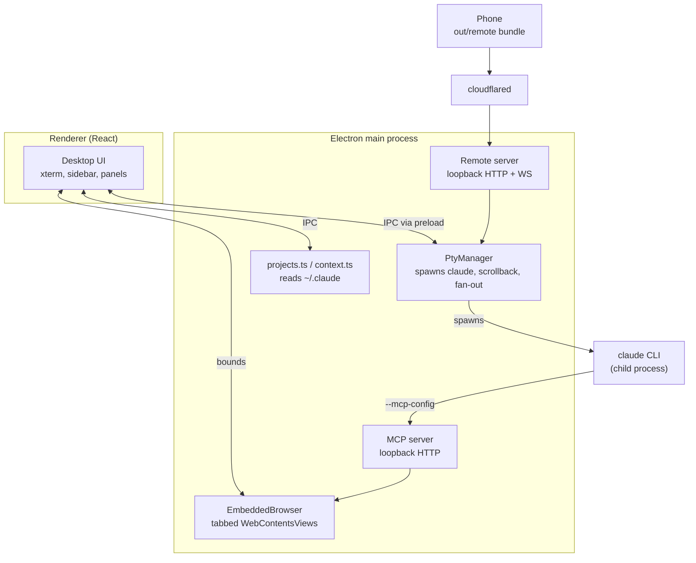

# Stoke architecture

How the whole thing fits together, and why it is built this way. [CLAUDE.md](CLAUDE.md) is
the short version; this is the reference.

## The central decision

Stoke drives the **real `claude` CLI inside a pseudo-terminal**. It does not talk to the
Anthropic API, and it does not use the Agent SDK.

That choice is what makes everything else work. Skills, MCP servers, plugins, hooks, slash
commands, permission prompts, the TUI's own rendering — all of it behaves exactly as it does
in a terminal, because it *is* a terminal. The cost is that Stoke cannot introspect the
conversation directly; it reads Claude Code's own files instead (see
[Reading Claude's state](#reading-claudes-state)).

## Processes

Three surfaces consume the same core: the desktop renderer over IPC, the CLI over MCP, and a
phone over HTTP/WebSocket.

## Sessions and the PTY

`src/main/pty.ts` owns every running session.

- `@lydell/node-pty` is used rather than `node-pty` because it ships **prebuilt N-API
  binaries for all six win/mac/linux × x64/arm64 targets**. There is no native compile step
  on either platform, which is the single biggest packaging simplification in the project.
- New sessions get a **generated `--session-id`**. That is what lets the context meter attach
  before the process has even written anything: the transcript path is known in advance.
- The environment is sanitised. See gotcha 1 in CLAUDE.md — this is not optional.
- Output is retained in a capped ring buffer *in main*, not only in the renderer, because a
  phone attaching to an hour-old session has no other way to see what happened.
- `subscribe()` fans output out to remote clients alongside the renderer.

`buildArgs()` in `cli.ts` maps Stoke's options onto CLI flags. Note that **`bypassPermissions`
maps to `--dangerously-skip-permissions`**, not `--permission-mode bypassPermissions`: the
latter requires the mode to already be enabled for the workspace.

Finding the executable matters more than it looks. On macOS a GUI app launched from Finder
does **not** inherit the login shell's PATH, so `cli.ts` asks the login shell for it once
(`$SHELL -ilc 'printf %s "$PATH"'`) and caches the result.

## Reading Claude's state

Stoke never writes to Claude Code's files. It reads:

| Source | Used for |
| --- | --- |
| `~/.claude.json` → `projects` | known project folders, last activity, last cost |
| `~/.claude/projects/<encoded-cwd>/<uuid>.jsonl` | sessions, titles, context usage |

The history directory name is the absolute cwd with every non-alphanumeric character replaced
by `-`. That encoding is **lossy**, so directories that cannot be matched back to a config
entry are resolved by reading `cwd` out of the transcript itself.

`~/.claude.json` can legitimately contain two keys differing only in case, so paths are always
compared case-folded on Windows.

### Transcript records

One JSON object per line. Types seen in practice: `mode`, `permission-mode`,
`file-history-snapshot`, `user`, `assistant`, `attachment`, `last-prompt`, `ai-title`,
`system`. Notably there are **no `summary` records** in current versions — do not depend on
them. `ai-title` gives free human-readable session titles.

### The context meter

Context in use is `input_tokens + cache_read_input_tokens + cache_creation_input_tokens` from
the most recent `assistant` record. These are overwritten, not accumulated: each turn's usage
already reports the full context being resent.

The window size is inferred from observed usage, not the model id — see gotcha 2. This was
wrong in the first implementation and reported 140–320% occupancy; `npm run verify:context`
exists because of it and asserts the invariant against real transcripts.

`ContextWatcher` polls rather than using `fs.watch`: transcripts are appended constantly,
append semantics differ across macOS and Windows, and only the handful of sessions with an
open tab are ever tracked.

## The docked browser

`src/main/browser.ts` runs tabbed `WebContentsView`s on a persistent partition
(`persist:stoke-browser`), so logins survive restarts.

Two structural points:

- **Views stay mounted and are merely hidden.** A detached view gets a 0×0 viewport and never
  lays out (gotcha 3).
- **Console and network capture uses Electron events and the `webRequest` API, not CDP.** Only
  one debugger client may attach at a time and that slot must stay free for DevTools. Network
  entries are routed back to their tab via `webContentsId`.

## Giving Claude the browser

This is the part worth understanding properly.

Stoke launches the CLI, so it **injects `--mcp-config`** pointing at an MCP server it runs
in-process. Every session automatically gets browser tools aimed at the pane the user is
watching — no install, no configuration.

- Transport is HTTP on loopback with an ephemeral port and a per-run bearer token.
- The config is written to a **file**, not passed as a JSON string on the command line:
  shell quoting of JSON differs per platform and fails silently.
- A fresh `McpServer` + transport is created per request (stateless mode). The tools close
  over the browser, so there is no session state worth keeping.

Because the browser shares the user's session, Claude can read authenticated dashboards a
cold headless browser cannot. That is the whole point, and it is also the risk: in Bypass mode
Claude can act in a browser holding live logins, and a hostile page can attempt prompt
injection. Documented in the README rather than hidden.

### Reading pages well

`src/main/mcp/inject/extract.js` runs inside the page and is deliberately dependency-free so
it can be injected as one string. It provides:

- **main-content extraction to markdown** — link-density scoring picks the article, and the
  walker preserves headings, lists, tables and code blocks
- **a ref-indexed interactive map** — only visible, actionable elements, each with a short
  stable ref so the agent clicks `e12` rather than a brittle selector
- **outline / section / find** for progressive disclosure on large pages
- **a content signature** the main process diffs

Two behaviours do most of the work for token cost:

1. **Actions return a diff, not the page.** After a click, re-sending a 95%-identical page is
   the dominant cost in a multi-step flow.
2. **Every read waits for the page to settle.** Reading a skeleton loader produces
   confidently wrong answers rather than obviously wrong ones.

Clicks dispatch a full pointer sequence, and typing goes through the prototype's native value
setter — React and Vue track input values internally and ignore a plain assignment.

## Remote access

`src/main/remote/server.ts` serves the mobile bundle plus a small API and a WebSocket that
attaches to a PTY, replaying its scrollback first.

- Binds to loopback. The intended deployment is a Cloudflare Tunnel pointing a hostname at
  it, so the machine **never opens an inbound port**.
- A bearer token is required regardless of Cloudflare Access. If the tunnel is up and the
  Access policy is misconfigured or removed, that token is the only thing between the
  internet and a shell. An opt-in mode additionally rejects anything lacking Access headers.
- **PTY resize from a phone is opt-in.** A phone resizing would reflow the desktop terminal
  under whoever is sitting at it, so by default the phone renders at the desktop's width and
  scrolls sideways.

The mobile UI (`src/remote/`) is a separate Vite build because it is a plain web app, not an
Electron surface. Input goes through a normal `<textarea>` rather than the terminal: typing
into an xterm on a soft keyboard is miserable and autocorrect fights the TUI. A key row
supplies `esc`, `tab`, arrows and `ctrl-c`, which phone keyboards lack.

## Renderer

React 19, hand-written CSS, no component library.

- Every colour is a CSS custom property written onto `:root`, so switching themes is one
  style write with no re-render. xterm gets its palette object separately.
- Terminals are **never unmounted** on tab switch, only hidden, or scrollback would be lost.
- `lib/ptyBus.ts` retains output per process and replays it on attach, which also makes the
  component safe under React StrictMode's double-mount.
- Shortcuts (`lib/shortcuts.ts`) use Cmd on macOS and **Ctrl+Shift** elsewhere, because bare
  `Ctrl+K`/`Ctrl+W`/`Ctrl+T` are readline bindings Claude Code's own prompt uses. Matching is
  on `event.code` so holding Shift does not break it.

## Build and packaging

`electron-vite` builds main, preload and renderer; a second plain `vite build` produces the
mobile bundle into `out/remote`. `build/icon.svg` is the icon source and `npm run icon`
rasterises it through Electron itself, avoiding an image toolchain.

Self-update uses `electron-updater` against GitHub releases, configured in the `publish` block
of `electron-builder.yml`. It only activates for a packaged app with a published release.

**macOS packages can only be built on macOS.** Windows can produce Windows and Linux
packages; a Mac can produce all three.

## Testing

`scripts/verify-context.mts` runs the real parser against the largest transcripts on the
machine and asserts the context maths, the window inference and the live watcher path. It is
wired into `npm run check`.

Beyond that, verification has been done by driving the running app over CDP — launching with
`--remote-debugging-port`, clicking through real flows and capturing screenshots. That is how
every bug listed in CLAUDE.md was found; all of them produced *empty or wrong output rather
than errors*, which is exactly the class a typecheck cannot catch.
