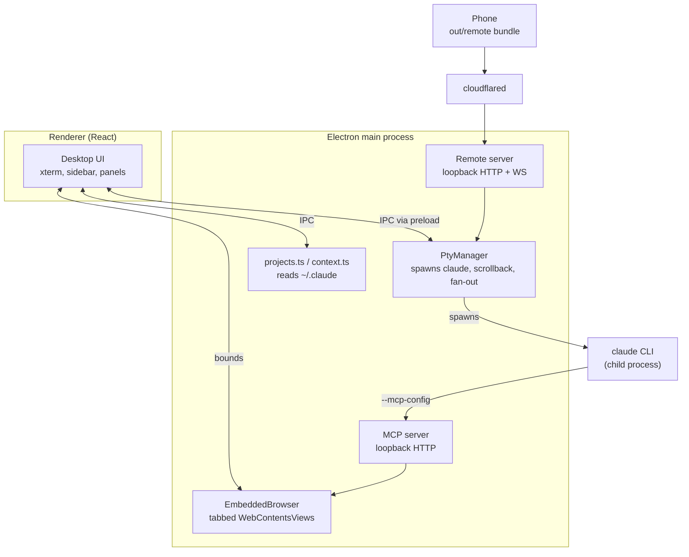

# Stoke architecture

How the whole thing fits together, and why it is built this way. [CLAUDE.md](CLAUDE.md) is
the short version; this is the reference.

## The central decision

Stoke drives the **real `claude` CLI inside a pseudo-terminal**. It does not talk to the
Anthropic API, and it does not use the Agent SDK.

That choice is what makes everything else work. Skills, MCP servers, plugins, hooks, slash
commands, permission prompts, the TUI's own rendering — all of it behaves exactly as it does
in a terminal, because it *is* a terminal. The cost is that Stoke cannot introspect the
conversation directly; it reads Claude Code's own files instead (see
[Reading Claude's state](#reading-claudes-state)).

## Processes

Three surfaces consume the same core: the desktop renderer over IPC, the CLI over MCP, and a
phone over HTTP/WebSocket.

## Sessions and the PTY

`src/main/pty.ts` owns every running session.

- `@lydell/node-pty` is used rather than `node-pty` because it ships **prebuilt N-API
  binaries for all six win/mac/linux × x64/arm64 targets**. There is no native compile step
  on either platform, which is the single biggest packaging simplification in the project.
- New sessions get a **generated `--session-id`**. That is what lets the context meter attach
  before the process has even written anything: the transcript path is known in advance.
- The environment is sanitised. See gotcha 1 in CLAUDE.md — this is not optional.
- Output is retained in a capped ring buffer *in main*, not only in the renderer, because a
  phone attaching to an hour-old session has no other way to see what happened.
- `subscribe()` fans output out to remote clients alongside the renderer.

`buildArgs()` in `cli.ts` maps Stoke's options onto CLI flags. Note that **`bypassPermissions`
maps to `--dangerously-skip-permissions`**, not `--permission-mode bypassPermissions`: the
latter requires the mode to already be enabled for the workspace.

Finding the executable matters more than it looks. On macOS a GUI app launched from Finder
does **not** inherit the login shell's PATH, so `cli.ts` asks the login shell for it once
(`$SHELL -ilc 'printf %s "$PATH"'`) and caches the result.

## Reading Claude's state

Stoke never writes to Claude Code's files. It reads:

| Source | Used for |
| --- | --- |
| `~/.claude.json` → `projects` | known project folders, last activity, last cost |
| `~/.claude/projects/<encoded-cwd>/<uuid>.jsonl` | sessions, titles, context usage |

The history directory name is the absolute cwd with every non-alphanumeric character replaced
by `-`. That encoding is **lossy**, so directories that cannot be matched back to a config
entry are resolved by reading `cwd` out of the transcript itself.

`~/.claude.json` can legitimately contain two keys differing only in case, so paths are always
compared case-folded on Windows.

### Transcript records

One JSON object per line. Types seen in practice: `mode`, `permission-mode`,
`file-history-snapshot`, `user`, `assistant`, `attachment`, `last-prompt`, `ai-title`,
`system`. Notably there are **no `summary` records** in current versions — do not depend on
them. `ai-title` gives free human-readable session titles.

### The context meter

Context in use is `input_tokens + cache_read_input_tokens + cache_creation_input_tokens` from
the most recent `assistant` record. These are overwritten, not accumulated: each turn's usage
already reports the full context being resent.

The window size is **stated**, not derived. Stoke installs its own `statusLine` command for the
sessions it spawns (`statusLine.ts`, folded into the one `--settings` file assembled at launch),
and the CLI pipes that command a JSON payload whose `context_window.context_window_size` is the
answer — per model, correct before a token is spent. The CLI's startup banner is the fallback
for older versions, and inferring the tier from observed usage is the fallback below that; see
gotcha 2. Inference alone was wrong in the first implementation and reported 140–320% occupancy,
which is why `npm run verify:context` exists and asserts the invariant against real transcripts.

That command, together with the `ultracode` key it shares a file with, is the only thing Stoke
puts into the session's `--settings` file — a separate mechanism from the `--mcp-config`
injection that hands the CLI its browser tools (below). Neither writes anything of Claude's: the
settings file, the wrapper and the payloads all live under the system temp directory, and
`~/.claude/settings.json` is read for the user's own status line and never modified.

`ContextWatcher` polls rather than using `fs.watch`: transcripts are appended constantly,
append semantics differ across macOS and Windows, and only the handful of sessions with an
open tab are ever tracked.

**One launch path gets no context ring at all: `--continue`.** The watcher depends on knowing
the session id before the process starts, which is why a new session is handed a `--session-id`
Stoke minted itself. `--continue` takes no id — the CLI picks one after launch — so `pty.ts`
resolves the id to the empty string, `ContextWatcher.watch('')` returns immediately rather than
starting a watch, and no `ctx:update` is ever emitted for that tab. Nor is there a
way to repair it later: `ctx:watch`, `ctx:unwatch` and `ctx:update` are the entire context
surface in `src/shared/ipc.ts`, and all three are keyed on an id the caller must already hold,
so a session id discovered after the fact has no channel to arrive on. `--resume` is unaffected,
because it is handed the id it is resuming. The session is not silent otherwise: it still gets a
statusLine wrapper, named after a random launch key instead of a session id, and still writes
payloads — which is why the plan-limit chip keeps working for it, since `refreshLastStatusLine`
reads those files by launch key and the rate limits in them are account-wide anyway. It is the
per-session reading, and only that, which is wired to nothing.

## The docked browser

`src/main/browser.ts` runs tabbed `WebContentsView`s on a persistent partition
(`persist:stoke-browser`), so logins survive restarts.

Two structural points:

- **Views stay mounted and are merely hidden.** A detached view gets a 0×0 viewport and never
  lays out (gotcha 3).
- **Console and network capture uses Electron events and the `webRequest` API, not CDP.** The
  reason is coverage, not availability: `webRequest` listens for the life of the session with
  no attach, no reload and no observer effect, so a page's very first request is captured — a
  debugger session opened on demand would already have missed it. Network entries are routed
  back to their tab via `webContentsId`.

CDP *is* used, just not for capture. `src/main/mcp/cdp.ts` opens a **short-lived session per
operation** rather than holding one open, because an attached debugger is not free — some
domains carry a stated cost for as long as they are enabled — and nothing here needs to observe
events between calls. Sessions are **serialised through one promise queue per `WebContents`**:
two tools running at once would otherwise race on attach and detach, and the loser either sees
"Debugger is already attached" or has the session pulled out from under it mid-command.
Three tools are built on it — `browser_design` (computed styles and geometry for
every laid-out node from a single `DOMSnapshot.captureSnapshot`), `browser_security` (the
`scriptParsed` replay that finds exposed source maps without issuing one extra request, plus
`Network.getAllCookies`) and `browser_perf` (`Profiler` and `CSS` coverage across a
cache-disabled reload). `browser_stack` is the exception: it runs its detection script through
`executeJavaScript` and touches CDP not at all.

This file and `browser.ts` both used to assert that only one debugger client may attach at a
time and that the slot had to stay free for DevTools, and every one of those capabilities was
written off on that basis. It is not true of Chromium, which supports several protocol clients
per target; probed directly on Electron 43, commands succeed while DevTools is open and a fresh
attach succeeds while it is open.

## Giving Claude the browser

This is the part worth understanding properly.

Stoke launches the CLI, so it **injects `--mcp-config`** pointing at an MCP server it runs
in-process. Every session automatically gets browser tools aimed at the pane the user is
watching — no install, no configuration.

- Transport is HTTP on loopback with an ephemeral port and a per-run bearer token.
- The config is written to a **file**, not passed as a JSON string on the command line:
  shell quoting of JSON differs per platform and fails silently.
- A fresh `McpServer` + transport is created per request (stateless mode). The tools close
  over the browser, so there is no session state worth keeping.

Because the browser shares the user's session, Claude can read authenticated dashboards a
cold headless browser cannot. That is the whole point, and it is also the risk: in Bypass mode
Claude can act in a browser holding live logins, and a hostile page can attempt prompt
injection. Documented in the README rather than hidden.

### Reading pages well

`src/main/mcp/inject/extract.js` runs inside the page and is deliberately dependency-free so
it can be injected as one string. It provides:

- **main-content extraction to markdown** — link-density scoring picks the article, and the
  walker preserves headings, lists, tables and code blocks
- **a ref-indexed interactive map** — only visible, actionable elements, each with a short
  stable ref so the agent clicks `e12` rather than a brittle selector
- **outline / section / find** for progressive disclosure on large pages
- **a content signature** the main process diffs

Two behaviours do most of the work for token cost:

1. **Actions return a diff, not the page.** After a click, re-sending a 95%-identical page is
   the dominant cost in a multi-step flow.
2. **Every read waits for the page to settle.** Reading a skeleton loader produces
   confidently wrong answers rather than obviously wrong ones.

Clicks dispatch a full pointer sequence, and typing goes through the prototype's native value
setter — React and Vue track input values internally and ignore a plain assignment.

## Remote access

`src/main/remote/server.ts` serves the mobile bundle plus a small API and a WebSocket that
attaches to a PTY, replaying its scrollback first.

- **Loopback by default**, and that is the intended deployment: a Cloudflare Tunnel pointing a
  hostname at it, with cloudflared running on this machine and dialling `127.0.0.1`, so nothing
  inbound is opened at all. Two shipped toggles do open a port, and both are off unless asked
  for. `bindLan` moves the listener to `0.0.0.0`, which is all-or-nothing — binding the LAN
  address alongside `127.0.0.1` would collide on the port — so it exposes Stoke to whatever
  network the machine is on. `bindTailscale` instead adds a *second* listener on the machine's
  own `100.64.0.0/10` address, so a phone on the tailnet reaches Stoke without the tunnel and
  nothing on the surrounding network can; it only applies when `bindLan` is off, since the
  `0.0.0.0` listener already covers the tailnet, and it is best effort, because Tailscale being
  absent or down must not take the whole remote server with it.
- **A bearer token is required on every path**, on every listener, regardless of Cloudflare
  Access. If the tunnel is up and the Access policy is misconfigured or removed, that token is
  the only thing between the internet and a shell.
- `requireAccessHeader` is the opt-in that additionally rejects anything arriving without
  Cloudflare Access headers. It is enforced on the loopback listener **and on the LAN one**, and
  deliberately not on the dedicated tailnet listener: a request that reached the machine over
  the tailnet did not come through the tunnel and so can never carry those headers, and
  enforcing it there would 401 every device on the VPN, WebSocket upgrade included. The
  exemption is decided by asking which listener accepted the connection — read off the socket's
  local address, so a header cannot forge it — rather than by inference. Two earlier attempts
  inferred it and were wrong in opposite directions, both silently: keying on "came in on
  loopback" also exempted the LAN, since `bindLan` collapses everything onto one `0.0.0.0`
  listener; adding a `!bindLan` guard then made the condition always true in the Tailscale
  configuration, so every tailnet request 401'd and the terminal simply never opened.
- **PTY resize from a phone is opt-in.** A phone resizing would reflow the desktop terminal
  under whoever is sitting at it, so by default the phone renders at the desktop's width and
  scrolls sideways.

The mobile UI (`src/remote/`) is a separate Vite build because it is a plain web app, not an
Electron surface. Input goes through a normal `<textarea>` rather than the terminal: typing
into an xterm on a soft keyboard is miserable and autocorrect fights the TUI. A key row
supplies `esc`, `tab`, arrows and `ctrl-c`, which phone keyboards lack.

## The worklog agent

`src/main/worklog/` turns finished work into Notion pages and ClickUp tasks. It is a **review
queue, not an auto-writer**: every run only ever proposes, and the sole code path that changes
anything outside Stoke is an accept the user pressed.

Four runs' worth of behaviour, and the ordering between them is the design:

1. **The gate** (`gate.ts`) decides whether a session may be looked at, keyed on the session's
   *own folder group* — never on the profile chip in the sidebar. The chip is a view filter, so
   keying off it would either skip a work session running in a background tab or hand a personal
   one to a work tracker. Both failures are silent.
2. **Auto-scan** (`autoscan.ts`) decides *when*. The signal is the transcript file: `ContextWatcher`
   already polls it at 1.5s for the context meter and already reports the message count and the
   mtime, which is exactly "how much work" and "when did it stop". So nothing new watches
   anything. A session is scanned once it has been quiet for two minutes, has at least six new
   messages *since Stoke started watching it*, and has not been scanned in the last twenty —
   with a ceiling of six scans an hour across everything. Closing a tab does not stop tracking:
   finishing and closing is the most natural end of a work block there is.
3. **Recall** (`recall.ts`) reads the boards before anything is proposed, so a job that is
   already tracked gets a status change instead of a near-duplicate beside it. This has to be
   its own run, because the scan is hermetic — `--safe-mode` plus an empty `--mcp-config` — and
   safe mode switches every MCP server off. It is read-only by an exact four-name allowlist, and
   cached with a TTL and a single-flight promise so two sessions scanned a second apart read the
   boards once. It also asks the *list* for its status vocabulary, not just the tasks: recall
   lists open records, so the states in use are precisely the ones a finished job does not need.
4. **The scan** (`runner.ts`) is handed a bounded digest of the transcript plus the recall
   block, and asked for entries. It never sees the repository: no cwd, no CLAUDE.md, no skills,
   no MCP, and Read/Glob/Grep denied — given a working directory a model that decides to go
   looking turns a fixed-price run into an open-ended one.

Two things are checked in code rather than asked for in the prompt, because both fail at
somebody else's API where the user can do nothing about it. An update naming an id recall never
returned is filed as a *create* instead and counted; a status the destination does not actually
offer is dropped, leaving a note-only update. Titles get the same treatment — every parsed title
goes through `tidyTitle`, which strips commit prefixes and markdown and caps the length, because
the title is the only part of a proposal the user reads before deciding.

Cost drove most of it. The probe that proved connector tools reach a headless run cost $0.50 for
one trivial prompt, because it defaulted to Opus against a large cached context. Everything here
is pinned to Sonnet with an explicit `--max-budget-usd`.

### Over SSH

An SSH session spawns `ssh -t <alias> <command>`, so `claude` runs on the far machine and writes
its transcript there. Everything above reads a local file, so none of it — nor the context meter —
had ever worked for a remote session.

`sshTranscript.ts` closes that by fetching the real JSONL back over the same connection. The
alternative was scraping the PTY stream, which Stoke does retain (512KB per session), and it is a
much worse signal: that stream is a recording of a *screen*, and Claude Code's TUI repaints as it
streams, so the same sentence arrives dozens of times interleaved with box drawing and none of
what matters — which tools ran, which subagents were spawned, how many tokens — is in it at all.

Three decisions are worth keeping:

- **The user's connect command is never modified.** Passing `--session-id` to the remote `claude`
  would correlate the session exactly, but a remote CLI that does not know the flag exits with an
  unknown-option error and the *terminal itself* breaks on every connection to that host. The
  newest transcript is asked for instead, and the path it came from is reported so the user can
  see which. Two Claude sessions on one host at once cannot be told apart; that is the price.
- **The gate is per host**, not per folder. A remote session's `cwd` is wherever Stoke was pointed
  locally, so the folder gate would match the wrong project or none. `SshHost.worklog` is the
  switch, and the true working directory is read out of the fetched transcript.
- **An unchanged transcript is not rewritten.** Every reader decides "has anything happened?" from
  the cache file's mtime, and auto-scan measures how long a session has been *quiet* from it.
  Rewriting an identical file each poll would move that forward forever, and a remote session
  would never once look idle — the feature would appear to work and silently never fire.

The fetch is routed through `ContextWatcher` rather than beside it, so one poller serves both:
the meter starts reading for SSH sessions, and the auto-scan trigger, which is fed from those same
snapshots, starts firing for them. Remote sessions poll at 30s rather than 1.5s, because it is a
network round trip rather than a `stat`.

The queue (`queue.ts`) is the safety property. Rejections are kept as tombstones rather than
deleted, so "no, don't log that" is permanent — and because proposal ids are the sha1 of the
dedupe key, updates were given their own key shape so the `create` key could stay byte-for-byte
what it was and no old rejection could come back.

## Renderer

React 19, hand-written CSS, no component library.

- Every colour is a CSS custom property written onto `:root`, so switching themes is one
  style write with no re-render. xterm gets its palette object separately.
- Terminals are **never unmounted** on tab switch, only hidden, or scrollback would be lost.
- `lib/ptyBus.ts` retains output per process and replays it on attach, which also makes the
  component safe under React StrictMode's double-mount.
- Shortcuts (`lib/shortcuts.ts`) use Cmd on macOS and **Ctrl+Shift** elsewhere, because bare
  `Ctrl+K`/`Ctrl+W`/`Ctrl+T` are readline bindings Claude Code's own prompt uses. Matching is
  on `event.code` so holding Shift does not break it.

## Build and packaging

`electron-vite` builds main, preload and renderer; a second plain `vite build` produces the
mobile bundle into `out/remote`. `build/icon.svg` is the icon source and `npm run icon`
rasterises it through Electron itself, avoiding an image toolchain.

Self-update uses `electron-updater` against GitHub releases, configured in the `publish` block
of `electron-builder.yml`. It only activates for a packaged app with a published release.

**macOS packages can only be built on macOS**, and the Windows NSIS installer needs Windows,
so neither installer can be produced on the other's machine. That is what
`.github/workflows/release.yml` exists for: a pushed tag fans out to a `windows-latest` and a
`macos-14` runner, and one later job creates the release from both sets of artifacts.

There is **no Linux build**. `electron-builder.yml` declares an `AppImage` target, but nothing
invokes it — there is no `dist:linux` script and no CI job passes `--linux` — so no Linux
package has ever been produced or shipped. Treat that target as a starting point for whoever
wants one, not as a supported output.

## Testing

Verification lives in `scripts/`, one `verify-*` suite per subject — eighteen of them now.
Sixteen are `.mts`, run straight through node's type-stripping with no build step, and those
sixteen are exactly what `npm run check` runs between the typecheck and the full build; `check`
is the gate, and it is what "done" means here. Between them they cover the context maths, the
statusLine payload and the plan limits read out of it, settings hydration, folder metadata,
profile resolution, colour and contrast, terminal cell widths, tab selection after a close, the
ssh argv and remote transcript fetch, the updater's error handling, and five separate suites for
the worklog. Each runs alone; `CLAUDE.md` is where the per-suite descriptions live.

The other two are `.mjs` and want a live instance rather than a fixture, which is why `check`
cannot run them: `verify:extract` drives the page extractor through Stoke's own MCP endpoint,
and `verify:security` is pointed at a running remote server with a URL and a token. CI leaves
out two more of its own — fourteen suites run there — for reasons written into
`.github/workflows/release.yml`. `verify:ssh` fails on a modern OpenSSH, which rejects the
suite's two-word host-alias fixture; pre-existing, and unrelated to any release. And
**`verify:context` deliberately reads the real transcripts under `~/.claude/projects`**: that is
the reason it exists, not an oversight. It asserts the context maths, the window inference and
the live watcher path against actual sessions on the machine, so on a clean runner the directory
is simply not there and the suite throws. Teaching it to synthesise its own fixtures would
delete the only thing it is for, so it runs on a developer's machine and is skipped in CI.

Beyond that, verification has been done by driving the running app over CDP — launching with
`--remote-debugging-port`, clicking through real flows and capturing screenshots. That is how
every bug listed in CLAUDE.md was found; all of them produced *empty or wrong output rather
than errors*, which is exactly the class a typecheck cannot catch.
