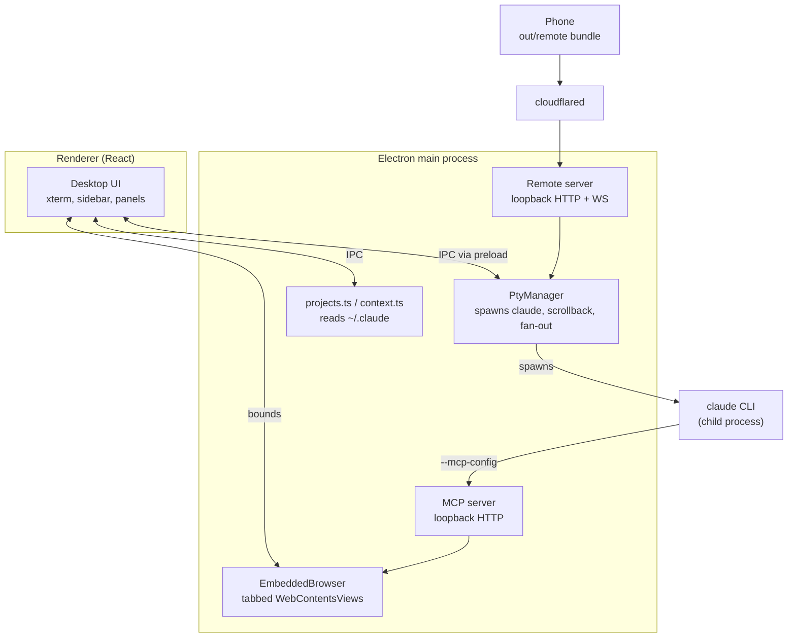

# Stoke architecture

How the whole thing fits together, and why it is built this way. [CLAUDE.md](CLAUDE.md) is
the short version; this is the reference.

## The central decision

Stoke drives the **real `claude` CLI inside a pseudo-terminal**. It does not talk to the
Anthropic API, and it does not use the Agent SDK.

That choice is what makes everything else work. Skills, MCP servers, plugins, hooks, slash
commands, permission prompts, the TUI's own rendering — all of it behaves exactly as it does
in a terminal, because it *is* a terminal. The cost is that Stoke cannot introspect the
conversation directly; it reads Claude Code's own files instead (see
[Reading Claude's state](#reading-claudes-state)).

## Processes


```mermaid
flowchart TB
  subgraph main["Electron main process"]
    pty["PtyManager<br/>spawns claude, scrollback, fan-out"]
    proj["projects.ts / context.ts<br/>reads ~/.claude"]
    br["EmbeddedBrowser<br/>tabbed WebContentsViews"]
    mcpsrv["MCP server<br/>loopback HTTP"]
    rem["Remote server<br/>loopback HTTP + WS"]
  end

  subgraph renderer["Renderer (React)"]
    ui["Desktop UI<br/>xterm, sidebar, panels"]
  end

  cli["claude CLI<br/>(child process)"]
  phone["Phone<br/>out/remote bundle"]
  cf["cloudflared"]

  ui <-->|IPC via preload| pty
  ui <-->|IPC| proj
  pty -->|spawns| cli
  cli -->|--mcp-config| mcpsrv
  mcpsrv --> br
  ui <-->|bounds| br
  rem --> pty
  cf --> rem
  phone --> cf
```

Three surfaces consume the same core: the desktop renderer over IPC, the CLI over MCP, and a
phone over HTTP/WebSocket.

## Sessions and the PTY

`src/main/pty.ts` owns every running session.

- `@lydell/node-pty` is used rather than `node-pty` because it ships **prebuilt N-API
  binaries for all six win/mac/linux × x64/arm64 targets**. There is no native compile step
  on either platform, which is the single biggest packaging simplification in the project.
- New sessions get a **generated `--session-id`**. That is what lets the context meter attach
  before the process has even written anything: the transcript path is known in advance.
- The environment is sanitised. See gotcha 1 in CLAUDE.md — this is not optional.
- Output is retained in a capped ring buffer *in main*, not only in the renderer, because a
  phone attaching to an hour-old session has no other way to see what happened.
- `subscribe()` fans output out to remote clients alongside the renderer.

`buildArgs()` in `cli.ts` maps Stoke's options onto CLI flags. Note that **`bypassPermissions`
maps to `--dangerously-skip-permissions`**, not `--permission-mode bypassPermissions`: the
latter requires the mode to already be enabled for the workspace.

**A session's id is not fixed for the life of its process.** `/clear` mints a new one, the
in-TUI `/resume` switches to another, and a `--continue` learns its id only after launch. The
CLI's own registry, `<config dir>/sessions/<pid>.json`, states the id the process is on now,
whether a turn is running (`busy`/`shell`/`waiting`/`idle`) and the binary's version.
`sessionRegistry.ts` reads it once a second for every live local Claude pty; a changed id is
a rebind (`rebindSession` in index.ts moves the context watcher and the worklog's address book
to it, and `session:rebind` moves the tab), and a changed state is pushed as `session:state`.
The statusLine files do NOT move: they belong to the launch (gotcha 73), so a reader holding a
session id finds them through `payloadKeyFor`. Gotcha 80.

Relaunching a session (the pill, onto a newer CLI) asks first when a turn is running — Force
restart, Wait, Cancel — waits for the old process to exit before starting the new one, and lets
main pick `--resume` or `--session-id` against the disk (`resumeOrMint`), because `--resume` on
an id with no transcript exits 1. Gotchas 81 and 82.

Finding the executable matters more than it looks. On macOS a GUI app launched from Finder
does **not** inherit the login shell's PATH, so `cli.ts` asks the login shell for it once
(`$SHELL -ilc 'printf %s "$PATH"'`) and caches the result.

## Reading Claude's state

Stoke never writes to Claude Code's files. It reads:

| Source | Used for |
| --- | --- |
| `~/.claude.json` → `projects` | known project folders, last activity, last cost |
| `~/.claude/projects/<encoded-cwd>/<uuid>.jsonl` | sessions, titles, context usage |

The history directory name is the absolute cwd with every non-alphanumeric character replaced
by `-`. That encoding is **lossy**, so directories that cannot be matched back to a config
entry are resolved by reading `cwd` out of the transcript itself.

`~/.claude.json` can legitimately contain two keys differing only in case, so paths are always
compared case-folded on Windows.

### Transcript records

One JSON object per line. Types seen in practice: `mode`, `permission-mode`,
`file-history-snapshot`, `user`, `assistant`, `attachment`, `last-prompt`, `ai-title`,
`system`. Notably there are **no `summary` records** in current versions — do not depend on
them. `ai-title` gives free human-readable session titles.

### The context meter

Context in use is `input_tokens + cache_read_input_tokens + cache_creation_input_tokens` from
the most recent `assistant` record. These are overwritten, not accumulated: each turn's usage
already reports the full context being resent.

The window size is **stated**, not derived. Stoke installs its own `statusLine` command for the
sessions it spawns (`statusLine.ts`, folded into the one `--settings` file assembled at launch),
and the CLI pipes that command a JSON payload whose `context_window.context_window_size` is the
answer — per model, correct before a token is spent. The CLI's startup banner is the fallback
for older versions, and inferring the tier from observed usage is the fallback below that; see
gotcha 2. Inference alone was wrong in the first implementation and reported 140–320% occupancy,
which is why `npm run verify:context` exists and asserts the invariant against real transcripts.

That command, together with the `ultracode` key it shares a file with, is the only thing Stoke
puts into the session's `--settings` file — a separate mechanism from the `--mcp-config`
injection that hands the CLI its browser tools (below). Neither writes anything of Claude's: the
settings file, the wrapper and the payloads all live under the system temp directory, and
`~/.claude/settings.json` is read for the user's own status line and never modified. With the
line suppressed (the default) the wrapper prints one SGR reset, `EMPTY_STATUS_LINE`, never an
empty stdout: the CLI lays its footer out by whether a status line is configured, and pads an
empty one into a blank row under the input box in its fullscreen renderer (gotcha 118).

`ContextWatcher` polls rather than using `fs.watch`: transcripts are appended constantly,
append semantics differ across macOS and Windows, and only the handful of sessions with an
open tab are ever tracked. A poll reads only what was appended since the last one: parsing a
whole 16-22 MB transcript on every changed tick held the main process 40-130 ms at a time, and
every pty byte and keystroke waited behind it (gotcha 103).

**One launch path gets no context ring at all: `--continue`.** The watcher depends on knowing
the session id before the process starts, which is why a new session is handed a `--session-id`
Stoke minted itself. `--continue` takes no id — the CLI picks one after launch — so `pty.ts`
resolves the id to the empty string, `ContextWatcher.watch('')` returns immediately rather than
starting a watch, and no `ctx:update` is ever emitted for that tab. Nor is there a
way to repair it later: `ctx:watch`, `ctx:unwatch` and `ctx:update` are the entire context
surface in `src/shared/ipc.ts`, and all three are keyed on an id the caller must already hold,
so a session id discovered after the fact has no channel to arrive on. `--resume` is unaffected,
because it is handed the id it is resuming. The session is not silent otherwise: it still gets a
statusLine wrapper, named after a random launch key instead of a session id, and still writes
payloads — which is why the plan-limit chip keeps working for it, since `refreshLastStatusLine`
reads those files by launch key and the rate limits in them are account-wide anyway. It is the
per-session reading, and only that, which is wired to nothing.

## The docked browser

`src/main/browser.ts` runs tabbed `WebContentsView`s on a persistent partition
(`persist:stoke-browser`), so logins survive restarts.

Two structural points:

- **Views stay mounted and are merely hidden.** A detached view gets a 0×0 viewport and never
  lays out (gotcha 3).
- **Console and network capture uses Electron events and the `webRequest` API, not CDP.** The
  reason is coverage, not availability: `webRequest` listens for the life of the session with
  no attach, no reload and no observer effect, so a page's very first request is captured — a
  debugger session opened on demand would already have missed it. Network entries are routed
  back to their tab via `webContentsId`.

CDP *is* used, just not for capture. `src/main/mcp/cdp.ts` opens a **short-lived session per
operation** rather than holding one open, because an attached debugger is not free — some
domains carry a stated cost for as long as they are enabled — and nothing here needs to observe
events between calls. Sessions are **serialised through one promise queue per `WebContents`**:
two tools running at once would otherwise race on attach and detach, and the loser either sees
"Debugger is already attached" or has the session pulled out from under it mid-command.
Three tools are built on it — `browser_design` (computed styles and geometry for
every laid-out node from a single `DOMSnapshot.captureSnapshot`), `browser_security` (the
`scriptParsed` replay that finds exposed source maps without issuing one extra request, plus
`Network.getAllCookies`) and `browser_perf` (`Profiler` and `CSS` coverage across a
cache-disabled reload). `browser_stack` is the exception: it runs its detection script through
`executeJavaScript` and touches CDP not at all.

This file and `browser.ts` both used to assert that only one debugger client may attach at a
time and that the slot had to stay free for DevTools, and every one of those capabilities was
written off on that basis. It is not true of Chromium, which supports several protocol clients
per target; probed directly on Electron 43, commands succeed while DevTools is open and a fresh
attach succeeds while it is open.

## Giving Claude the browser

This is the part worth understanding properly.

Stoke launches the CLI, so it **injects `--mcp-config`** pointing at an MCP server it runs
in-process. Every session automatically gets browser tools aimed at the pane the user is
watching — no install, no configuration.

- Transport is HTTP on loopback with an ephemeral port and a per-run bearer token.
- The config is written to a **file**, not passed as a JSON string on the command line:
  shell quoting of JSON differs per platform and fails silently.
- A fresh `McpServer` + transport is created per request (stateless mode). The tools close
  over the browser, so there is no session state worth keeping.

Because the browser shares the user's session, Claude can read authenticated dashboards a
cold headless browser cannot. That is the whole point, and it is also the risk: in Bypass mode
Claude can act in a browser holding live logins, and a hostile page can attempt prompt
injection. Documented in the README rather than hidden.

### Reading pages well

`src/main/mcp/inject/extract.js` runs inside the page and is deliberately dependency-free so
it can be injected as one string. It provides:

- **main-content extraction to markdown** — link-density scoring picks the article, and the
  walker preserves headings, lists, tables and code blocks
- **a ref-indexed interactive map** — only visible, actionable elements, each with a short
  stable ref so the agent clicks `e12` rather than a brittle selector
- **outline / section / find** for progressive disclosure on large pages
- **a content signature** the main process diffs

Two behaviours do most of the work for token cost:

1. **Actions return a diff, not the page.** After a click, re-sending a 95%-identical page is
   the dominant cost in a multi-step flow.
2. **Every read waits for the page to settle.** Reading a skeleton loader produces
   confidently wrong answers rather than obviously wrong ones.

Clicks dispatch a full pointer sequence, and typing goes through the prototype's native value
setter — React and Vue track input values internally and ignore a plain assignment.

## Secrets at rest, and the setup file

Phase 1 of the auth-hub design (`docs/superpowers/specs/2026-09-30-auth-hub-design.md` §16): no
account, no server.

**Where keys live.** Through 0.9.97 every key Stoke held sat in plain text in
`<userData>/settings.json`: `providers.{anthropicApiKey, openrouterApiKey, customAuthToken}`,
`agents.endpoints[*].apiKey`, and `remote.token` — the phone bearer, which grants a shell (and
now `voice.keys.*`, one speech-to-text key per provider). They
now live in `<userData>/secrets.json` (mode 0600) as `{ v: 1, backend, items: { <settings path>:
base64(safeStorage ciphertext) } }`, and settings.json keeps an empty string in each place.
`src/shared/secrets.ts` holds `SECRET_PATHS`, the one registry of secret paths (`*` matches one
object key), and the pure move between a settings object and a `{ path: value }` map; a later
secret (a speech-to-text key, per-account keys) is one line there. `src/main/secrets.ts`
(`SecretStore`, no electron import) does the sealing. `store.ts` keeps WHEN a write happens
(coalescing, gotcha 63) and hands every write to `SecretStore.save`, which writes secrets.json
first and only when a key moved, then settings.json scrubbed. `hydrateSettings` stays pure:
`load` overlays the decrypted values onto the parsed file before hydrate sees it, so the cache,
every IPC answer and the renderer see the keys exactly as before. Each sealed value carries its
path (`sealedText`): macOS `safeStorage` is AES-CBC with no MAC, and the prefix turns a value
opened with the wrong key into a refusal rather than garbage.

**The migration** runs once per boot, first thing in `whenReady` (`initSecretStore`; `safeStorage`
is not usable before `ready` on Windows and Linux): plaintext in settings.json is sealed, the
vault is read back and every item opened, and only then is settings.json scrubbed and any
`settings.json.tmp` removed. Idempotent — a clean profile writes nothing. Plaintext wins over the
vault, being the newer write. The key store is asked only when there is something to seal or
open, so a profile with no keys never touches the Keychain.

**No lock-outs.** Protection is judged by `judgeProtection`: the Keychain and DPAPI count, and on
Linux libsecret and KWallet do; Linux's `basic_text` (no Secret Service, common under tiling WMs)
encrypts with a password hardcoded in Chromium and does NOT count. An unprotected run keeps the
old behaviour exactly — plaintext settings.json — and Settings › Backup & transfer says so. An
item that will not open (another key store, a recreated Keychain item) is kept verbatim and
listed as stranded; re-entering the key replaces it. A key store that refuses mid-run demotes
that run to plaintext rather than drop the key just typed. A secrets.json write that FAILS
(ENOSPC; on Windows an EPERM/EBUSY rename while antivirus holds the file) commits nothing — `save`
compares against what the vault holds on disk, so the next write of any setting retries it — and
meanwhile keeps the changed key, and only that one, in settings.json in plain text, which a boot in
between migrates in; Settings names the failure (`vaultWriteError`) until a write lands.

**Downgrade.** A build from before this reads settings.json only, so it sees every key as empty:
API-key sessions refuse to start and Phone access mints a new key (the phone needs the new QR).
secrets.json is untouched by it, and a key typed into the older build is plaintext the next boot
of this build migrates in.

**The setup file** (`.stoke-setup`, Settings › Backup & transfer) is one JSON object:
`{ format: "stoke-setup", v: 1, kdf: { alg: "scrypt", N: 131072, r: 8, p: 1, salt }, aead:
"AES-256-GCM", nonce, ciphertext }`, the tag appended to the ciphertext and the header bound as
AAD. node:crypto only (`src/main/setupFile.ts`); scrypt at those parameters takes ~0.5 s in
Electron 43, measured, off the main thread. The KDF bounds are checked before any key is
derived, so a crafted header cannot ask for gigabytes. What travels is decided in
`src/shared/setupFile.ts`: `PORTABLE_KEYS` whole, `PARTIAL_KEYS` in part, `LOCAL_KEYS` never
(folders and projectMeta, `claudePath`, `remote`, `uiScale`, `sidebarWidth`, `activeProfile`,
`welcomeSeenVersion`, the wallpaper file, browser partitions and window state); verify:secrets
holds the three lists to a partition of every setting. Keys travel only when ticked, and never
the phone key. Hosts travel without `keyEnrolled` (a fact about this device's key). Import is
pick → preview → apply with the decrypted payload held in main throughout; `planImport` merges
field by field (hosts, themes and profiles by id, bookmarks as a union), runs the result through
`hydrateSettings`, and previews exactly what would be stored. A synced `bypassPermissions` is not
applied. Driven sandboxes answer the native dialogs with `STOKE_TEST_SETUP_FILE` (unpackaged
only), and should pass `--use-mock-keychain`, which Electron 43 honours: safeStorage then works
with no Keychain item created or read.

Not done here, on purpose: the `nodeCliInspect`/`nodeOptions` fuses (design §6.7). The
statusLine shim runs as node (`runAsNode`, gotcha 108), and only a packaged build can prove a fuse
change safe.

## Stoke Hub (sync and remote between the owner's devices)

Phases 2+ of the auth-hub plan, re-planned self-hosted first:
`docs/superpowers/specs/2026-10-01-stoke-hub-selfhosted.md`. One small Node 24 service on the
owner's NUC, reached as `https://stoke.vinn.dev/hub` through a separate edge Worker on the route
`stoke.vinn.dev/hub/*` (the installer Worker is untouched) and a Cloudflare Tunnel, or directly on
the LAN/tailnet. Email + password sign-in that opens nothing; per-device Ed25519/X25519 keys; a
signed device list the hub cannot extend; a vault key per epoch; items sealed under opaque ids;
pairing by a six-digit code both screens show; a Recovery Kit; relays carrying the phone API
end-to-end encrypted between two devices, authorised on the host.

The CONTRACT is `src/shared/hub/` (pure, both tsconfigs) and the node:crypto reference
`src/main/hub/crypto.ts`, which imports only `node:crypto` and `src/shared` so the hub server can
import it as is. `verify:hub` runs them against each other and pins test vectors over every label
and byte layout — a changed label would strand every wrap and item already on a hub, so it must
fail there first.

The SERVER is `hub/`: a Node 24 service on `node:http`, `node:sqlite` (one WAL file,
`synchronous = FULL`: a chain append the hub acknowledged and then lost to a power cut would look,
to every device that pinned it, exactly like a rollback attack) and `ws`, runnable from source
under strip-types (`npm run hub`) or as one bundled file (`npm run build:hub` ->
`hub/dist/stoke-hub.mjs`, what the NUC runs). Two listeners: the EDGE one on loopback, which
cloudflared targets and which demands the Worker's shared secret on every request, and an optional
LAN one that asks for none and refuses anything carrying Cloudflare's headers. It runs the
contract's own rules rather than trusting clients (`verifyChain` on every append, `putVerdict` on
every put, the pairing commitment), counts a device ACTIVE only when the chain lists its id WITH
the key it signed in with (gotcha 140), takes every claim before its one await (scrypt), and relays
frames between two sockets of one account without parsing them. The hub is reached publicly
through a second Worker, `worker/hub-edge.ts`, on the route `stoke.vinn.dev/hub/*`; the installer
Worker is not changed. The runbook for the NUC is `hub/README.md`.

The CLIENT is `src/main/hub/` beside the reference crypto, loaded lazily (gotcha 40) the first
time Settings › Account & sync asks, or 4 s after a boot with a hub configured. `service.ts` is the
order things happen in: sign-in (an active device proves its sign-in by signature, spec §3.3), the
vault's genesis only after the Recovery Kit is typed back, joining by the six digits (confirmed on
BOTH screens: the joining device takes nothing until the owner presses "The codes match" there) or
by the Kit (which is replaced in the same append, `postRecovery`), a sync pass (verify and pin the
chain, count this device in only where the chain holds its own ANCHOR — the entry it joined
through — take any new vault key only as the chain's `vk` commitment vouches for it, read the change
feed and apply only what is sealed under the current epoch, hold anything that would change what
runs here until the owner applies it on this computer, give new hosts sync ids, upload), SSH keys
shared one at a time and installed by a press, rename (`acct/pref/device-names`), revoke with
re-seal and prune, presence hints, and sign-out. One queue for every hub step; every action claims
before its first await. The rules it follows are pure in `src/shared/hub/client.ts` (what each tier
offers, the pass plan, conflict notes, where a received key lands, the panel's view);
`files.ts` keeps `hub-device.json` and `hub-state.json` (0600, every secret sealed by safeStorage,
no vault key where the key store protects nothing); `sshKeys.ts` lists key pairs by their `.pub`,
reads one private key when it is shared, and writes a received one with `wx` at 0600, appending
an IdentityFile block (checked with `ssh -G -F` when the config is not the passwd home's). The
session never reaches Settings or the renderer; `settings.hub` has one writer, the service, and
`commitSettings` drops a renderer patch's copy. Revoking needs the Recovery Kit (or makes a new
one): the hub demands the Kit's wrap of every new epoch, and a device that kept the Kit's wrap key
could open every later key from a pending session with the password (gotcha 141) — so a device that
has had the current Kit in hand (`kitHandlers`: made it, joined with it, or had it typed to remove
another) is removed only with a new Kit. A hub gone back in time is republished to from a device
(§7.3), and only over a list that is an earlier copy of the device's own (`isPrefixOf`); the pin and
the anchor go only with sign-out. Every walk of the change feed is paged and bounded (`feedStep`),
and every answer is read under a 16 MiB cap. Still to build: the relay's host and guest sides (spec
H3), and `SshReach` on T3 hosts.

## Remote access

`src/main/remote/server.ts` serves the mobile bundle plus a small API and a WebSocket that
attaches to a PTY, replaying its scrollback first.

- **Loopback by default**, and that is the intended deployment: a Cloudflare Tunnel pointing a
  hostname at it, with cloudflared running on this machine and dialling `127.0.0.1`, so nothing
  inbound is opened at all. Two shipped toggles do open a port, and both are off unless asked
  for. `bindLan` moves the listener to `0.0.0.0`, which is all-or-nothing — binding the LAN
  address alongside `127.0.0.1` would collide on the port — so it exposes Stoke to whatever
  network the machine is on. `bindTailscale` instead adds a *second* listener on the machine's
  own `100.64.0.0/10` address, so a phone on the tailnet reaches Stoke without the tunnel and
  nothing on the surrounding network can; it only applies when `bindLan` is off, since the
  `0.0.0.0` listener already covers the tailnet, and it is best effort, because Tailscale being
  absent or down must not take the whole remote server with it.
- **A bearer token is required on every path**, on every listener, regardless of Cloudflare
  Access. If the tunnel is up and the Access policy is misconfigured or removed, that token is
  the only thing between the internet and a shell.
- `requireAccessHeader` is the opt-in that additionally requires Cloudflare Access. With
  `accessTeamDomain` and `accessAud` set it **verifies** `Cf-Access-Jwt-Assertion`
  (`remote/accessJwt.ts`, gotcha 124): RS256 only, signed by a key from
  `https://<team>/cdn-cgi/access/certs` looked up by `kid`, `iss` equal to `https://<team>`,
  `aud` containing the AUD tag, `exp` required and `nbf`/`iat` checked, 60 s of leeway. It fails
  closed — a missing, forged or expired token is refused, and so is every request while the keys
  cannot be fetched — and the unsigned `Cf-Access-Authenticated-User-Email` counts for nothing.
  An Access refusal is **403** with `{error, refused: 'access'}` (`remoteRefusal`,
  `RemoteAuthVerdict`), never the key's 401: the phone reads every 401 as "your key was replaced",
  so a stale AUD, an unreachable JWKS or a skewed clock sent people to re-scan a key that worked.
  The phone shows the computer's sentence (`accessRefusalForPhone`) instead, and `?k=` still sets
  the cookie when the key matched and only Access refused, so the next call hears that reason.
  The bearer key is checked first, so a keyless request never reaches the verifier or causes a
  fetch. `AccessKeySet` holds one fetch in flight, refetches for an unknown `kid` at most every
  30 s, retries an empty cache every 5 s, and keeps a last-good set through an outage for a day.
  The team and AUD come from Settings › Phone access's **Look it up** (`discoverAccess`): a
  browser-shaped request to the hostname, whose Access login redirect names the team and carries
  the AUD as `kid` plus a `meta` JWT the team signed — trusted only once that signature and its
  `hostname` check out — or from the two fields, pasted from Zero Trust. A settings file with
  Access on and either field empty keeps the old PRESENCE check (anything that reaches the port
  can add the header), reported as `access.mode: 'presence-only'` and said in amber beside Look it
  up; turning the box on from off looks them up first. `STOKE_ACCESS_CERTS_URL` points an
  unpackaged run at a loopback JWKS, which is how `verify:security --access-configured` runs.
  It is enforced on the loopback listener **and on the LAN one**, and
  deliberately not on the dedicated tailnet listener: a request that reached the machine over
  the tailnet did not come through the tunnel and so can never carry those headers, and
  enforcing it there would 401 every device on the VPN, WebSocket upgrade included. The
  exemption is decided by asking which listener accepted the connection — read off the socket's
  local address, so a header cannot forge it — rather than by inference. Two earlier attempts
  inferred it and were wrong in opposite directions, both silently: keying on "came in on
  loopback" also exempted the LAN, since `bindLan` collapses everything onto one `0.0.0.0`
  listener; adding a `!bindLan` guard then made the condition always true in the Tailscale
  configuration, so every tailnet request 401'd and the terminal simply never opened.
- **The link says how it gets there.** `link.ts`'s `connectTarget` returns a `reach` beside the
  URL — a running tunnel, the configured hostname, the tailnet address, the best LAN address,
  and last `loopback`, which is reported as such so no surface ever draws a QR code of
  127.0.0.1. `remote:openOnPhone` is the one-press path: it picks the tailnet when Tailscale is
  up and the LAN otherwise, mints a key if there is none, starts, and pushes `settingsChanged`.
  A running server is restarted from the `settings:set` handler when a bound field changes.
- **Dictation is proxied, and its provider is read per clip.** `/api/transcribe` hands the
  phone's WAV to `RemoteDeps.transcribe`, which calls `stt.ts` with `sttConfigOf(voice)`
  (Settings → Voice) as it stands now — the sidecar, a custom server, or a hosted provider
  whose key only main holds; the phone never sees it. The server's own config, captured at
  start, holds nothing about speech: it used to hold the address, and since the speech server
  is not a bound field the phone kept the old one until Phone access was turned off and on.
  `/api/host`'s `stt` is `sttReadiness`: a server is probed, a hosted provider is `ready` with a
  key and `off` without — never a paid call.
- **The phone reflows the desktop terminal by default, and puts it back.** `Fit` is on unless
  the user turned it off, so opening a session from a phone fits the PTY to the phone's screen
  and the desktop's xterm follows. The server remembers the desktop's own size the first time a
  phone resizes a pty and restores it when the last phone detaches. (This used to say resize was
  opt-in; it has defaulted to on since the first visit stopped rendering a tiny grid in a corner.)
- **The phone paints the desktop's theme.** `GET /api/theme` serves the resolved theme and the
  terminal font; the mobile bundle writes the tokens onto `:root` and hands xterm the same
  sixteen ANSI slots the desktop uses. The stylesheet's Ember copy paints one frame at most.
- **A phone starts where the desktop's switcher would.** New session offers `folderChoices` —
  recent projects, the default folder, a scratch folder, SSH hosts (named by id; main looks the
  host up) — plus Browse, which walks folders and creates one. Browse and New folder reach only
  project roots, the default folder and the folders holding known projects, judged on the
  realpath and never shallower than two folders (`remoteFolderVerdict`, gotcha 121); a folder
  picked there is added as a project first, so the start itself still passes `knownCwd`.
- **A dropped socket comes back.** iOS Safari drops a WebSocket seconds after backgrounding; the
  phone reconnects with backoff and on `visibilitychange`, resetting the terminal before the
  server's history replay lands.

The mobile UI (`src/remote/`) is a separate Vite build because it is a plain web app, not an
Electron surface. Input goes through a normal `<textarea>` rather than the terminal: typing
into an xterm on a soft keyboard is miserable and autocorrect fights the TUI. A key row
supplies `esc`, `tab`, arrows and `ctrl-c`, which phone keyboards lack; it comes out while the
composer has focus, and otherwise waits behind one toggle (`keyRowShown`).

It is an installable PWA shell: a manifest, and a service worker (`public/sw.js`) registered only
in a secure context — the tunnel's https, or localhost; browsers refuse one on a plain-http LAN or
tailnet link, and that page runs as it always did. The worker caches the shell and the hashed
bundle so the app opens at once and paints Connect or "can't reach" with no network, and never
touches /api or /ws. It also takes Web Push (`notify.ts`, main's `remote/push.ts`): a content-free
"Needs you" or "Finished" on `pushFor`'s edges, sent only where the page is a secure context; the
phone re-sends its subscription at every start and sheet open, so the sheet's On is the computer's
answer rather than the browser's (gotcha 136).

## The worklog agent

`src/main/worklog/` turns finished work into Notion pages and ClickUp tasks. It is a **review
queue, not an auto-writer**: every run only ever proposes, and the sole code path that changes
anything outside Stoke is an accept the user pressed.

Four runs' worth of behaviour, and the ordering between them is the design:

1. **The gate** (`gate.ts`) decides whether a session may be looked at, keyed on the session's
   *own folder group* — never on the profile chip in the sidebar. The chip is a view filter, so
   keying off it would either skip a work session running in a background tab or hand a personal
   one to a work tracker. Both failures are silent.
2. **Auto-scan** (`autoscan.ts`) decides *when*. The signal is the transcript file: `ContextWatcher`
   already polls it at 1.5s for the context meter and already reports the message count and the
   mtime, which is exactly "how much work" and "when did it stop". So nothing new watches
   anything. A session is scanned once it has been quiet for two minutes, has at least six new
   messages *since Stoke started watching it*, and has not been scanned in the last twenty —
   with a ceiling of six scans an hour across everything. Closing a tab does not stop tracking:
   finishing and closing is the most natural end of a work block there is.
3. **Recall** (`recall.ts`) reads the boards before anything is proposed, so a job that is
   already tracked gets a status change instead of a near-duplicate beside it. This has to be
   its own run, because the scan is hermetic — `--safe-mode` plus an empty `--mcp-config` — and
   safe mode switches every MCP server off. It is read-only by an exact four-name allowlist, and
   cached with a TTL and a single-flight promise so two sessions scanned a second apart read the
   boards once. It also asks the *list* for its status vocabulary, not just the tasks: recall
   lists open records, so the states in use are precisely the ones a finished job does not need.
4. **The scan** (`runner.ts`) is handed a bounded digest of the transcript plus the recall
   block, and asked for entries. It never sees the repository: no cwd, no CLAUDE.md, no skills,
   no MCP, and Read/Glob/Grep denied — given a working directory a model that decides to go
   looking turns a fixed-price run into an open-ended one.

Two things are checked in code rather than asked for in the prompt, because both fail at
somebody else's API where the user can do nothing about it. An update naming an id recall never
returned is filed as a *create* instead and counted; a status the destination does not actually
offer is dropped, leaving a note-only update. Titles get the same treatment — every parsed title
goes through `tidyTitle`, which strips commit prefixes and markdown and caps the length, because
the title is the only part of a proposal the user reads before deciding.

Cost drove most of it. The probe that proved connector tools reach a headless run cost $0.50 for
one trivial prompt, because it defaulted to Opus against a large cached context. Everything here
is pinned to Sonnet with an explicit `--max-budget-usd`.

### Over SSH

An SSH session spawns `ssh -t <alias> <command>`, so `claude` runs on the far machine and writes
its transcript there. Everything above reads a local file, so none of it — nor the context meter —
had ever worked for a remote session.

`sshTranscript.ts` closes that by fetching the real JSONL back over the same connection. The
alternative was scraping the PTY stream, which Stoke does retain (512KB per session), and it is a
much worse signal: that stream is a recording of a *screen*, and Claude Code's TUI repaints as it
streams, so the same sentence arrives dozens of times interleaved with box drawing and none of
what matters — which tools ran, which subagents were spawned, how many tokens — is in it at all.

Three decisions are worth keeping:

- **The user's connect command is never modified.** Passing `--session-id` to the remote `claude`
  would correlate the session exactly, but a remote CLI that does not know the flag exits with an
  unknown-option error and the *terminal itself* breaks on every connection to that host. The
  newest transcript is asked for instead, and the path it came from is reported so the user can
  see which. Two Claude sessions on one host at once cannot be told apart; that is the price.
- **The gate is per host**, not per folder. A remote session's `cwd` is wherever Stoke was pointed
  locally, so the folder gate would match the wrong project or none. `SshHost.worklog` is the
  switch, and the true working directory is read out of the fetched transcript.
- **An unchanged transcript is not rewritten.** Every reader decides "has anything happened?" from
  the cache file's mtime, and auto-scan measures how long a session has been *quiet* from it.
  Rewriting an identical file each poll would move that forward forever, and a remote session
  would never once look idle — the feature would appear to work and silently never fire.

The fetch is routed through `ContextWatcher` rather than beside it, so one poller serves both:
the meter starts reading for SSH sessions, and the auto-scan trigger, which is fed from those same
snapshots, starts firing for them. Remote sessions poll at 30s rather than 1.5s, because it is a
network round trip rather than a `stat`.

That fetch is `BatchMode=yes`, so on a host that only takes a password it fails silently, every
poll. **Key login** is what fixes that, and it is the one SSH flow that needs the user's hands:
when a tab's ssh prints its password prompt (`sshAuthStep`, gotcha 75) a strip offers to set up
a key, and "Set up key login" in Settings > SSH hosts does the same without waiting for one. Main
(`sshEnroll.ts`) picks or makes the key and, when plain `ssh <alias>` would not offer it, appends
one `IdentityFile` block to `~/.ssh/config`; then `ssh-copy-id` runs in a visible "Add key to …"
tab, because ssh reads a password from its own terminal and nowhere else (gotcha 109). When that
tab exits, a `BatchMode` login probe with the tab's own identities decides `keyEnrolled`, and a
tab still sitting at ssh's own `password:` is reconnected — never one whose user already got in.
"Never got in" is a one-way watch over the session's whole life (`SshLoginWatch`), not the end of
its output: a logged-in shell that runs `su` or `ssh other` ends in the very same prompt shape.

**Kept sessions** (`SshHost.persist: 'tmux'`, on for new hosts) are what replaces byobu. Each tab
gets a name (`Tab.remoteSession`, `stoke-<8 hex>`, minted in `startHostSession`, saved in
`tabs.json`) and runs inside its own invisible tmux session on a private socket, so the shell
outlives the connection. The session has no status bar and no prefix key (`prefix None`), so every
key, Ctrl+B included, reaches the shell. ssh's keepalives end a dead link in about a minute with
exit 255, which reconnects the tab by itself with backoff (`reconnectDecision`); the run of tries
starts over only after a connection that got past auth — main's login watch, sent with the pty's
exit — and lasted, never on uptime alone. Resume, Start again and a restart reattach by the same
name; closing a kept tab asks Detach or End (`closeAsksDetach`), holding any pending reconnect while
it asks, and End is a BatchMode `kill-session`; the launcher's folder switcher asks each kept host
what is still running there. The screen stays on xterm's normal buffer, so the wheel and selection
are Stoke's own, and every reconnect reprints the session's history into the new terminal before
attaching (gotcha 126 records what tmux does to scrollback, and the seam that has to be exact).

The queue (`queue.ts`) is the safety property. Rejections are kept as tombstones rather than
deleted, so "no, don't log that" is permanent — and because proposal ids are the sha1 of the
dedupe key, updates were given their own key shape so the `create` key could stay byte-for-byte
what it was and no old rejection could come back.

## `stoke` from a terminal

`stoke .` in any terminal opens that folder in the running Stoke — or starts Stoke — and focuses
the tab already running there rather than opening a twin. The command is a shell shim shipped
inside the app (`build/bin/stoke`, `build/bin/stoke.cmd`, via `extraResources`) and linked onto
PATH as `~/.local/bin/stoke` on macOS; on Linux it is the launcher the one-line installer writes,
and on Windows the shim's folder goes on the user PATH. The shim answers `--help`, `--version`
and `install-cli` itself and turns everything else into
`--stoke-cli --stoke-cwd=<shell cwd> -- <what was typed>` for the app — `open -n` on macOS,
because a running app is only activated by `open -a` and its arguments dropped.

Main parses its OWN argv before the single-instance lock (`parseStokeArgs`, in
`src/shared/stokeArgs.ts`) and hands the parsed request to the running instance as the lock's
`additionalData`, because the `argv` a `second-instance` handler receives has been reordered by
Chromium. An argv without the `--stoke-cli` marker is never a request, and the `--` after the
marker is Chromium's switch terminator, so nothing typed can configure the browser. Main checks
the folder (async, with a deadline), adds it to the sidebar, and QUEUES the request until the
renderer asks for it once tab restore has settled (`CH.cliPending`); after that it pushes
(`CH.cliRequest`). App.tsx claims a (cli, folder) before its first await and holds the claim until
that session's tab is in the list, so two quick `stoke .` cannot open two tabs. A request with no
`--cli` names no agent (`cli: null`; `--continue` is always `claude`): the second instance cannot
know the default agent, so main fills it (`withDefaultCli`) from `settings.agents.defaultCli`,
resolved the way the launcher's Start resolves it (`resolveDefaultAgent`).

## Renderer

React 19, hand-written CSS, no component library.

- Every colour is a CSS custom property written onto `:root`, so switching themes is one
  style write with no re-render. xterm gets its palette object separately.
- Terminals are **never unmounted** on tab switch, only hidden, or scrollback would be lost.
  Nor are they moved: the panes render in `paneOrder` (sorted by id, `lib/tabs.ts`), not in
  strip order, because React moving a focused xterm's node blurs it.
- The tab strip is dragged Chrome-style by `lib/useTabDrag.ts`: pointer events with capture on
  `.tablist`, the real tab on an inline transform, neighbours sliding to preview slots, one
  `moveTab` commit on release with a FLIP settle, Escape reverting. Imperative by design — no
  React state per frame. Its maths (`nearestSlot`, `previewSlot`, `clampDrag`,
  `autoscrollVelocity`) is in `lib/tabs.ts` and asserted by `verify:tabs`; the wiring is not
  reachable from any suite (gotcha 31).
- `lib/ptyBus.ts` retains output per process and replays it on attach, which also makes the
  component safe under React StrictMode's double-mount.
- Shortcuts (`lib/shortcuts.ts`) use Cmd on macOS and **Ctrl+Shift** elsewhere, because bare
  `Ctrl+K`/`Ctrl+W`/`Ctrl+T` are readline bindings Claude Code's own prompt uses. Matching is
  on `event.code` so holding Shift does not break it.

## Build and packaging

`electron-vite` builds main, preload and renderer; a second plain `vite build` produces the
mobile bundle into `out/remote`. `build/icon.svg` is the icon source and `npm run icon`
rasterises it through Electron itself, avoiding an image toolchain.

The **installer artwork** works the same way. Four more SVGs in `build/` are the sources, and
`npm run art` rasterises them to the bitmaps the Windows wizard and the macOS dmg actually
read: `installerSidebar.bmp` and `uninstallerSidebar.bmp` (164×314), `installerHeader.bmp`
(150×57), and `background.png` / `background@2x.png` (540×380 and 1080×760). The BMPs are
written by hand, because Chromium's canvas cannot encode one and NSIS only displays the classic
40-byte-header "Windows 3.x" variant. All five outputs are **committed**, like `build/icon.png`,
so no release runner rasterises anything; `npm run art` is a deliberate act and does not run in
`check`. What `check` runs is `verify:installer-art` over the committed files, because
electron-builder validates none of them — see gotcha 69, and `.claude/rules/release.md` for what
each failure looks like from outside. `npm run art` also writes `build/installer-art.json`,
committed with them: it hashes each source and each output, which is the only way the suite can
tell a current raster from one whose SVG has moved on since.

`build/installer.nsh` is the only NSIS script Stoke owns, named by `nsis.include`, and it does
one thing: `!insertmacro MUI_PAGE_WELCOME` inside a `customWelcomePage` macro. Without it the
164×314 sidebar is read by no installer page until `MUI_PAGE_FINISH`, so the art commissioned
for the wizard appears once, at the end, after every decision has been made — electron-builder
adds no welcome page by default and inserts that macro only `!ifmacrodef`. `nsis.script` is the
key that must never be used: it replaces the whole generated script and takes the uninstaller's
generation *and* its signing with it. **None of the NSIS half is verified** — no round of work
in this repo has run on Windows, so `verify:welcome` checks that the file says what
app-builder-lib's own templates need it to say, and nothing about what a wizard draws.

The same campfire appears **inside the app**, once per install or upgrade:
`src/renderer/src/components/Campfire.tsx` draws `installerSidebar.svg`'s own flame paths as an
SVG/CSS animation tinted from `--accent`, and `src/shared/welcome.ts` decides whether it plays
at all. It is loaded through `import()` so a launch that is not showing it fetches, parses and
evaluates none of its **JavaScript** (gotcha 40's lesson, one process over) — measured at 5,340
bytes of its own chunk, 1,612 gzipped. Its CSS is the exception and is not free: Vite does not
split a single imported `app.css`, so the campfire's 5,563 bytes of rules sit in the one 142 KB
stylesheet every launch parses. The `import()` also carries a `.catch`, because `lazy` rethrows
a rejected factory during render and nothing in this tree is an error boundary — without it a
chunk that will not load blanks the entire window, measured. What it remembers is one settings
field, `welcomeSeenVersion`: a version rather than a boolean, so an upgrade can be marked as
well as an install without spending a second field.

Self-update uses `electron-updater` against GitHub releases, configured in the `publish` block
of `electron-builder.yml`. It only activates for a packaged app with a published release.

**On Windows, how a copy updates depends on how it got there**, and that is decided first
(`src/shared/installKind.ts`, probed once at startup). electron-updater only ever runs the NSIS
installer, which is right for a copy the installer put down — the website `.exe`, the one-line
installer and winget all run that same installer, so they all update the same way, and the
installer rewrites the Apps & Features version winget reads. It is wrong for anything else: an
unzipped folder "updated" by installing a second copy under `%LOCALAPPDATA%\Programs` and staying
stale itself. So a folder without `Uninstall Stoke.exe` beside Stoke.exe takes the **portable**
route: electron-updater still checks, then `portableUpdate.ts` fetches the release's
`-<arch>-win.zip` (its sha512 in `latest.yml`, injected by the publish job), unpacks it beside the
running folder and hands a plan to `portableSwap.ts`'s helper, which waits for every process
running out of the folder to exit and swaps the two by rename — never killing anything, and
putting the old copy back if the new one will not move in. Because the swap renames the WHOLE
folder, a folder holding anything that is not part of a Stoke build is never portable (it is
told to update by hand), and the same check runs again after staging and right before the
helper starts. A package manager's own folder
(Scoop, a winget portable install, Chocolatey's lib) is shown its update command instead; a
folder Stoke cannot write beside is shown the releases page and why. The NSIS installer itself,
run silently over a running Stoke (`winget upgrade`, the one-liner), asks it to close rather
than killing it (`build/installer.nsh`, `customCheckAppRunning`). `.github/workflows/windows.yml`
runs all of this on real x64 and arm64 Windows.

**macOS packages can only be built on macOS**, and the Windows NSIS installer needs Windows,
so neither installer can be produced on the other's machine. The architecture is just as hard a
constraint and fails silently instead (gotcha 67), so a release is **one arch per job on a
native runner**: five legs, read out of `scripts/targets.mjs` by a `prepare` job rather than
written into the workflow a second time. One later job downloads all five, merges the per-job
`latest*.yml` — electron-builder names those per platform, so both Windows jobs and both macOS
jobs write the same name (gotcha 68) — refuses to publish a feed that cannot update some arch,
and creates the release.

**Linux x64 is now built and has still never been run.** `npm run dist:linux` and a
`ubuntu-latest` matrix leg produce an AppImage, and `toolsets.appimage` is set so it carries
the static FUSE-3 runtime rather than the legacy one that needs libfuse2 and will not start on
a default Ubuntu 24.04. AppImage is the only Linux format in scope, because it is the only one
electron-updater installs without elevation; there is no `tar.gz`, because an unpacked tarball
sets no `$APPIMAGE` and so can never update itself by any route. None of that is the same as
the app working: nothing in `pty.ts`, `cli.ts`'s login-shell probe, `claudePaths.ts` or
`workspaceRoots.ts` has ever executed on Linux. Treat a Linux release as experimental.
Linux arm64 is deliberately not built (`NOT_BUILT` in `scripts/targets.mjs`).

## Testing

Verification lives in `scripts/`, one `verify-*` suite per subject — fifty of them now.
Forty-eight are in `npm run check`, between the typecheck and the full build; `check` is the
gate, and it is what "done" means here. They are `.mts` run straight through node's
type-stripping with no build step, except `verify:selection`, which opens a real Electron window
and so needs a display. Each runs alone:

```bash
npm run verify:context        # context meter against the real transcripts on this machine,
                              # and that folding them in pieces at random cut points equals
                              # one pass (gotcha 103)
npm run verify:statusline     # the statusLine wrapper: payload, suppression, pass-through,
                              # the context meter's four tiers at every boundary, and that
                              # no bypass bead is drawn where the ring's arc would touch it
npm run verify:unicode        # xterm's cell widths for emoji and box drawing
npm run verify:profiles       # profile resolution + every accent clears 4.5:1
npm run verify:settings       # settings hydration: repair, clamps, what it drops, the
                              # light/dark theme pair the OS chooses between, and the speech
                              # server's move from `remote.sttUrl` to `voice` (and its mirror)
npm run verify:secrets        # secrets at rest and the setup file, on a SYNTHETIC userData with
                              # an injected key store (never the Keychain) and a bystander that
                              # must survive: migration scrubs settings.json and its .tmp, is
                              # idempotent, plaintext wins; basic_text and no key store keep
                              # plaintext; stranded items are kept; a failed vault rename keeps
                              # the typed key and the next save retries; a canary never reaches disk
                              # or an export; real scrypt/AES-GCM round trip, wrong passphrase,
                              # flipped byte, edited header, unknown KDF/cipher/format refused;
                              # import drops unknown keys, clamps, keeps local fields
npm run verify:hub            # the Stoke Hub contract against its node:crypto reference: codecs,
                              # a real signed device chain and 24 forged or broken ones refused,
                              # vault wraps (a wrap of any key but the one the epoch's signed
                              # entry commits to refused), the Recovery Kit, item sealing
                              # (moved, replayed, relabelled, forged-path envelopes refused),
                              # the put rule, LWW conflicts, pairing codes, the relay
                              # handshake and ciphers (MITM, drop, replay, reflection),
                              # grants, signed requests, the hub URL
                              # and edge rules, synced-settings folding (gotcha 139), and pinned
                              # vectors that reproduce under Node/OpenSSL and Electron/BoringSSL
npm run verify:claude-config  # writing Claude Code's OWN config: the allowlist, the refusals,
                              # and the ~/.claude.json lock. Runs against real files in a temp
                              # CLAUDE_CONFIG_DIR, never the user's (gotchas 38, 39)
npm run verify:folders        # folder metadata: trimming, caps, added folders, hide/pin; and
                              # transcripts read in pieces on synthetic files - incremental
                              # == one pass at every cut, a split UTF-8 character, resets on
                              # truncate/rename/rewrite, the watcher end to end, and
                              # listSessions re-parsing only what changed (gotcha 103); and a
                              # phone's Start here / New folder under a real symlinked place,
                              # remembered by its realpath and listed once (gotcha 91), and
                              # Start here on every place, three rounds, moving no place (121)
npm run verify:search         # sidebar + palette search: tiers, recency, highlight ranges on
                              # accented text, the label in both surfaces; and the session
                              # index against real files in a temp dir - a 40 MB transcript
                              # costs two 256 KB reads, a second pass costs none
npm run verify:chat-sources   # chat history, against synthetic fixtures for every source
                              # (Claude, Codex + its threads table, OpenCode, Cline, Zed's zstd,
                              # Cowork) under a fake home: tool output, reasoning, injected
                              # context, base64 and keys never indexed; caps enforced AND said;
                              # an append reads only its bytes; Cline's copies folded; snippets
                              # per chat, accents and CJK; subagents on (every record a sidechain,
                              # as real ones are); no empty chat stored; the FIRST cwd kept; the
                              # store ceiling evicts once, never every pass; the worker keeps the
                              # main loop free; Delete index leaves the bystander beside the store
                              # (gotcha 74). Exports: real zips built in the suite (stored,
                              # deflated, ZIP64) read back, and escaping names, bombs, lying and
                              # oversize headers refused; claude.ai and ChatGPT branch trees keep
                              # only the branch shown; a re-import updates in place; caps said;
                              # imports survive passes and Rebuild, not Delete index; a pass
                              # holds imports to caps lowered after them; an import stopped
                              # part-way says so (and Rebuild never stops one); the viewer
                              # re-reads a subagent's file at open time
npm run verify:cli            # finding the `claude` binary: the version-manager shim dirs,
                              # the probe's retry rule, and the two not-found messages.
                              # Hermetic - HOME is redirected into a temp tree (gotcha 52)
npm run verify:stoke-args     # `stoke …` from a terminal: no marker, no request; every command,
                              # path form and refusal; an argv reordered the way Chromium
                              # reorders it; a forwarded request rebuilt, never trusted. Then
                              # build/bin/stoke RUN against a fake bundle, with `open` recorded
                              # and fed back through the parser, its install-cli against the
                              # fixtures the link rules classify, and src/main/stokeCommand.ts
                              # against the same ones, under a temp HOME with a bystander file
npm run verify:tabs           # which tab is selected after one is closed, where the
                              # next/previous chord lands, and the tab drag's maths: that its
                              # preview is exactly the reorder it commits, and that no
                              # reorder moves a terminal pane. And the relaunch: the plan
                              # (the registry's id and version over the tab's, busy, fresh),
                              # Wait and the automatic relaunch, and what counts as a draft.
                              # And the agent tag: hidden, renamed, keyed on the default agent
npm run verify:launcher       # the new-session page: each launch value resolved through
                              # tab, Stoke and Claude Code's files (the machine the QA ran
                              # on, modelSettings included, reads what the banner said),
                              # same-name projects told apart, the switcher's groups, the
                              # conversation list, every key, and the picker's Select all
                              # never reaching an uninstalled agent
npm run verify:registry       # Claude Code's session registry: parsing junk, missing fields and
                              # every status; matching a pty to its file (pid, then the unique
                              # id, then the unique folder); and the poller against a directory
                              # that exists only in memory — rebind on /clear, once, and never a
                              # path outside the directory it was handed (gotcha 74); and
                              # activityView's whole table beside the hooks (gotcha 104)
npm run verify:shortcuts      # app chords vs the keys the terminal owns, the zoom maths, and
                              # that Ctrl+Tab and the bare brackets still reach the CLI
npm run verify:drop           # what a dropped file types: quoting per platform, and the
                              # names that cannot be typed at all
npm run verify:fullscreen     # the macOS full-screen menu bar: how far it reaches (notch,
                              # never-hide, failed reads) and when the shell moves under it
                              # and back, replayed from measured pointer events (gotcha 105)
npm run verify:layers         # nothing floats behind the docked browser: the overlap rule,
                              # and every component that draws a popover, menu or dialog
                              # registers it or is an overlayOpen overlay (gotcha 14)
npm run verify:browser-url    # what the docked browser will load: file://, javascript:,
                              # data: refused to a tool call, file:// kept for the address
                              # bar, and localhost:3000 not mistaken for a scheme
npm run verify:browser-profiles  # browser profiles: Default keeps the old partition, a settings
                              # file cannot name one two profiles would share (browserProfiles.ts)
npm run verify:chrome-import  # Chrome's cookie crypto and row mapping, on values the suite encrypts
                              # itself the way Chrome does (gotcha 107)
npm run verify:safari-import  # Safari's binarycookies and XML plists, on synthetic files
npm run verify:accounts       # agent accounts: the home/key variable per agent, which account
                              # a launch runs on and every refusal, a second account's rate
                              # limits kept out of the chip (both orders), Claude's Keychain
                              # name against the sha256/NFC formula, the account folder and
                              # its links on synthetic trees with bystanders (gotcha 74), and
                              # the real build/bin/stoke's `account list|env` under every
                              # POSIX shell, its output evaluated back; the index shared by
                              # several Stokes: a dev boot with no accounts writes nothing,
                              # each writer's rows survive the others', a deleted userData's
                              # are dropped, two concurrent writers both land (the lock)
npm run verify:agents         # the coding agents: what is stored, what the launcher shows,
                              # the default agent and its fallback (`resolveDefaultAgent`),
                              # the tab tag and agent colours as stored (junk included), the
                              # palette's distances from each other, the meter, --danger and
                              # --warning on every theme, when colour is painted at all,
                              # each CLI's exact launch plan (endpoint, MCP, continue) with
                              # every key in env and none in argv, the Default model's exact
                              # argv per agent on its own sign-in (`modelArgs`), a pre-format-2
                              # file's default-mode leftovers cleared once and never again
                              # (`upgradeEndpoint`), model ids
                              # that could reach cmd.exe or pose as a flag refused at hydrate,
                              # endpointProblem and launch, and the install script —
                              # only table ids survive into a command; the shared-skills
                              # projection and its plugin folder on a fake home and userData
                              # (bystanders survive, links are never followed); every MCP
                              # adapter's exact plan on a stdio-with-secret + http-with-bearer
                              # fixture (no secret in argv, a key in a URL included),
                              # each agent's own server names from its user and folder
                              # config (never replaced), unsafe server names refused,
                              # Claude's list from a ~/.claude.json fixture (disabledMcpServers,
                              # .mcp.json approvals, the canonical-root key and the parent
                              # chain, gotcha 129), Settings' project-scope rows under the
                              # same trust gate, the ticks' hydrate, and the 0600 files
npm run verify:voice          # who owns a held Space: Claude Code's /voice or Stoke's
                              # dictation; `spaceHold` (a tap types a space and never
                              # opens the microphone, a hold records, every REPEAT is
                              # taken in every phase); the level line's dBFS maths; the
                              # microphone pick (exact id, then label, then the default
                              # with a notice) and the virtual-cable names; what a refused
                              # microphone is called; the speech providers — each one's
                              # URL, auth header and body (`buildSttRequest`), no key in
                              # any URL, its transcript path (`readTranscript`), the size
                              # and length refusals, the failure wording (key refused,
                              # credit, daily quota, rate, too large; keys redacted), a
                              # 429 told apart by its structured code and never its prose,
                              # on real Groq, OpenAI and Gemini bodies that link billing
                              # while only throttling, the free key checks — and the
                              # shipped `stt.ts` against a fake on loopback port 0
                              # (multipart bytes intact, Deepgram's raw body, 401, real
                              # 429s, a hang); and the wire from TerminalView, the
                              # phone, main and Settings to those rules, with the Test
                              # meter's per-press claim (gotcha 20) — `--wire <files>`
                              # runs it against another revision (gotcha 79)
npm run verify:campfire       # the installer's campfire: the locked alphabet that lets one
                              # copy of the art live in a POSIX string and a PowerShell
                              # here-string, a hearth that never moves, the stage boundaries,
                              # a golden hash per colour tier, zero escape bytes in `none`,
                              # and the shipped art blocks against the generator. Also runs
                              # the block through sh, bash, zsh and dash for real
npm run verify:color          # colour maths: contrast, APCA, oklch; every theme's tokens, the
                              # accent matrix, every agent's ink on every theme and its tag
                              # text at 4.5:1 on the tab strip's three grounds, the meter
                              # colours and the bypass mark at 3:1; the colour picker's HSV
                              # round trips, ring/map geometry, keys, names and placement
npm run verify:theme-gen      # the theme generator: that a five-field seed reproduces every
                              # built-in byte-for-byte, that no slider position can breach a
                              # contrast floor, and that a saved seed survives hydration
npm run verify:updates        # the updater: a failure and a success must not read the same,
                              # whether the channel the CLI follows is itself behind latest,
                              # and macOS must still build the zip it updates from (24, 25, 46)
npm run verify:worklog-gate     # which sessions the worklog agent would watch
npm run verify:worklog-runner   # prompt building, JSON parsing, titles, create-vs-update
npm run verify:worklog-retry    # writes happen once, and a retry never duplicates a record
npm run verify:worklog-recall   # the read-only board read, its parse and its cache
npm run verify:worklog-autoscan # when a session is scanned without being asked
npm run verify:ssh            # ssh argv, ~/.ssh/config parsing, the remote transcript fetch,
                              # the login probe and IdentityFile block against real `ssh -G`,
                              # the kept-session names/commands (refused, never escaped) and
                              # the command run by every local login shell against a fake tmux
npm run verify:ssh-enroll     # the password-prompt detector (POSIX and ConPTY-shaped streams),
                              # the login watch that gates a reconnect (a `su` or nested ssh
                              # after login is never "at the prompt"), the offer table,
                              # the append-only config writer on synthetic
                              # paths, the launch plan by id, prepare/finish with ssh faked,
                              # and the fallback command run under sh/bash/zsh/dash/tcsh
npm run verify:remote         # phone access: where the link points and how it says it gets
                              # there, the LAN interface ranking, what a dead tunnel reports,
                              # and stt.ts against fake sidecars on loopback port 0: the
                              # address per call, and `unset` (503) vs a failed server (502);
                              # Cloudflare Access verification against keypairs it generates
                              # and a fake JWKS: every forgery, rotation, the refetch budget,
                              # outages, and Look it up's signed-redirect check (gotcha 124)
                              # where a phone may browse (`remoteFolderVerdict`: a sibling
                              # prefix, a symlink out, `..`, case per OS, too-shallow places),
                              # that no phone add widens the places (every add, every
                              # configuration of a small tree) and /api/folders against a
                              # real temp tree (gotcha 121); the public shell's static answers
                              # (a missing file is a 404, never the shell; only hashed /assets
                              # immutable) and public/sw.js run in a vm sandbox: never /api or
                              # /ws, offline paints the kept shell, the kept shell has no URL
                              # (a network stub whose `url` survives clone, so a `?k=` shows),
                              # activation drops only Stoke's other builds
npm run verify:phone-ui       # the phone UI's decisions: list sections, answer options read
                              # off the screen, the resize policy (a height change never
                              # resizes, not even on the blur), queued sends, connect input,
                              # the New session picker (the desktop's `folderChoices`), the
                              # Browse breadcrumb and New folder names, home's segments, the
                              # two-line row, and when the key row is out
npm run verify:installer-art  # the committed installer bitmaps: BMP3 headers decoded by hand,
                              # exact dimensions, that neither the bitmaps nor the dmg PNGs are a
                              # well-formed blank, that the generator, electron-builder.yml and
                              # the four SVG sources name the same files and share one campfire,
                              # and — via build/installer-art.json — that every raster was
                              # generated from the SVG committed beside it
npm run verify:hub-server     # the hub SERVER over real sockets on a temp data dir and a fake
                              # clock: the bootstrap invite, both listeners and the edge secret,
                              # sign-up by invite only (a race on one invite has one winner),
                              # lockout and its doubling, the per-IP counter, one sign-in in
                              # flight per email, signed requests (replay, skew, body, query,
                              # stolen token), genesis and wraps, compare-and-swap items and
                              # epochs, pairing by the six digits, the Recovery Kit join and a
                              # rotate, a squatter on a not-yet-listed id kept pending, a second
                              # account kept apart, the relay (frames byte-for-byte, another
                              # account refused, 1 MiB cap, idle and unjoined timeouts, flow
                              # control under a host that reads nothing, pongs that must echo),
                              # a wrap planted in hub.db refused by the device, wraps never
                              # replaced and only from a member, pairs by id AND key, an active
                              # device's proven sign-in past a stranger's email lock,
                              # revocation, size caps, the rate bucket, the edge Worker in front
                              # of it, logs and the SQLite file free of every planted secret,
                              # graceful shutdown, and the `stoke-hub` command from source and
                              # bundled (serve, invite, backup, reset-password, health, SIGTERM)
npm run verify:hub-client     # the hub CLIENT: what each tier offers and what never syncs (the
                              # phone key, the hub session, account keys, T4 outside a press),
                              # the pass plan (upload, apply, adopt, last-writer-wins with a note,
                              # the hub's copy winning a first meeting but never a tombstone over
                              # a value never agreed, no phantom upload after hydrate), the state
                              # file's repair, no vault key under basic_text, SSH keys listed by
                              # .pub and received with no overwrite (-stoke-2, a lone .pub counts,
                              # 0600, IdentityFile appended with a backup), then three devices
                              # against a real hub on 127.0.0.1: genesis after the Kit, join by
                              # the six digits (confirmed on both screens) and by the Kit (a new
                              # Kit in the same append), an API key and an SSH key arriving, a
                              # conflict, rename, revoke with re-seal, a held MCP program and host
                              # command, and hub.db holding no secret — and a hub that lies,
                              # through each device's injected fetch: a vault built around a new
                              # device's keys, a fake approver, another account's id, a list gone
                              # back in time (republish) or replaced (refused), an old-epoch item
                              # a removed device forged, a feed that never ends. Sixteen fixes
                              # mutated back one at a time each turn it red
npm run verify:install        # the one-line installer and the endpoint that serves it: the whole
                              # User-Agent matrix through the Worker's routing rule (PowerShell
                              # before anything browser-shaped, and HTML as the fallback), the
                              # truncation guard as the LAST line of both scripts, `-n` under sh,
                              # bash, dash and zsh, install.sh's own painter run and diffed
                              # against campfire.ts's paint() in all four tiers, its degrade
                              # rules against renderPlan's, the sha512-is-base64 digest run on
                              # random bytes, the NSIS upgrade GUID recomputed from
                              # electron-builder.yml's appId, http answered with a 301, the
                              # Mac refusals (inside Stoke, several copies) run through main
                              # before any download, the Linux launcher run both as a user
                              # and as root, and the macOS `stoke` link step via --link-cli;
                              # and that /hub/* is the hub edge Worker's: both wrangler configs
                              # (names, one route, never a custom domain), who answers each URL,
                              # and the edge's forwarding and refusals, run under node
npm run verify:welcome        # the first-run campfire: which (lastSeen, current) version pairs
                              # play it and which must not, the settings field it remembers that
                              # in, that the component carries no colour and no second copy of
                              # the flame geometry, that App imports it with import() rather than
                              # statically — and, from the other end of the same feature, that
                              # build/installer.nsh still defines customWelcomePage and
                              # electron-builder.yml still names it through `include`
npm run verify:selection      # a selecting drag survives letting go of the mouse —
                              # Option on macOS, Shift elsewhere, no modifier at a
                              # shell. Opens a real Electron window, so it needs a
                              # display: CI's Linux gate runs it under xvfb-run
npm run verify:extract        # page extractor regression set
npm run verify:usage          # usage for every account: plan limits, per-account tokens and backoff,
                              # no cross-account merge, Codex rollouts, OpenRouter, Kimi, Cline
                              # (synthetic homes); STOKE_LIVE_USAGE=1 adds the Default Claude
                              # account call, this machine's newest Codex rollout and Cline's
                              # balance (only while its own sign-in is live)
npm run verify:security <url> <token> --access   # remote server, against a running instance
# Access VERIFIED, with no Cloudflare account (gotcha 124): serve a fake team's JWKS first,
#   node scripts/verify-remote-security.mjs --serve-fake-access 7991 /tmp/x/access.json
# start an unpackaged Stoke with STOKE_ACCESS_CERTS_URL and the team/AUD it prints, then
npm run verify:security <url> <token> --access-configured /tmp/x/access.json
```

Four more sit in the `check` chain without an entry above: `verify:activity` (the activity
report's active time and lines written — a session's wall-clock span is not time worked — and
that every `className="…"` in ActivityPanel.tsx and WorklogPrompt.tsx has a rule in app.css),
`verify:restore` (the tab-restore store: what survives a quit, what is trimmed, what a corrupt
file does), `verify:targets` (that every runner in the release matrix is native for the arch it
builds, that the `dist:*` scripts and the workflow both read `scripts/targets.mjs`, that
every platform/arch node-pty publishes is built or named as deliberately unbuilt, and that
ci.yml's everyday gate is release.yml's gate step for step, run on every push) and
`verify:manifests` (the update-manifest merger and the publish gate, asserted against the real
published v0.9.4 manifests, against electron-builder's own `writeUpdateInfoFiles`, and against
electron-updater's own `findFile`/`filterFilesForArch`). And `verify:portable`: which kind of
Windows copy this is, the zip each arch is offered (never another arch's), download/verify/unpack
against a local server with every refusal made to happen, and the swap helper itself RUN under a
real PowerShell where one exists — CI's ubuntu runner ships `pwsh`; elsewhere set `STOKE_PWSH`.

The two `.mjs` suites want a live instance rather than a fixture, which is why `check` cannot
run them: `verify:extract` drives the page extractor through Stoke's own MCP endpoint, and
`verify:security` is pointed at a running remote server with a URL and a token.

**CI runs on every push, every pull request and once a night** (`.github/workflows/ci.yml`),
not only on a release tag, which until 2026-09-30 was the only time a suite ran in CI. Its
`verify` job on ubuntu-latest is the gate — typecheck, `npm run verify:ci`, build — and it is
release.yml's `verify` job step for step, which still gates every release on its own:
`verify:targets` parses both files and fails if a single step differs, and names on its own
each gate's xvfb and sandbox steps and its timeout. Beside it, a non-gating
`portability` job runs typecheck and `verify:ci` on macos-14 and windows-latest, because a suite
that passes on only one OS is a defect in the suite and nothing had ever run them off a Mac and
that one Linux gate. Those legs are allowed to fail until they have a green streak.

`verify:ci` runs the `check` chain minus one, and the list is derived rather than transcribed:
`scripts/ci-verify.mjs` reads the chain out of `package.json` and fails on a stale exclusion
(`npm run verify:ci -- --list` prints the plan; add `--platform linux` to see the Linux gate's
from another machine). A suite whose script starts Electron needs a display, and that is decided
per runner rather than excluded: macOS and Windows have one, Linux uses a set `DISPLAY` or else
wraps the suite in `xvfb-run -a`, and only with neither is it skipped, saying why. A display is
not enough on Linux: where the kernel refuses unprivileged user namespaces (Ubuntu 24.04's
AppArmor knob, which GitHub's image leaves on) and Chromium's setuid helper is not setuid root,
Electron aborts before the suite runs, so that is skipped too, with the sysctl that fixes it
(`sandboxProblem`). Both gates relax that knob and have xvfb, so `verify:selection` runs in
both. The route follows the runner, not the workflow, and that is why the two gates are held
to one step list: ubuntu-latest already ships `xvfb-run`, so when only ci.yml had the sysctl,
release.yml's gate would have started the suite without it and failed the job every installer
build waits on. The one exclusion is **`verify:context`, which deliberately reads the real
transcripts under `~/.claude/projects`**: that is the reason it exists, not an oversight. It
asserts the context maths, the window inference and the live watcher path against actual
sessions on the machine, so on a clean runner the directory is simply not there and the suite
throws. Teaching it to synthesise its own fixtures would delete the only thing it is for, so it
runs on a developer's machine and is skipped in CI.

**The packaged-app probe drives what a release ships, on every OS it ships for** (ci.yml's
`probe` and `debian` jobs, non-gating until they have a streak). Its legs are the release
targets themselves (`targets.mjs --probe-matrix`, so a new target is probed with no second edit,
and `verify:targets` holds ci.yml to reading it): each packages its target with `--dir` on its own
native runner, runs `assert-packaged-pty` and `assert-cookie-fuse` as a release build does, then
`scripts/probe-e2e.mts` boots it with CDP. Paid CLIs cannot sign in on a runner, so every agent is
`scripts/probe/fake-agent.mjs`, which speaks the part of each contract Stoke depends on (argv, the
transcript and registry entry, the statusLine and hook commands run in the CLI's own shell, the
MCP config it was handed) — a green probe says Stoke's side held, never that the real CLI still
behaves that way. The Linux leg also connects to a Debian sshd container
(`.github/probe/sshd.Dockerfile`: a key user, a password-only user, tmux) and the arm64 Mac leg to
the runner's own sshd on loopback (`scripts/probe/sshd-mac.sh`) for the kept-session, `~.` and
key-enrollment checks; which legs have an sshd is `targets.mjs`'s `PROBE_SSH`. The `debian` legs are "terminal-only Debian": a bare
`debian:bookworm` container as root runs this branch's one-line installer (served by
`serve-install.mjs`), checks the launcher's uid-0 `--no-sandbox`, and boots the published AppImage
under xvfb with FUSE and without (`scripts/probe/debian.sh`). Every check was shown able to fail:
against the unpackaged Electron the cookie-encryption check goes red (no fuse); a statusLine
command in the wrong shell's syntax turns the payload, hook and activity checks red; a stub that
ignores `--session-id` turns the restore check red; the process table forced unreadable on Windows
turns the `--continue` tab's registry checks red — the one place descent alone can name a tab
(gotcha 92), and red for real on windows-11-arm, where the CIM query outlasts its deadline.

Beyond that, verification has been done by driving the running app over CDP — launching with
`--remote-debugging-port`, clicking through real flows and capturing screenshots. That is how
every bug listed in CLAUDE.md was found; all of them produced *empty or wrong output rather
than errors*, which is exactly the class a typecheck cannot catch.

## File map

Every file worth knowing about, and the one thing about it that is easy to get wrong. CLAUDE.md
carries a shorter copy; this is the full one.

```
src/main/         Electron main process
  index.ts          lifecycle, window, every IPC handler
  pty.ts            PTY sessions, env sanitising, scrollback, fan-out. A session's
                    `sessionId` is where it is NOW (`rebind`); its `statusKey` is where its
                    files are, and never moves. `stop()` kills and waits for the exit, capped at 3s
  sessionRegistry.ts  reads Claude Code's own `<config dir>/sessions/<pid>.json` for every
                    live local Claude pty: the session it is on now (a `/clear` moves it) and
                    whether a turn is running. No electron import and the fs is injected, so
                    verify:registry runs it against a directory in memory. Gotcha 80
  cli.ts            locating claude and every other agent, building claude's argv. An agent
                    whose name an unrelated program also uses (Homebrew's `grok` is a regex
                    tool, its `amp` a text editor) must match its `identify` pattern on
                    `--version`, or detection reports the impostor as a conflict and a tab
                    never launches it
  stokeCommand.ts   Settings > Updates > Command line: `~/.local/bin/stoke` as a symlink
                    to this bundle's shim (macOS, async fs), the installer's launcher read
                    back (Linux, never written from here: an AppImage mount is under /tmp),
                    the user PATH through PowerShell (Windows, unverified). Replaces nothing
                    that is not a link into some Stoke.app. No electron import
  projects.ts       project + session discovery from Claude's own files. `listSessions`
                    caches each transcript's parse on path+mtime+size, 8 at a time, so a
                    focus re-fetch parses only the one that moved (gotcha 103)
  projectMeta.ts    per-folder emoji/label/added-by-hand, and the one pair of caps
  context.ts        live context-window watcher (polls transcripts). Publishes on a
                    changed transcript OR a newly-stated window, for gotcha 49's reason.
                    Incremental: each watch keeps a `TranscriptCursor`, so a tick reads
                    only the bytes appended since the last (an SSH copy, rewritten in
                    place, is read whole each time). No 32 MB sampling (gotcha 103)
  sessionFile.ts    transcript parsing and the context maths. `promptOf`/`titleOf` are the
                    one definition of a session's first prompt and title, and the fold
                    (`createFold`/`foldLine`/`finishFold`) the one rule every reader
                    shares. `foldFrom` streams 1 MB reads, one chunk's fold per
                    event-loop turn across the process, so no parse blocks the main
                    thread for long (gotcha 103)
  chatIndex/        chat history: a searchable copy of every AI chat's TEXT, off until the
                    user says yes (shared/chatIndex.ts has the rules both processes share)
    host.ts           main's handle on the worker: lazy start, idle stop, a pass claimed
                      before its first await, a second ask queued once (gotcha 20)
    worker.ts         the worker thread (its own bundle via `?modulePath`): the store's only
                      writer and the only reader of any source; yields between chats so a
                      search is answered mid-pass. A pass and an import each have their own
                      stop flag: Rebuild stops only the pass
    sources.ts        where each tool keeps its chats (named roots only, overrides honoured),
                      listing newest first under discovery's cap, and SYNC reads — the libuv
                      pool is shared with pty writes. JSONL is read from the last offset with
                      advanceCursor's checks (gotcha 103); detection is names and sizes only
    parse.ts          user + assistant words only, per source: no tool payloads, reasoning,
                      injected context, base64 or keys; Claude's rules are sessionFile.ts's own
    scan.ts           one pass: list everything, fold Cline's copies into originals their tool
                      still has, admit the newest per source then in all (a file holding no
                      chat takes no slot; nothing at or below the store ceiling's remembered
                      cut; imports, held to THIS pass's caps, take their room under the total
                      first), read what changed
                      under the byte and time budget, prune only a complete listing — never
                      an import
    store.ts          node:sqlite + FTS5 in userData/chat-index (0700, files 0600). Search is
                      grouped per chat in SQL; a rowid bound to FTS5 must be an integer
                      (gotcha 125). The ceiling is chat TEXT, evicted oldest by admission
                      key: FTS5 frees no page when a row is deleted (`evictToText`). Imports
                      are `import_file` rows plus `chat.import_id` (schema 2, added in place)
    zip.ts            a suspicious ZIP reader: the central directory (ZIP64 too), then ONE
                      member inflated under its declared size; refuses escaping names, bombs
                      (200:1 past 1 MB), oversize members, encryption, other methods, bad CRCs
    exports.ts        claude.ai and ChatGPT `conversations.json` as words: split into objects
                      by byte range (never one parse), only the branch the user sees
                      (`current_leaf_message_uuid`, `current_node`), their own titles and times
    importer.ts       an export into the store: recognised by content, ranked newest first,
                      held to `perSource` and `total`, keyed by the conversation's own id so a
                      re-import updates in place; disclosed per file (`importDisclosure`),
                      a stop part-way included (`ok: false`, "stopped after K of N")
    viewer.ts         one chat for the read-only viewer: a local one re-read from its tool's
                      own file or database at open time (only inside that tool's root), the
                      store's copy for an import or an original that is gone
  sessionIndex.ts   every session's title + first prompt, for search: one 256 KB chunk
                    from each end of a transcript, cached on mtime+size, top-level
                    `*.jsonl` only (never `<id>/subagents/`). Never `listSessions`, which
                    parses every file whole on a miss
  statusLine.ts     Stoke's statusLine wrapper: context window + plan limits, and the SAME
                    shim run as a hook. The session's --settings file carries Stop,
                    Notification and UserPromptSubmit hooks that append one JSON line each
                    to <key>.events.jsonl; index.ts polls that every second and pushes
                    `session:event`, which the tab strip's activity dot, the status bar's
                    "Claude is working…" line and the OS notifications all read, beside the
                    registry, through shared/activityView.ts. A Stop carries the background
                    work still running and a prompt who put it in (gotcha 104). Measured:
                    hooks in a --settings file fire and MERGE with the user's own (a project
                    hook and the flag-file hook both ran on one prompt), and a hook that
                    prints is shown in the TUI (Stop) or fed to the model (UserPromptSubmit),
                    so the event branch of the wrapper prints nothing, ever
  usage.ts          plan limits from the undocumented OAuth endpoint the CLI itself calls.
                    Reads the token from ~/.claude/.credentials.json OR, on macOS, the login
                    Keychain - which is why the chip works with no session running (gotcha 36).
                    Per Claude account: `readCredentials(home)` reads that account's own
                    `<home>/.credentials.json` and hash-named Keychain item (`credentialSources`)
  usageBoard.ts     every usage source, per account (gotcha 132): `planUsageSources` (each
                    agent's Default and login accounts, the OpenRouter key), `UsageScheduler`
                    (a cache, floor and backoff per `<source>:<account>`), `readUsageSource`,
                    and the `STOKE_FAKE_USAGE` fixtures (`multi` fakes every source through
                    the real parsers). A plan holds a key or a token path and never leaves main
  codexUsage.ts     the newest `<CODEX_HOME>/sessions/…/rollout-*.jsonl` that states limits,
                    by mtime, tail only (gotcha 103), under a deadline
  usageVendors.ts   the OpenRouter key, Kimi Code and Cline readers: one read-only GET each,
                    with the agent's own stored token, never refreshed, never logged
  claudePaths.ts    where Claude Code's own two config files are. Pure; env and home are
                    arguments, so a suite can ask about another machine's layout
  claudeSettings.ts ~/.claude/settings.json: read, and patch one allowlisted key, preserving
                    every key Stoke does not draw
  claudeGlobalConfig.ts  ~/.claude.json: the lock protocol, the refusals, and the
                    verify-after-write. See gotcha 38 before touching it
  browser.ts        docked Chromium: tabs, find, console/network capture
  browserImport/    Chrome-family and Safari profiles into a Stoke browser profile each:
                    chrome.ts (Local State, the Keychain key, the cookie DB copied and read with
                    node:sqlite), chromeCookies.ts (the macOS v10 crypto and BOTH row mappings — the
                    SQLite row and the CDP cookie — pure), chromeCookiesWin.ts (the Windows login
                    path: locate the browser's exe, copy the profile, launch it headless and read
                    decrypted cookies over CDP; a copy locked by the running browser offers one
                    close-and-reopen, done the way a sign-out ends it (Restart Manager), once per
                    browser — gotchas 130/135/99/101, lazy), chromiumProfiles.ts (where
                    each browser keeps its profiles on macOS/Windows, pure and platform-parameterised
                    — bookmarks import on both, logins on macOS (proven) and Windows (v10 rows,
                    proven in CI; never v20 — Chromium unseals app-bound rows only in the default
                    dir, which refuses debugging — gotcha 130),
                    safari.ts + safariCookies.ts + plist.ts (Full Disk Access, binarycookies,
                    Bookmarks.plist), index.ts (scan, runImport). Gotcha 107
  workspace.ts      default folder + scratch folders
  folderCheck.ts    a named folder asked about under the launch deadline: why it cannot be
                    opened (`launchFolderProblem`) and its realpath (`realpathFolder`, gotcha
                    91). No electron import, so the phone's folder routes and verify:folders
                    run the very checks `stoke .` does
  workspaceRoots.ts where a session with no project starts, per platform. Takes the
                    platform and home as arguments so a suite can ask for another machine's
  wallpaper.ts      the picked image, copied under userData and served over the custom
                    `stoke-asset://` scheme. Refuses anything that is not a bare file name
                    inside its own folder, so the scheme cannot be turned into a file reader
  store.ts          settings persistence: WHEN a write happens (coalesced, gotcha 63).
                    Opens the secret store first thing in `whenReady` (`initSecretStore`)
  secrets.ts        secrets at rest: `SecretStore` seals the registered secret paths into
                    secrets.json with safeStorage and writes settings.json with them empty;
                    the one-time migration. No electron import; the backend is injected, so
                    verify:secrets never touches the Keychain. basic_text is NOT protection
  setupFile.ts      sealing/opening a `.stoke-setup`: scrypt N=2^17 + AES-256-GCM, header as
                    AAD, node:crypto only
  hub/crypto.ts     Stoke Hub's node:crypto reference: device keys, signed requests, vault
                    wraps, the Recovery Kit, item seal/open under opaque ids, the pairing code,
                    the relay handshake and `RelayCipher`, scrypt passwords. No electron import;
                    the hub server imports it. verify:hub
  hub/service.ts    the hub CLIENT: sign-in, the vault and its Kit, joining (code or Kit), the
                    sync pass, SSH key share/install, rename, revoke + re-seal, presence,
                    sign-out. One queue; claims before awaits. No electron import (dialogs are
                    injected by index.ts). verify:hub-client
  hub/files.ts      `hub-device.json` (device keys, session, the digest key) and
                    `hub-state.json` (chain, pin, anchor, records keyed by HMAC digests, cursor,
                    notes, prefs, held changes, sealed vault keys), 0600, sealed by the injected
                    SecretBackend; refuses a vault key under an unprotected key store
  hub/http.ts       one signed request, read under a 16 MiB cap through `readHubResponse` (a 200
                    web page is not the hub, gotcha 71)
  hub/sshKeys.ts    ~/.ssh key pairs by their .pub, one private key read on share, a received
                    key written `wx` 0600 and an IdentityFile appended (`ssh -G -F` when the
                    config is not the passwd home's). Paths injectable
  accounts.ts       an agent account's folder, `~/.stoke/accounts/<cli>-<slug>` (not userData:
                    dev and packaged differ, and the `stoke` command reads it with no app),
                    realpath'd once — Claude's Keychain item is named after that exact string
                    (`claudeKeychainService`, sha256 of the NFC dir, 8 hex). A Claude account
                    DIRECTORY-links projects/sessions/skills/agents/commands/plugins/
                    output-styles into the default tree (junctions on Windows), so transcripts,
                    the registry and `--resume` stay one tree; never links, copies or creates
                    `.claude.json`/`.credentials.json`; copies settings.json and CLAUDE.md
                    once. Codex links skills only. `updateAccountIndex` keeps this Stoke's
                    part of `index.json` for the shim: every Stoke on the machine (installed,
                    dev, a sandbox) shares that one file, so it is merged per userData under a
                    `mkdir` lock, never rewritten from one settings file. No electron import:
                    verify:accounts runs it on synthetic trees
  settingsSchema.ts defaults + hydrate, with no electron import so a suite can run it
  tabStore.ts       the tabs that were open at quit. Restoring is a relaunch
                    (`claude --resume`), never a reattach: a CLI child cannot outlive the app.
                    Also the update-restart marker: written by main just before
                    `quitAndInstall`, consumed by the next boot's `tabs:restore`, and the
                    only thing that makes restored tabs come back resumed rather than paused
  activity.ts       what was worked on, from Claude Code's own transcripts. Pure and
                    electron-free so verify:activity can run it
  activityGit.ts    commit subjects to put names to the activity numbers. Corroboration,
                    never a dependency: several work folders have no repository at all
  updates.ts        claude CLI version/health, and the gate that decides whether to
                    install an update unasked. Reads the CLI's own `autoUpdatesChannel`
                    rather than assuming `latest`, because those are different numbers
                    (gotcha 46). The gate is pure and separate from the six-hour timer
                    that calls it, for gotcha 31's reason
  selfUpdate.ts     Stoke's own updates (electron-updater). Downloads in the background when
                    `selfUpdateAuto` is on and the build could install what it fetched
                    (`shouldAutoDownload`); installs only on a quit or "Restart and install",
                    which App asks about first when a turn is running
  codesign.ts       whether this copy's signature could ever accept a downloaded update.
                    No electron import, so verify:updates can run the rule. Gotcha 24
  portableUpdate.ts a portable Windows copy updating itself: gathers the facts
                    installKind.ts decides on, downloads the release's -<arch>-win.zip
                    checked against latest.yml's sha512, unpacks it beside the running
                    folder with System32\tar.exe, checks the copy (app-update.yml, the
                    version inside app.asar) and starts the swap helper. No electron
                    import; recursive deletes go through original-fs (Electron's fs walks
                    into app.asar)
  portableSwap.ts   the swap helper: a constant ASCII PowerShell script plus a JSON plan,
                    run with -File after Stoke quits. Waits for everything running out of
                    the folder, renames it aside, renames the new copy in, rolls back on
                    failure, never kills. Writes a result the next launch reports
  profiles.ts       plans and creates a profile's folder + scan root
  ssh.ts            ~/.ssh/config parsing, the ssh argv (keepalives before the
                    destination), the transcript command; for key
                    login the ssh-copy-id / fallback argv, the LOGIN probe (no -i, no
                    IdentitiesOnly: what the tab itself will do), and the append-only
                    `Host` / `IdentityFile` block. For a host that keeps its shells
                    (`persist: 'tmux'`): `buildPersistentCommand` (one `sh -c` that prints
                    the session's history then attaches its private tmux session),
                    `sshHostArgs` (refuses rather than connecting unkept), and the
                    BatchMode list/kill argv and parser. Gotchas 29, 75, 126
  sshSessions.ts    runs those BatchMode list and kill calls (execFile, never a shell;
                    never throws) for the launcher's "Running on <host>" and a tab's
                    "End session". No electron import; the runner is injectable
  sshEnroll.ts      setting up key login for a host that asks for a password.
                    `planEnrollLaunch` takes only the host id and size from a
                    `pty:start` with `opts.enroll`; `prepareEnroll` picks the key ssh -G
                    already names or makes ~/.ssh/id_ed25519, appends an IdentityFile
                    block to ~/.ssh/config if plain ssh would not offer it (bytes kept,
                    config.stoke.bak, tmp+rename, re-checked with ssh -G) and builds the
                    install argv; the install runs in a VISIBLE "Add key to …" tab where
                    the user types the password; `finishEnroll` runs after that tab exits
                    and alone may set keyEnrolled. Every path and program injectable.
                    Gotchas 75, 109
  sshTranscript.ts  pulls a remote session's JSONL back, so SSH sessions can be read
  agent.ts          headless `claude -p` runner (prompt on stdin, json out)
  skillsScan.ts     lists the skills in every folder an agent reads, with each one's real
                    path, so a symlink is told apart from a copy that drifts, plus Claude
                    Code's plugin skills (`installed_plugins.json`, user scope, enabled)
                    as `<plugin>:<skill>`. Read-only; `home` is a parameter so
                    verify:agents runs it on a fake tree
  skillsProject.ts  lends a local Claude session the `~/.agents/skills` entries it would
                    not otherwise see: `--plugin-dir <userData>/agents/claude-skills/<set>`,
                    a `stoke-shared` plugin of links (junctions on win32), one folder per
                    distinct set, never rewritten once built, filtered by the `skillOverrides`
                    Claude reads for the launch folder (Claude ignores those for plugin skills;
                    `localSettingsFiles` finds the local layer at the git root, as the CLI
                    does, under the cwd's own legacy copy). Serialised
                    (gotcha 20), under a deadline, never throws; deletes only its own names,
                    link by link, never recursively. Not SSH, not headless (gotchas 19, 15)
  mcpLaunch.ts      the main half of shared/mcpServers.ts: one launch's MCP set. Reads
                    `~/.claude.json` async (never claudeGlobalConfig's sync reader, gotcha 40;
                    never written, gotcha 38), cached on mtime and size, and only when a
                    non-default tick needs it; files the folder under its canonical git root
                    (`claudeProjectKey`) and reads `.mcp.json` along every parent, approvals
                    only once trusted (gotcha 129); reads the names each agent's own config
                    defines, its user file and the launch folder's layers (`ownMcpSources`:
                    Codex, OpenCode, Kilo, Qwen, Copilot, Kimi, Vibe), so none is replaced or
                    merged into; Settings' list adds every known folder's approved `.mcp.json`
                    servers (`readMcpCatalog`). `McpFileStore`
                    writes the Qwen/Copilot/Kimi/Claude files owner-only under
                    `<userData>/agents/mcp/`, content-named, and sweeps only its own names once
                    per run. Not SSH, not headless (gotchas 19, 15). A second Claude account
                    (its own `CLAUDE_CONFIG_DIR`, so its own `~/.claude.json`) is handed the
                    Default account's user-scope servers in that generated file
                    (`resolveAccountMirror`, `accountMcpMirror`): URL and headers only for
                    http, never an OAuth token (gotcha 36), never a name it defines itself
  stt.ts            the one place Stoke sends a recording to be transcribed — the sidecar,
                    a custom OpenAI-compatible server, or a hosted provider. Both the
                    desktop and the phone route through it, because "only main may reach
                    it" is the sidecar's whole authentication story and a provider's key
                    must never leave main. It sends what `buildSttRequest`
                    (shared/speechProviders.ts) describes, with global fetch/FormData/Blob
                    (no SDK), and words each failure (key refused, out of credit,
                    daily quota used, rate-limited, too large; "not the microphone" when
                    nothing answered). A 429 is money only by its structured code
                    (`sttErrorCodes`): a throttled free tier's own sentence links the
                    billing page, so a word match called it out of credit.
                    Both callers read `sttConfigOf(voice)` per call (`CH.transcribe`,
                    `RemoteDeps.transcribe`); `unset` (no address, no key) is what turns
                    "not set up" into the phone's 503 rather than a 502.
                    `testSpeechService` is Settings' Test: a model listing, never billed
  audio/            reads the Windows default capture device, to warn about virtual
                    cables — by `isVirtualCapture` (shared/micDevice.ts), the same rule the
                    Voice picker applies to a device picked for Stoke's dictation
  worklog/          the Notion/ClickUp review queue
    gate.ts           which project groups are watched
    watch.ts          the one predicate: is this session watched, and why not
    sessionStore.ts   session -> folder/host, on disk, so a restart keeps placing them
    autoscan.ts       when a quiet session is scanned without being asked
    autoscanStore.ts  its baselines on disk, split out so autoscan.ts imports nothing
    recall.ts         reads the boards (read-only, cached) so updates beat duplicates
    runner.ts         scan (read-only) and apply (writes, on accept only)
    queue.ts          the persisted proposal list
    json.ts           the shared "read JSON out of a model's reply" rescue
  mcp/              MCP server exposing the browser to Claude
    server.ts         HTTP transport + the 17 tool definitions
    page.ts           drives the page through the injected extractor
    cdp.ts            short-lived CDP sessions over the docked page. browser.ts long
                      claimed the debugger slot had to stay free because only one client
                      may attach; probing Electron 43 disproved that, which is what makes
                      audit.ts, design.ts and perf.ts possible at all
    audit.ts          passive security/hygiene audit: reads only what Chromium already
                      received or rendered. Nothing probes, so "not observed" is reported
                      as exactly that
    design.ts         what a page looks like, as text: a DOMSnapshot compressed hard
    perf.ts           why a page is slow, as a checklist. Reloads by default, because
                      unused bytes only mean anything if tracking started first
    stack.ts          what a page is built with, from live evidence rather than a
                      signature database that would already be stale
    inject/extract.js runs IN the page; markdown + refs + find. No deps.
  remote/           phone access
    server.ts         loopback HTTP + WebSocket, token auth, tailnet listener, and
                      /api/theme so the phone paints the desktop's own palette
    folders.ts        the phone's folder routes minus HTTP: the places it may reach
                      (realpath'd, `remoteFolderBases`), one folder's subfolders under the
                      deadline, and Start here / New folder as a project. Every WHERE is
                      `remoteFolderVerdict`'s. No electron import. Gotcha 121
    link.ts           where the phone link points and HOW it gets there (`reach`).
                      Pure, so verify:remote can hold the fallback order. Gotcha 53
    tunnel.ts         supervises cloudflared; finds it on the login-shell PATH
    cloudflare.ts     everything BEFORE a tunnel exists: is it installed, are you logged in,
                      does the tunnel exist, does a hostname point at it. The probe mutates
                      nothing and has a third answer, `unknown`, because the account lookup is
                      a live API call. Gotcha 58
    accessJwt.ts      verifying Cloudflare Access's `Cf-Access-Jwt-Assertion`: RS256 against
                      the team JWKS (`AccessKeySet`: single-flight, kid cooldown, staleness),
                      the claims, and `discoverAccess` for Look it up. node:crypto only, fetch
                      and clock injected, no electron import, so verify:remote runs it. 124
    push.ts           Web Push with node:crypto alone (no `web-push`, gotcha 40): the VAPID
                      pair (minted only by `ensureRemoteToken`, a start path, gotcha 53; the
                      private half sealed in secrets.json), the ES256 JWT, the RFC 8291
                      `aes128gcm` message (verify:remote holds it to the RFC's Appendix A
                      vector) and `sendPush` (404/410 forget the phone). WHEN a session pushes
                      is `pushFor` (a new prompt is the registry's own stamp, `samePrompt`, never
                      the answer id `trackPrompt` re-mints after input), WHAT it says
                      `pushPayload` (content-free), WHERE it may go `pushEndpointOk` (the real
                      push services only), all in remotePhone.ts. 136
src/preload/      contextBridge -> window.stoke
src/renderer/     desktop React UI (all colour via CSS custom properties)
  src/components/BusyDialog.tsx  "a prompt is running — Force restart / Wait / Cancel", asked
                    before the relaunch pill or "Restart and install" kills a turn in flight.
                    Wait is the focused button. In `overlayOpen`, so the docked browser comes
                    off the window while it is up (gotcha 14). Gotcha 82
  src/components/SshKeyPrompt.tsx  "E2E box asked for a password. Set up key login?" — a
                    `.main-col` row, never an overlay (gotcha 14). Add a key opens the
                    "Add key to …" tab (App's `startSshEnroll`); the strip then reports
                    main's stages and never takes a password itself (gotcha 109)
  src/components/Launcher.tsx  a New tab's page, one top-aligned column: where it runs
                    (FolderSwitcher), Start split with the other agents, the launch chips
                    (resolved, THIS launch only, "Make default"), the conversation list.
                    Top-aligned so nothing above a row moves when a row below loads. Its
                    keys come from `launcherKey` (shared/launcher.ts). Gotcha 88
  src/components/ChatOffer.tsx  "Make your AI chats searchable?" — the one-time offer, a card
                    in the launcher's column (Launcher's `above`), never a modal: shown only
                    once the splash and agent picker have settled, never focused, and its
                    buttons take Enter/Space only on the launcher's terms (gotchas 88, 93)
  src/components/ChatHistorySettings.tsx  Settings › Chat history: the switch, each source with
                    what was found and the sentence naming any cap that bound, the presets and
                    six caps (committed on blur/Enter, gotcha 63), Index now, Rebuild (imports
                    kept), Delete (waits for a running import); "Import an export…" and a drop zone (Files only, gotcha 59)
                    with each import, what it left in the index, and its Remove
  src/components/ChatViewer.tsx  the read-only chat viewer: a `.body-row` column beside the main
                    one, never an overlay (gotcha 14) — messages in order with who and when, the
                    query's words marked (`highlightRanges`), copy per message and Copy all, and
                    why it is not a live session (`chatOpenAction`'s note)
  src/components/AgentsSettings.tsx  Settings › Agents: the default agent, choosing and
                    re-detecting agents and the skills report, then one page per installed or
                    ticked agent (install state, endpoint, Default model, colour, tab tag) and
                    "More agents" folded. Claude Code's page holds its four launch defaults
                    (moved from Sessions, still `settings.defaults`, gotcha 57) and the way to
                    Providers and Claude Code's own config — never an endpoint
  src/components/AccountSyncSettings.tsx  Settings › Account & sync: Stoke Hub's panel — the
                    address, sign-in or invite sign-up, the vault and its Recovery Kit (shown once,
                    file or print, a group typed back), joining by the code or the Kit, what syncs,
                    SSH keys (share one, install by a press), conflict notes, devices (rename,
                    remove with the Kit), a new Kit, sign-out. Draws main's `HubView` and presses
                    `window.stoke.hub`; never writes `settings.hub`, never sees a key
  src/components/SpeechServiceSettings.tsx  Settings → Voice's speech service: the provider
                    picker, the sidecar's address or a custom server's base URL, the model
                    (a list plus "Another model…", free text for custom), a key per provider
                    with Show, the Test button (`CH.voiceTest`, claimed before its await,
                    sends the drafts on screen) and the one honest line of where audio goes
                    (`audioDestination`). The pill is `CH.sttStatus` (`sttReadiness`)
  src/components/MicPicker.tsx  Settings → Voice's microphone for Stoke's dictation (System
                    default + the audio inputs, refreshed on devicechange, "Show device names"
                    when the browser withholds them), a Test meter that records nothing, and
                    the Hold Space threshold. Writes settings only on a choice (gotcha 57)
  src/components/Spinner.tsx  the busy mark for a check / refresh / look-again button. The
                    house rule it belongs to: the button keeps `disabled` (plus a ref claimed
                    before the await), carries `aria-busy="true"` so app.css leaves it at full
                    strength instead of dimming it, and changes its label ("Checking…"). The
                    ring is drawn in `currentColor` inside a `.btn`, and stands still under
                    reduced motion (gotcha 72) — the label is what carries the state
  src/components/ColorPicker.tsx  the colour wheel every colour field opens (ColorField's
                    swatch, a profile's Custom… chip): a hue ring round a saturation/brightness
                    map, the hex, presets, Reset to default, an EyeDropper where Chromium has
                    one, and the ink Stoke will paint on this theme. Previews live once a
                    frame (`onPreview`, unsaved — an agent's goes through App's single writer)
                    and commits once, on Enter/Done/outside/unmount; Escape reverts. Portalled
                    into its dialog, fixed, flipped and clamped (`placePopover`), a floating
                    layer (gotcha 14). Never hidden while unplaced (gotcha 137)
  src/lib/rootTheme.ts  the theme in force, read back off `:root` (draft previews included),
                    for the picker's "on this theme" preview
  src/components/FolderSwitcher.tsx  the launcher's title as a combobox: recent projects
                    (profile-scoped, same names told apart), the default folder, scratch,
                    remote machines, Open folder…. Replaced the separate "Start a session"
                    page, which could not be reached again once a project was clicked
  src/lib/tabs.ts   besides the tab arithmetic, every relaunch decision as a pure function:
                    `relaunchPlan`, `pendingRelaunchStep` (Wait), `autoRelaunchStep`
                    (`cliRelaunch: 'auto'`) and `looksTyped` (what counts as a draft); and
                    the launcher's: `continuePlan` (Continue resumes by id, never a twin),
                    `newTabToReuse`, `tabLabel` (the agent tag: shown or not, the user's
                    label, on tabs whose agent is not the default one)
  src/lib/agentColor.ts  `agentMark(key)`: `data-agent` plus `--agent-ink`/`-text`/`-fill`
                    pointed at that key's tokens, inline, so a new agent or account needs
                    no stylesheet line. `paneAgent`: an install or key-enrolment tab is no
                    agent's
  src/lib/pressBurst.ts  the window's one record of the Enter/Space burst in progress,
                    registered first from main.tsx; the agent picker and a launcher armed by
                    the splash or picker closing ask it `activationAllowed`. Gotcha 88
  src/lib/floatingLayers.ts  every open popover, menu and picker (`useFloatingLayer`), and
                    whether one lies over `.browser-hole` (`useBrowserCovered`), which App
                    hides the docked browser for. verify:layers. Gotcha 14
  src/lib/projectSearch.ts  the one matcher the sidebar search and the Cmd+K palette share:
                    label/name/path, session title and first prompt, ranked by tier then
                    recency, with highlight ranges. No runtime imports, so verify:search
                    imports it directly
src/remote/       mobile web UI, built separately to out/remote. Vanilla TS on one `el()`
                  builder, hash-routed; below 1024px one screen at a time, from 1024px a
                  340px session rail beside the session (never a stretched phone)
  main.ts           boot (key scrub, live theme, service worker in a secure context only), the
                    router and the rail/pane layout; home is Running | Recent (`homeSegmentFor`),
                    `#/history` being Recent, so the bar carries one action, New
  public/sw.js      the installable shell's service worker. Network-first index.html, kept under
                    one fixed key as a URL-less copy (`keepShell`: a stored Response keeps its URL,
                    so Connect's `?k=` navigation would), cache-first for the
                    content-hashed /assets and the icons, never /api or /ws. vite.remote.config.ts
                    stamps BUILD and the file list into the copy in out/remote, so each bundle is
                    a new worker whose activation drops the old build's cache. It also shows Web
                    Push notifications (`pushNotice`: text cut to size, a tap only to a `#/`
                    route of this shell). verify:remote runs it in a vm sandbox
  api.ts            the phone contract's shapes, the fetch wrapper (a 401 is the Connect
                    screen; a 403 `refused: 'access'` is the computer's Access reason,
                    `accessRefusalOf`), /api/theme -> :root including derived accent-ink and meters
  store.ts          the one session list: /ws/events pushes, a 5s poll while it is down
  list.ts           Needs you / Working / Idle / Ended groups of two-line rows (title; `rowMeta`),
                    a pill only for news (`rowPillShown`: a prompt's kind, Ended, and Running
                    for another agent filed under Idle), answerable from the list; reads
                    a waiting prompt's options by replaying the pty into an unopened xterm
  session.ts        terminal, a two-line header (title; place, state, context), answer tray,
                    keys behind one toggle (`keyRowShown`), composer with the mic in its field
                    (queued sends), Fit to phone via decideResize (gotcha 87), ended banner
  newSession.ts, history.ts, connect.ts, dom.ts   the new-session sheet, Recent (`mountRecent`),
                    a project's sessions and read-back, the paste-your-link screen, the
                    builder/icons/sheets. The sheet's confirm step draws what the chosen agent
                    takes (`/api/host` `choices`: Claude's modes/models/efforts, another agent's
                    one fixed model, an account picker), and main holds a start to the same
                    (`phoneLaunchVerdict`)
  notify.ts         the home bar's bell: Web Push on or off for this phone, and a test send.
                    On is the computer's answer: a held subscription is re-sent at every start
                    and sheet open (`confirm`, an upsert), and a 410 — its push service refused
                    it — drops the browser's copy and reads Off with the reason.
                    Says which thing is missing where it cannot (`pushAvailability`: a plain
                    http LAN/tailnet link above all, iOS outside the Home Screen app, blocked);
                    a tapped notification with the shell open is routed by the worker's
                    `stoke:open` message
src/shared/       types, IPC channel names, themes, profiles, colour maths
  secrets.ts        `SECRET_PATHS`, the one registry of which settings are secrets (a new
                    secret is one line here), the move between settings and a path->value
                    map (`__proto__` refused), the secrets.json format, `judgeProtection`
  setupFile.ts      the `.stoke-setup` header and its refusals, what travels
                    (PORTABLE/PARTIAL/LOCAL_KEYS, a partition of Settings), the import merge
                    and preview (`planImport`), and the passphrase strength reading
  hub/              the Stoke Hub wire contract, pure: codec.ts (base64url, Crockford base32,
                    canonical JSON, ids), labels.ts (every signature/KDF/AAD label), protocol.ts
                    (routes, bodies, errors, headers, presence, the request-signing text),
                    auth.ts (email, password hash format, invites, throttle), chain.ts (the
                    signed device list: `verifyChain`, `compareToPinned`), pairing.ts (commit,
                    six-digit code, Recovery Kit format), items.ts (path grammar, T1_KEYS,
                    envelope, `putVerdict`, `decideConflict`), relay.ts (handshake, frames,
                    RELAY_ROUTES, grants), edge.ts (`hubUrlVerdict`, the edge Worker's rules,
                    `edgeVerdict`), settings.ts (the T0 `hub` block, `applySyncedSettings`,
                    `sshKeyTarget`), client.ts (the desktop client's rules: `localValues`,
                    `planSync`, `incomingFrom`, `sshKeyInstallPlan`, hub-state.json's shape, the
                    panel's `HubView`)
  cfAccess.ts       Cloudflare Access without crypto: the team-domain and AUD clamps settings
                    hydrate through, the policy, the login-redirect parser Look it up reads,
                    the status and refusal words the panel shows. Gotcha 124
  remotePhone.ts    the phone contract's pure pieces: status mapping and sort, the ended
                    ring, `submitFrames` (typed, never bracketed for Claude: gotcha 86)
  phoneUi.ts        the phone UI's decisions: sections, answer-option parsing, the resize
                    policy, the queued-send state, connect input, transcript folding.
                    verify:phone-ui
  paths.ts          cwd -> project group. Pure, platform passed in, no node imports,
                    so the renderer runs the identical rule for the profile chip
  ladder.ts         the 12-step ladder every built-in theme is generated from. Fixed
                    rungs in OKLCH L, solved onto rather than picked. Gotcha 43
  themeGen.ts       seed -> whole theme. The generator themes.ts always claimed existed and
                    the repo did not contain; what the theme editor drives. Gotcha 43
  url.ts            what the docked browser may load, and what the address bar makes of
                    `localhost:3000`. `browser_open` is refused file://, javascript: and
                    data: outright — `browser_read` would hand a local file to the model
  agents.ts         the coding agents the user chose, where each non-Claude one sends its
                    requests, and what installs one. Every override is applied AT LAUNCH —
                    flags and env for one process, keys only in env — and never written
                    into the agent's own config, gotcha 38's rule for tools that rewrite
                    their files. `installScript` builds a tab's shell script from the table
                    and ids it validates, so the renderer can never contribute command text.
                    `defaultCli` is the agent NEW sessions start (Start, the sidebar, Start on
                    launch, scratch, `stoke .`, the phone); `resolveDefaultAgent` falls back
                    to Claude Code, then the first agent on offer, when it is not installed
                    and chosen. Resume, relaunch and Continue stay Claude's (gotcha 81).
                    `endpoint.model` is also the Default model on an agent's own sign-in,
                    passed only through its table flag; `isModelId` gates it everywhere.
                    The block's `format` (`AGENTS_FORMAT`, 2) clears every default-mode
                    model in a file from before it, once — hidden leftovers of a mode switch
                    then — and `mergeSetup` does the same for an old setup file's endpoints.
                    `tag` (show, labels) and `colors` are hydrated here too, and `mcp`
  mcpServers.ts     one model of an MCP server (`McpServerSpec`) and an adapter per agent
                    that hands it over at launch: Codex `-c mcp_servers.*` (secrets by
                    variable name), OpenCode/Kilo inline config, Vibe's `VIBE_MCP_SERVERS`,
                    Pi through a constant extension, Qwen/Copilot/Kimi/Claude as 0600 files.
                    A URL that may carry a key never reaches Codex's argv (`urlInArgvProblem`).
                    The list is Claude Code's own (`claudeMcpServers`), read at every launch
                    and never stored; settings hold only per-agent ticks (`agents.mcp.perAgent`,
                    default: Stoke's browser alone) and Stoke-held servers (`extra`, secrets
                    in the vault). `CLI_CAPS[id].mcp` says which agents have no route. Claude's
                    OAuth sign-ins are never copied (gotcha 36); names are a whitelist
                    (`isSafeServerName`), as they become TOML keys and reach cmd.exe (gotcha 13)
  agentColors.ts    each coding agent's colour: `AGENT_SEEDS` (each vendor's own colour, the
                    source cited per row; format 3 drops a stored old seed once), the user's
                    override, and `agentColorTokens` — deriveAccent per seed, which
                    applyAppearance writes as `--agent-<key>-ink`/`-text`/`-fill` and the
                    suites assert; `-text` is the ink re-solved where it misses 4.5:1 on the tab
                    strip. Clear of the meter, --danger and --warning by measurement
                    (`clearanceFloor`, `reservedNear`), Claude's orange the one documented
                    exception; painted only while more than one agent is in view
                    (`paintAgentColors`). Keyed by string so an account can add `claude-work` —
                    accounts pass their seeds as `extra`
  colorPicker.ts    the colour picker's maths: HSV <-> sRGB, the hue ring's and the S/V map's
                    geometry, arrow-key steps, colour names for aria-valuetext, the typed-hex
                    reader, the "painted darker here" note, and the popover's flip-and-clamp.
                    Pure so verify:color can assert it
  accounts.ts       agent accounts: a login account is a config HOME per agent
                    (`ACCOUNT_HOME_ENV`, each read from the vendor's artefact; Cursor and Vibe
                    get none, their sign-ins do not follow a home), a key account is an API key
                    (`ACCOUNT_KEY_ENV`, sealed as `accounts.*.apiKey`). The implicit Default
                    account is today's behaviour, no variable; `resolveLaunchAccount` picks
                    the tab's account, else `agents.defaultAccount`, and refuses a removed or
                    another agent's one. A Claude account skips Settings › Providers (the
                    Default account's auth). Usage is keyed per account
                    (usageSources.ts), so a second account's rate limits are its own.
                    `accountIndexText` is the line-shaped JSON `stoke account list|env` reads;
                    `mergeAccountIndex` keeps every other writer's rows (its `writers` record),
                    and a Stoke that never held an account never writes (`accountIndexNeedsWrite`)
  skills.ts         which skill folders each agent reads, and the report of who can see
                    which skill. `~/.agents/skills` is the one nearly all share; Claude Code
                    reads only `~/.claude/skills`. A report, never a sync — linking between
                    folders would hand agents that read both every skill twice.
                    `claudeProjection` is the one launch-time exception (skillsProject.ts);
                    visibility counts a skill by real path too, so a link under another
                    name is not "missing"
  voiceRoute.ts     who owns a held Space bar in a tab — Claude Code's /voice or Stoke's
                    dictation — `spaceHold`, the reducer that makes a tap a space and only a
                    hold a recording (desktop and phone), and the words for a refused
                    microphone. On macOS a CLI in a
                    Stoke pty records AS Stoke (TCC's responsible process), so Stoke's one
                    Privacy switch is every CLI's. Gotcha 79
  voiceLevel.ts     the recording-volume line: `levelFromSamples` (RMS in dBFS, -60..0 ->
                    0..1), attack/release smoothing, and the 2 s flat-line "no signal" watch.
                    Pure; voice.ts's analyser feeds it (gotcha 27/78)
  micDevice.ts      which microphone Stoke's dictation records from: `pickDevice` (exact
                    id, else the same label under a re-minted id, else the default with a
                    notice), the pseudo-device filter, and `isVirtualCapture`, moved here
                    from main so a PICKED cable warns too. Claude's /voice has no device
  speechProviders.ts  where Stoke's dictation can send a clip: `STT_PROVIDERS` (sidecar,
                    OpenAI, Groq, Deepgram, ElevenLabs, Mistral, AssemblyAI, Gemini, custom
                    OpenAI-compatible) with each one's URL, default model and list, auth
                    scheme, body kind (raw WAV, multipart, base64 JSON), transcript path
                    and byte/second caps; `buildSttRequest` (a declarative request, key in
                    a header only), `readTranscript`, `keyCheckRequest` (a free listing),
                    `sttReadiness`, `describeSttFailure` (key-redacted) and
                    `audioDestination`. Pure; `stt.ts` sends what it builds, verify:voice
                    holds the matrix
  voiceSettings.ts  the `voice` settings block (Settings → Voice): VOICE_DEFAULTS,
                    DEFAULT_STT_URL, the speech provider (`provider`, `model`, `baseUrl`,
                    `keys` — one per provider, sealed as `voice.keys.*` in SECRET_PATHS),
                    the hold threshold (`holdMs`, 150-800) and the chosen
                    microphone (`micDeviceId` + `micLabel`), and `clampVoice`, which
                    rebuilds it from named keys (an unknown provider is the sidecar) and
                    migrates the speech server from the old `remote.sttUrl`. hydrate keeps
                    `remote.sttUrl` as a write-only mirror for one release, for older builds.
                    A new voice field needs its default AND a clampVoice line in one change
  drop.ts           what a file dropped on the terminal types: the per-platform quoting,
                    and the refusal for a name that cannot be typed. Pure, platform passed
                    in, so verify:drop runs it for every OS. Gotcha 59
  browserProfiles.ts  the docked browser's profiles: each its own persistent partition
                    (`partitionFor`; Default keeps `persist:stoke-browser`), the hydrate that
                    repairs a settings file's list, and id/label minting. verify:browser-profiles
  fullScreenReveal.ts  how far macOS's full-screen menu bar and title strip reach over the
                    window (main measures the inputs), and the pointer rule that moves the
                    shell below them and back. Pure, geometry passed in, so
                    verify:fullscreen replays the measured events. Gotcha 105
  floating.ts       `coversBrowser`: whether any floating layer's rect overlaps the docked
                    browser's. Pure, so verify:layers runs it. Gotcha 14
  campfire.ts       the fire the one-line installer burns while it downloads: twelve frames
                    over a constant hearth, which one a progress value shows, the four
                    colour tiers and the segment encoding the shell draws from, and the
                    plain lines that replace all of it when the terminal cannot draw.
                    Nothing in the app imports it — the installers do, through
                    gen-installer-art.mts. No imports at all, no RNG, no clock. Gotcha 70
                    gen-installer-art.mts. No imports at all, no RNG, no clock. Gotcha 67
  launch.ts         what a launch runs with and where each value came from: this tab's
                    override, Stoke's default, then Claude Code's own settings files
                    (user < project < local, `modelSettings` per model beating the top-level
                    `effortLevel`). The model alias list, `[1m]` included, read from the
                    CLI. Main reads the files (`readLaunchDefaults`), the chips draw this.
                    Gotcha 89
  launcher.ts       the new-session page's pure half: same-name disambiguation, the
                    folder switcher's groups, which conversations list, the keyboard map,
                    the pinned launch aim (`launchAim`), the activation-key burst rule
                    (`pressAllowed`), the agent picker's sections and scoped Select all, and
                    whether a card can start Claude Code (`claudeLaunchesHere`) — then its
                    chips and bypass warning show whatever the default agent is
  chatIndex.ts      chat history's pure half: the source registry, the `chatIndex` setting and
                    `clampChatIndexOptions`, the caps and presets, `sourceDisclosure` (every
                    cap that binds is said), the FTS query and snippet marks, and
                    `chatOpenAction` — what pressing a hit may open (resume, or the viewer).
                    Imports (`CHAT_IMPORT_KINDS`, never a pass's source), the export reader's
                    limits (`CHAT_EXPORT_LIMITS`) and `importDisclosure`
  welcome.ts        whether the first-run campfire plays, from two strings: the version whose
                    splash was last watched and the version running now. A semver comparison
                    and the clamp that repairs the stored value, together in one file because
                    a clamp that kept what the comparator cannot read would replay the splash
                    on every launch. Nothing about how it looks
  notation.ts       reading and writing one colour as OKLCH/HSL/RGB/hex. Split out of the
                    component so a suite can reach it
  accent.ts         one accent in, five tokens out, per appearance. The reason
                    --accent (a fill) and --accent-ink (a foreground) are two
                    things and not one. Gotcha 44
  meter.ts          the context meter's green / orange / red (--meter-low/-mid/-high),
                    graphics-grade and solved per theme to 3:1 on --bg and --bg-sunken.
                    Written by applyAppearance and by the phone's loadTheme; not on
                    ThemeColors, so no theme literal moves (gotcha 43)
  contextLevel.ts   the percent the meter prints and its tier: 0-30 low, 31-60 mid,
                    61-80 high, 81+ full, banded on the ROUNDED percent. No imports, so
                    the ring, the bar, the phone and verify:statusline run one copy
  ring.ts           the tab ring's radius and stroke, and which of bypass mode's eight
                    beads it draws: any bead the arc would touch is left out whole, so
                    none pokes out past the arc's round end. No imports, for the suite
  worklog.ts        the board targets the worklog can write to, and their defaults
  claudeConfig.ts   which of Claude Code's settings Stoke will draw, their vocabularies, and
                    the never-offer list. Hand-transcribed from the CLI binary's zod schema
  ui.ts             the uiScale / fontSize bounds, TERMINAL_DEFAULTS and WALLPAPER_DEFAULTS,
                    and the clamps both processes use. A new terminal or wallpaper field needs
                    its default in TERMINAL_DEFAULTS/WALLPAPER_DEFAULTS and a line in
                    clampTerminal/clampWallpaper in the same change: the clamps rebuild the
                    object from named keys, so a settings file written by an older build
                    hydrates a field they miss as undefined and the pane that reads it
                    renders blank. settingsSchema.ts only spreads the defaults
  statusLine.ts     the two plan-limit windows the usage chip draws, from the payload
  usageView.ts      the plan-limit chip's arithmetic, framed as what is left and when it
                    comes back, and money as the vendor's own client prints it. Pure
  usageSources.ts   which reading answers for a tab (`usageRouteFor`: its agent, on its
                    account; OpenRouter when pointed there; null for a removed or another
                    agent's account), `claudeWindowsFor` (one Claude account's endpoint
                    reading merged with only its own payloads), the panel's groups
  codexUsage.ts     Codex's rate limits from a rollout's `token_count` lines: seconds to ms
                    once, the plan's bucket first, a window reset since the turn dropped
  openRouterUsage.ts  `GET /api/v1/key` (documented): key limit, spend, the free-model day
  kimiUsage.ts      Kimi Code's own `/usages` and where its token lives, from its 2.1.1 package
  clineUsage.ts     the Cline balance its CLI shows: providers.json's token, `workos:`
                    bearer, micro-dollars; nothing is sent for an expired sign-in
  color.ts          contrast, APCA and oklch maths behind the ladder and the accent ink
  codingClis.ts     the coding CLIs Stoke can launch — id, label, and the executable
                    names to try per platform (Windows needs .exe/.cmd/.bat spelled out,
                    since an npm install is a .cmd shim) — and CLI_CAPS, what Stoke may
                    honestly draw beside each. Only Claude Code feeds the ring, resume and
                    the worklog; every other CLI starts at the floor, so a Codex tab shows
                    nothing there rather than Claude's numbers. `usage` is raised for Codex,
                    Kimi Code and Cline, each from its own source (usageSources.ts). `modelArgs`
                    is each agent's model flag, only where it was read in the vendor's own
                    artefact or docs (dated beside it); it raises `launchFlags.model`
  stokeArgs.ts      `stoke …` from a terminal: an argv into one request (focus, session,
                    open, update, error), or null. ONLY an argv carrying `--stoke-cli` is a
                    request; the first `--` after it is Chromium's terminator, not the
                    user's. Also `requestFrom` (a forwarded request rebuilt field by field)
                    and `stokeHelp`, which the three shell copies of the help are held to
  stokeCommand.ts   the rules for what at ~/.local/bin/stoke is Stoke's to replace, whether
                    a bundle can be linked to at all (not translocated, not a mounted dmg),
                    and whether a folder is on a PATH. The shim's install-cli follows the
                    same rules, and verify:stoke-args runs both against the same fixtures
  updateCheck.ts    "Up to date, checked at 14:32" for both update panels, and every
                    state that must NOT show a green badge — an error, a download in
                    flight, a version that could not be read, a channel behind latest.
                    And `shouldAutoDownload`, the background-download gate
  claudeRegistry.ts the CLI's session registry as data: `parseRegistry` (every field
                    optional — the file is undocumented, and a wrong reading is worse than
                    none), which statuses are busy, and `pickEntry`, which matches a pty to
                    its file by pid, then by the one entry holding its id, then by the one
                    unclaimed entry in its folder. The two fallbacks are for a Windows
                    `.cmd` install, whose pty pid is cmd.exe's — unverified. Gotcha 80
  activityView.ts   what a tab's activity dot and status line show, from the hooks and the
                    registry together: working, background (the turn ended, its workflow or
                    subagent runs on), waiting (level-triggered, never cleared by looking),
                    done. Whether a Stop raises "Finished", what looking clears, and which
                    prompts and registry edges empty the prompt box (gotcha 82's guard).
                    Derived at render, never stored. verify:registry holds the table.
                    Gotcha 104
  sshAuth.ts        recognising that a remote is asking for a PASSWORD rather than for a
                    key passphrase or a sudo password, and whether to offer to enroll a
                    key. The tail anchor is the load-bearing rule; gotcha 75. Under ConPTY
                    (Windows) the stream is scrubbed first (`conptyScrub`) — unverified on
                    Windows. `SshLoginWatch` (`sshOutputStep`, `sshLoginInput`)
                    follows each remote session until it shows a login, and
                    `awaitingSshPassword` over it decides whether a tab may be
                    reconnected after enrolling — and withholds the offer from a
                    session already in; `buildRemoteInstallCommand` is the
                    no-ssh-copy-id body, wrapped in `sh -c '…'` for any login shell
  sshPersist.ts     the kept remote session's pure halves, for both processes: the
                    private socket name, the session-name whitelist and minting
                    (`stoke-<8 hex>`), which connect commands may run inside one
                    (refused, never escaped) and the sentence Settings and a refused
                    launch both show. Gotcha 126
  api.ts            the type of window.stoke, shared by preload and renderer
scripts/          the verify-*.mts suites, make-icon.cjs
  ci-verify.mjs     derives CI's suite list from the `check` chain and fails on a stale
                    exclusion. A suite that starts Electron gets a display per runner
                    (xvfb-run -a on a Linux one without), never an exclusion, and
                    skips it, saying why, on a Linux runner where Electron's sandbox
                    cannot start (`sandboxProblem`: the userns knobs, root). Runs
                    suites through the shell on Windows, where npm is npm.cmd.
                    `npm run verify:ci -- --list [--platform linux]` prints the plan
  targets.mjs       the ONE list of what a release builds: key, job name, runner,
                    electron-builder flags, and the platform/arch the runner must be.
                    The release workflow reads its matrix from it (`--matrix`) and every
                    `dist:*` script resolves its flags from it (`--build <key>`), so the
                    two cannot drift. One arch per job on a NATIVE runner, because npm
                    installs only the host's `@lydell/node-pty-<platform>-<arch>` and
                    node-pty resolves that name at runtime — a cross-arch build ships a
                    terminal that throws MODULE_NOT_FOUND with no build error. Gotcha 67.
                    `--probe-matrix` and `--debian-matrix` are ci.yml's probe legs: the
                    same targets on the same runners, plus the Debian container legs
  probe-e2e.mts     the packaged-app probe (ci.yml `probe`): boots a `--dir` build with CDP
                    in a fully faked world (HOME, TMPDIR, userData, a no-rc SHELL) and
                    drives it — `stoke --new` as a second instance, typing, the statusLine
                    shim and hooks, three agents, a docked-browser login kept to its
                    profile, the browser MCP from each agent, phone access and
                    verify-remote-security.mjs, a graceful quit (SIGTERM; the window's close
                    on Windows), the cookie encrypted on disk, a relaunch that resumes;
                    `--ssh` (CI only: ssh reads the passwd home) a real sshd, `~.`, and a
                    key enrollment. `--dev` runs the unpackaged build for a rehearsal. Not
                    a suite; its tally and exit code are the last statement
  probe/            the probe's parts. fake-agent.mjs is every agent (one launcher per id,
                    .cmd on Windows): records argv/env (redacted), writes a Claude
                    transcript and registry entry, runs the statusLine and hook commands
                    in the shell the CLI would, calls the MCP server it was handed.
                    login-server.mjs (/login, /whoami, /account, and windows.yml's /seed).
                    debian.sh is the Debian legs: this branch's install.sh as root, the
                    launcher's --no-sandbox, and the AppImage booting with and without FUSE.
                    sshd-mac.sh is the arm64 Mac leg's SSH target: the runner's own sshd on
                    loopback with two throwaway accounts (no Docker on a Mac runner); the
                    Linux leg's is .github/probe/sshd.Dockerfile
  cdp-lib.mjs       the CDP plumbing cdp-eval.mjs and the probe share: Stoke's renderer is
                    the page with `window.stoke` (gotcha 6), a docked-browser page one
                    without it, narrowed by URL
  assert-packaged-pty.mjs  each build job reads back which node-pty it actually packaged,
                    under app.asar.unpacked. The only thing that turns that silent runtime
                    failure into a red job
  merge-update-manifests.mjs  the publish job's merge: electron-builder names a manifest
                    per PLATFORM (arch-suffixed only on Linux), so two Windows jobs and
                    two macOS jobs each write one `latest.yml`/`latest-mac.yml` and only
                    one can survive a flatten. Groups by basename, merges each group by
                    updateInfoBuilder's own rules, refuses a version mismatch. Dependency
                    free, including its YAML, so the publish job needs no `npm ci`
  check-release-assets.mjs  the publish gate: for every target in targets.mjs, the feed
                    its updater fetches must list a file its updater will accept, and that
                    file must be on disk. Derived from the matrix, so a new platform
                    tightens it in the same edit
  make-installer-art.cjs  rasterises build/'s four installer SVGs through Electron, as
                    make-icon.cjs does, plus a hand-written BMP3 encoder: canvas cannot
                    emit a BMP and NSIS shows only the 40-byte-header kind. Alpha is
                    composited onto a per-asset solid, since BMP3 has none. Gotcha 69
  mac-signing-secrets.sh  puts the release signing certificate into GitHub secrets.
                    Exists because macOS 26 removed Keychain Access, so every
                    "export it from the GUI" recipe is now dead. Gotcha 24
  gen-themes.mts    prints a built-in theme as the literal `themes.ts` checks in, from its
                    seed. `node scripts/gen-themes.mts lantern`, or `--all`. Gotcha 43
  gen-installer-art.mts  prints the campfire art block the sh and ps1 installers carry,
                    between `# BEGIN CAMPFIRE ART` sentinels. Same arrangement as
                    gen-themes.mts: the generator is the only way the art is produced and
                    verify:campfire compares the shipped block against it byte for byte,
                    so a hand-edited frame fails check. `sh`, `ps1` or `--all`
  campfire-demo.mts  watches the fire without an install: `--sweep` for every frame (safe to
                    redirect and `type` on Windows), `--plain` for the degraded path,
                    `--mode=` to force a tier. The only way to see the things no pure suite
                    can: whether a console renders the sequences, and whether the cursor
                    comes back
  cdp-eval.mjs      evaluates one expression in the renderer, or screenshots it.
                    Picks the target by its window.stoke object, never by URL. A thin CLI
                    over cdp-lib.mjs; windows.yml relies on its output and exit codes
  serve-install.mjs the install endpoint served locally from THIS checkout, through the
                    Worker's own routeFor, so a test can pipe `irm http://127.0.0.1:8787`
                    into PowerShell and exercise the branch rather than the deploy
  probe-clis.mts    what Stoke's own locator (detectCodingClis) finds on this machine and
                    whether each find runs `--version`; `--path-file` hands it the PATH from
                    before an install, which is what a running Stoke has. Machine-facing,
                    so not in check; the Windows workflow runs it after every install route
  windows-e2e.mts   the Windows workflow's hands for the steps that must use Stoke's own
                    code: writing the swap helper's files, waiting on its result, the
                    registry-PATH re-read and one-key terminal env checks (gotcha 99)
  windows-chrome-probe.mts  owner-run, on a real Windows PC: measures what a login import
                    brings over from the real Chrome profile — its install level, per-domain
                    v10/v20 counts and which came back (the source predicts every v10, no v20 —
                    gotcha 130). Read-only against the profile; counts only, never a value. Not
                    in check — it needs real Chrome
  assert-nsis-payload.mjs  opens each built *-setup.exe with the full 7-Zip, extracts the
                    embedded app-<arch>.7z and fails on a filter the installer's own nsis7z
                    (19.00) cannot decode — the v0.9.9 arm64 installer installed nothing
                    for exactly that (gotcha 102). Run after every Windows build
build/bin/        the `stoke` command, shipped inside the app by `extraResources`
  stoke             macOS: resolves its own symlink back to the bundle, answers --help,
                    --version (PlistBuddy on the bundle's Info.plist), install-cli and
                    uninstall-cli, and otherwise runs `open -n -a <bundle> --args
                    --stoke-cli --stoke-cwd=$PWD -- "$@"`. A script in Resources is sealed
                    as a resource, so `codesign --verify --strict --deep` still covers it
  stoke.cmd         Windows: `start "" <install>\Stoke.exe --stoke-cli --stoke-cwd=%CD% --
                    %*`. CRLF on purpose (.gitattributes), and cmd.exe expands %* before it
                    runs, so metacharacters in a folder name need quoting. NEVER RUN
install/          the one-line installer, and the page a browser gets instead
  install.sh        macOS and Linux. Whole body inside main(), called on the LAST line,
                    because `sh` executes a piped script as it reads it. Resolves the
                    version from the release's own latest*.yml, verifies the sha512 —
                    which is BASE64, not hex — burns the campfire while it downloads, and
                    installs. `--print-plan`, `--fire-frames` and `--sha512` are offline
                    debugging flags that verify:install runs the shipped code through.
                    On a Mac it refuses before downloading inside a Stoke terminal
                    (installing quits the app that owns the shell) or with several copies
                    running, and after installing links the `stoke` command by running the
                    new bundle's own `install-cli` (`--link-cli` is that step, for the
                    suite). The Linux launcher it writes wraps typed arguments for the app
                    and launches detached. Gotchas 71, 76
  install.ps1       Windows, under PowerShell 5.1 and 7. Same shape, Install-Stoke on the
                    last line. NEVER RUN: there is no PowerShell on this machine, so the
                    file has not been parsed by one. Gotcha 71
  index.html        what a browser gets from stoke.vinn.dev, and the fallback for anything
                    the Worker could not identify. No frameworks, no fonts, Stoke's palette
hub/              Stoke Hub, the server the owner runs on the NUC (spec:
                  docs/superpowers/specs/2026-10-01-stoke-hub-selfhosted.md; runbook: README.md).
                  Imports src/shared/hub and src/main/hub/crypto.ts by relative .ts path
  server.ts         `stoke-hub`: serve, invite, backup, reset-password, health. Refusals are
                    thrown, never process.exit (stdout/stderr on a macOS pipe are async)
  app.ts            the HTTP routes, the auth pipeline (session, device signature, nonce,
                    active = chain id AND key), the chain/items/pairing/relay handlers,
                    graceful close. `startHub` is what verify:hub-server drives
  store.ts          the SQLite file: WAL, synchronous FULL, 0600; hashes of tokens and invites,
                    never the values; VACUUM INTO for backups
  sockets.ts        presence registry and the relay broker (in memory, frames forwarded verbatim)
  limits.ts         the per-IP bucket, the scrypt semaphore, the one-sign-in-per-email claim
  log.ts            JSON-lines log that redacts by field name and by value shape
  config.ts         env and flags; the edge secret never from argv
  build.mjs         esbuild bundle -> hub/dist/stoke-hub.mjs (NOT out/: electron-builder ships out/**)
  Dockerfile, compose.yaml, stoke-hub.service, stoke-hub-backup.{service,timer},
  cloudflared.example.yml, hub.env.example   deployment artefacts, none run yet
worker/           the Cloudflare Workers behind stoke.vinn.dev
  route.ts          which of the three bodies a request gets, and why. Pure and import-free
                    so verify:install can run the whole User-Agent matrix through it — the
                    PowerShell test must come before anything browser-shaped, because
                    PowerShell's own User-Agent starts `Mozilla/5.0`. Gotcha 71
  index.ts          content negotiation, after a 301 from http to https (`httpsRedirect`:
                    plain HTTP used to be served the whole script). The three bodies are EMBEDDED at
                    deploy time from install/, never fetched at request time, and the
                    Worker never learns what the current release is — the scripts resolve
                    that themselves, so cutting a release needs no deploy
  hub-edge.ts       the SECOND Worker, on the route stoke.vinn.dev/hub/*: forwards to the
                    hub's tunnel origin with the shared secret (the client's copy dropped),
                    path and query exact so signatures verify; bridges WebSocket upgrades.
                    Refuses http, paths outside /hub/, an unset secret, a looping origin
wrangler.hub-edge.jsonc   the edge Worker's config: name stoke-hub-edge, one route, never a custom
                    domain; `npm run deploy:hub-edge` after `wrangler secret put HUB_EDGE_SECRET`
wrangler.jsonc    deployed by hand: `npx wrangler login`, then `npm run deploy:install`.
                    A custom domain, so Cloudflare makes the DNS record and the certificate
```
